

🕒 Duração Estimada: 15 min

## 🔍 Visão Geral  

A **Alexandra** está satisfeita com as customizações do aplicativo **Cross-Training** e agora ele está pronto para ser utilizado pelos funcionários da empresa.  

A equipe de **App Engine Admins** aprovou sua solicitação de implantação na instância de **Produção** do ServiceNow utilizando o **App Engine Management Center**, que gerenciou a mudança via **Change Management e CMDB**.  

Agora, é hora de testar!  

## **Seção 1 – O Treinador que deseja ensinar**  

**Richard Lambert** é um treinador na organização e deseja se voluntariar para ministrar uma sessão sobre **Cloud Computing e Machine Learning**.  

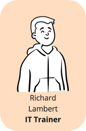

:::danger
⚠️ **Você pode ver algumas mensagens de erro em vermelho durante o teste. Elas podem ser ignoradas com segurança.**
  
:::
### **Passos**  

1. **Impersonar Richard Lambert**.  
2. No menu **Favorites**, clique em **"Volunteer to lead a Training Session"**.  
3. No campo **"Select the training topic…"**, selecione **Cloud Computing**.
   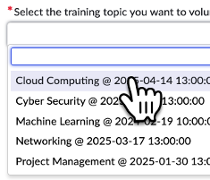  
4. Observe a **mensagem de alerta vermelha** na parte superior da página.  

   > 📌 Como essa sessão já possui um treinador voluntário, a validação do formulário exige a seleção de outro tópico.  

5. No campo **"Select the training topic…"**, selecione **Networking**. 
   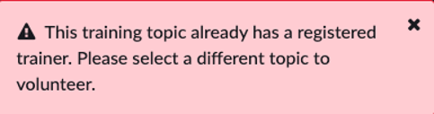 
6. No campo **"Session Type"**, selecione **Virtual**. 
   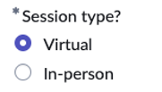 
7. Clique em **Submit**.  
   
8. Feche a aba atual do navegador.  

### **Recapitulação**  

**Richard conseguiu se inscrever como voluntário para ministrar uma sessão de treinamento.**  

## **Seção 2 – O Funcionário que deseja aprender**  

**Peter Harrell** é um funcionário da organização e precisa se especializar em **Cloud Computing e Machine Learning**, pois essas habilidades são exigidas para seu próximo projeto.

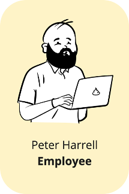

### **Passos**  

1. **Impersonar Peter Harrell**.  
2. No menu **Favorites**, clique em **"Register for training session"**.  
3. No campo **"Select a Training Session…"**, selecione **Cloud Computing**.  
4. Observe a **mensagem de alerta vermelha** na parte superior da página.  
   
   > 📌 Como essa sessão já atingiu o número máximo de participantes, o sistema solicita que Peter escolha outra sessão.  

5. No campo **"Select a Training Session…"**, selecione **Machine Learning**.  
6. Clique no botão **Submit**.  
7. Feche a aba atual do navegador.  

### **Recapitulação**  

**Peter conseguiu se inscrever em uma sessão de treinamento disponível.**  

## **Seção 3 – A Gestora do Programa de Treinamento**  

Agora vamos testar o aplicativo como **Alexandra**.  

Ela deseja **acompanhar e gerenciar** todas as sessões do **Programa de Cross-Training** na ACME Inc.  

Ela pode fazer isso através do **novo Workspace** criado para o aplicativo.  

### **Passos**  

1. **Impersonar Alexandra Arias**.  
2. Clique no menu **Workspaces**.  

   > 📌 Se o menu Workspaces não estiver visível, clique nos **três pontos** para expandi-lo.  

3. Clique em **Cross-Training Management**.  
   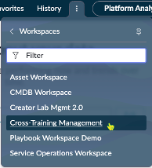

   > 📌 Isso abrirá o **Workspace personalizado** para o aplicativo de Alexandra.  

4. No painel principal do **Dashboard**, clique em **Machine Learning** na lista central.  
   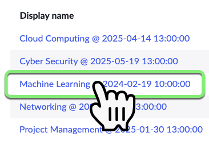
5. Observe que a **aba Playbook** é a guia padrão no registro da sessão de treinamento.  
   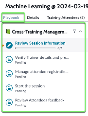
6. Na etapa **Review Session Information**, clique na **Activity Card "Instruction"**.  
   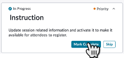
   > 📌 Alexandra revisa as instruções e clica em **Mark Complete** para finalizar essa etapa do Playbook.  

7. Confirme que a **etapa Review Session Information está agora completa**.  
   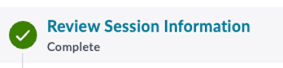
8. No lado esquerdo, clique na **etapa Manage Attendees**.  
   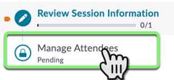
9.  Clique na **Activity Card "Review Attendee List"**.  
    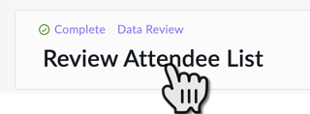

   > 📌 Esta atividade exibe uma **lista de registros** da tabela de participantes **(Attendees)** relacionados à sessão de treinamento.  

10. Revise a atividade **Send email to Attendees** e clique no botão **Send Email**.  
   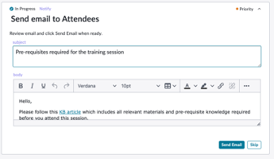
    > 📌 O sistema enviará e-mails automáticos aos participantes.  

11. O Playbook avançará automaticamente para a próxima etapa: **Prep the Volunteer**.  
12. Clique no botão **Send Email** para enviar um e-mail ao **Training Volunteer**, explicando os detalhes da sessão.  
13. O Playbook avançará para a etapa **Day of Training**.  
    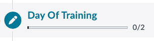
14. No dia da sessão, o **Training Volunteer** clica no botão **Update** para iniciar o treinamento.  
    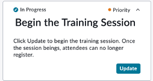
15. Após a conclusão da sessão, o **Training Volunteer** clica no botão **Update** na atividade **End the Training Session**. 
    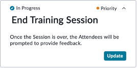 
16. Neste estágio do Playbook, um **e-mail automatizado** será enviado para os participantes, solicitando feedback sobre a sessão.  
17. O **Training Volunteer** e o **Training Coordinator** revisarão as respostas na **Review Feedback Activity Card**.  
    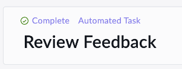
18. Após revisar os feedbacks, o **Training Coordinator** finalizará a sessão clicando no botão **Mark Complete**.  
    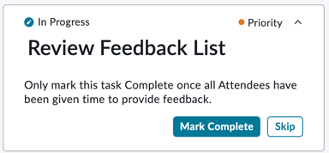
---

## 🎯 **Recapitulação**  

**Alexandra agora pode gerenciar facilmente todas as sessões do Programa de Cross-Training através do Workspace personalizado.**  

Antes, esse processo era feito manualmente via **e-mails e planilhas**, mas agora **quase tudo está automatizado**!  

---

## **🏆 Conclusão do Laboratório**  

🚀 **Parabéns!** Alexandra construiu um **aplicativo incrível** de Cross-Training utilizando a **plataforma ServiceNow**, o **App Engine** e o **Now Assist for Creator**.  

Agora, ela pode **escalar o programa de treinamentos globalmente** e permitir que mais funcionários colaborem no desenvolvimento de novas habilidades.  

---

## **💡 Explore mais!**  

Se você ainda tem tempo restante no laboratório, sinta-se à vontade para **experimentar outras funcionalidades do Now Assist for Creator** e explorar diferentes ideias!  

🔹 **Obrigado por participar deste laboratório!** 🎉