Neste laboratório, exploraremos os diferentes componentes da página **Summary and Insights** que é gerada em todo projeto de Process Mining.

A página Summary and Insights é a primeira aba em qualquer projeto de Process Mining que você criar. Todos se encantam com o mapa do processo visualizado que é gerado, mas há muito valor e informações úteis nessa página. Essas informações ajudam a entender melhor os dados minerados em alto nível e também orientam para áreas que podem ser exploradas mais a fundo com o Analyst Workbench. Vamos abordar as diferentes seções da página: project metrics, a possibilidade de adicionar dashboards customizados, variation analysis e as Improvement Opportunities geradas.

## Preparação inicial

Antes de começar, há alguns passos logísticos:

1. Ao iniciar sua instância, aparecerá um pop-up "Work your way". Use o **X** no canto superior direito para fechá-lo.

  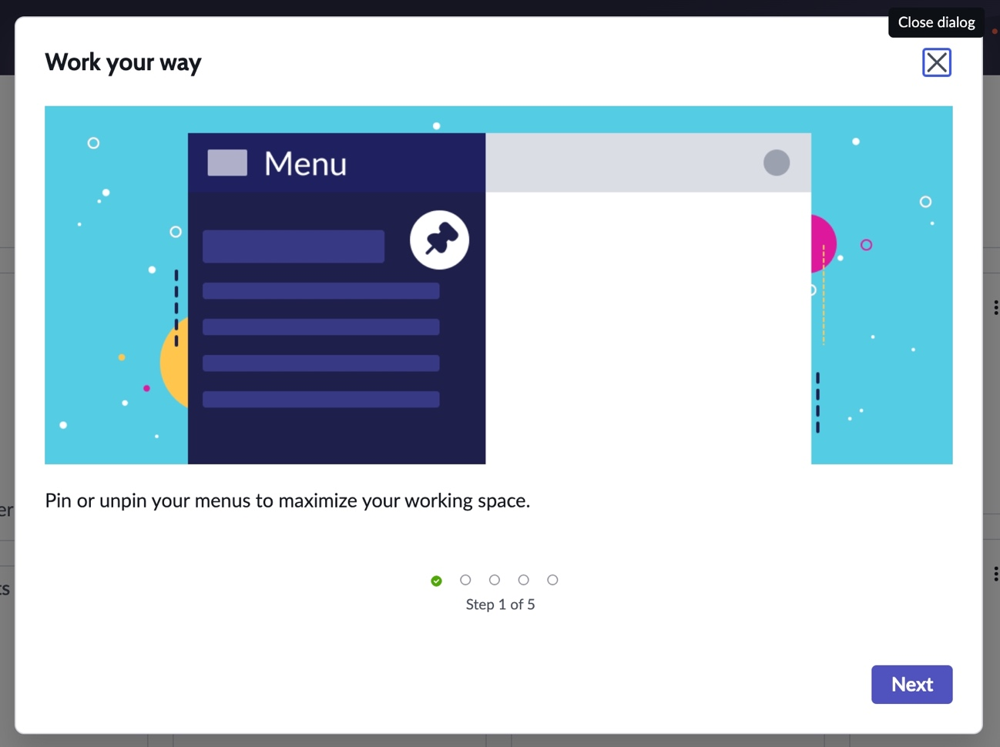

2. Certifique-se de que sua instância está conectada à infraestrutura de Machine Learning.

   - Clique em **All** no canto superior esquerdo para abrir o menu de navegação lateral.
   - Pesquise e selecione **Repair Machine Learning Settings**.

  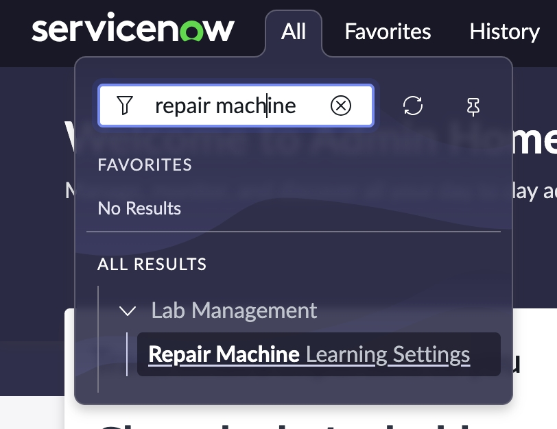

3. Clique no botão azul **Reset Machine Learning Settings**.

  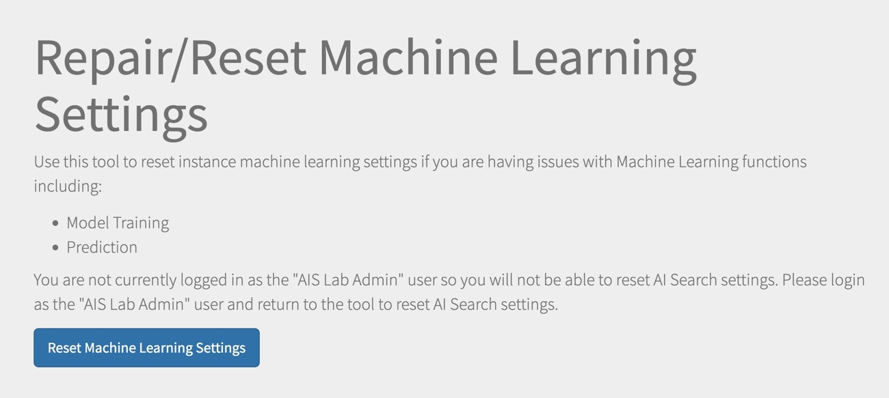

4. Aguarde alguns segundos até a mensagem indicando que as configurações foram resetadas.

  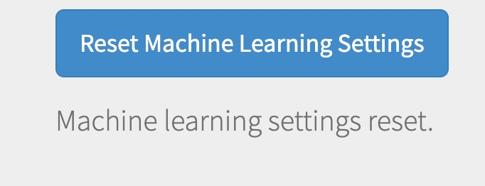

Agora estamos prontos para continuar com o laboratório.

## Localizando o projeto de Process Mining

1. No menu superior, localize **Workspaces** e selecione o **Process Mining Workspace**.

  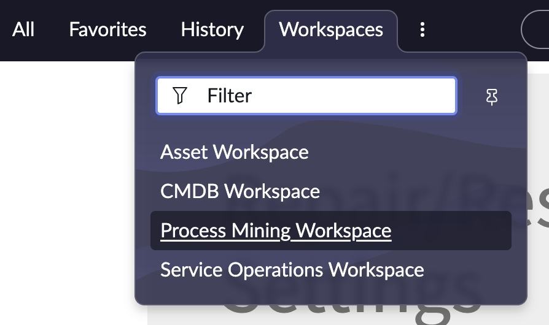

2. No Process Mining Workspace, você verá vários projetos. Trabalharemos com o **Lab Project – Incident Analysis**. Note também os **Evaluation Projects** disponíveis, que são ativados para clientes ServiceNow na release Xanadu para testar Process Mining com seus próprios dados. Saiba mais sobre esses projetos [aqui](https://www.servicenow.com/community/process-mining-blog/how-to-use-the-process-mining-evaluation-project-in-your/ba-p/3214970).

  

3. Clique nos três pontos no canto superior direito do projeto **Lab Project – Incident Analysis** para abrir o menu. Caso fosse necessário editar ou minerar o projeto, seria feito por esse menu. **Nota: Mine Project (Sample) minera até 3600 registros para testes. NÃO MINERE O PROJETO AGORA, ele já está minerado para agilizar o laboratório.**

4. Selecione **Open** para abrir o projeto.

  

## Explorando a aba Summary and Insights

Ao abrir o projeto, você estará na aba **Summary and Insights**. No topo, são exibidas estatísticas sobre os dados minerados:

- Project Name  
- Table fonte dos dados do processo  
- Total de registros no projeto (exemplo: 3600 registros devido ao Sample Mine)  
- Número de rotas únicas que os registros seguiram (rotas equivalem aos diferentes passos ou caminhos do trabalho)  
- Média de dias para fechamento/completar uma rota  
- Desvio padrão da duração das rotas  
- Valor mediano da duração  

  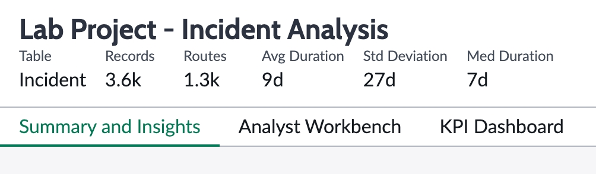

### Process overview

Nesta seção, são apresentadas duas visualizações geradas automaticamente:

  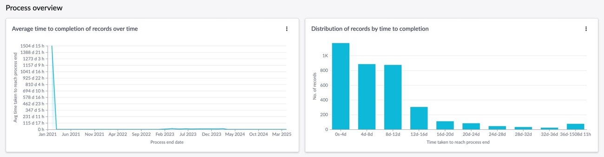

- A primeira é a **completion time trend**, mostrando o tempo médio para completar o trabalho ao longo do período analisado, com base nos timestamps do audit log.
- A segunda é um **histogram** que mostra a distribuição dos tempos de fechamento no conjunto de dados. Por exemplo, a maioria dos incidentes fechou entre 0-4 dias, com um grupo significativo entre 8-12 dias.

Ambas fornecem uma visão geral do comportamento dos dados.

**Nota: Estes são dados de demonstração e podem diferir das imagens.**

### Variation Analysis

Antes de avançar para Improvement Opportunities, clique na aba **Variation Analysis**.

  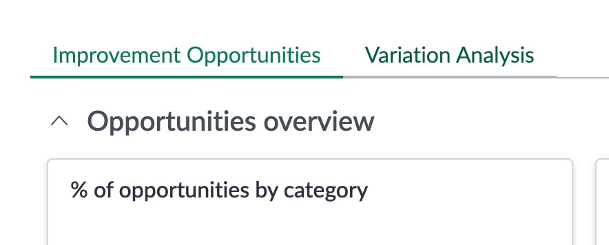

A Variation Analysis mostra as diferentes combinações de rotas que o trabalho tomou até o fechamento. Ajuda a entender o quanto o processo está seguindo o caminho ideal e quais são as rotas alternativas mais frequentes.

  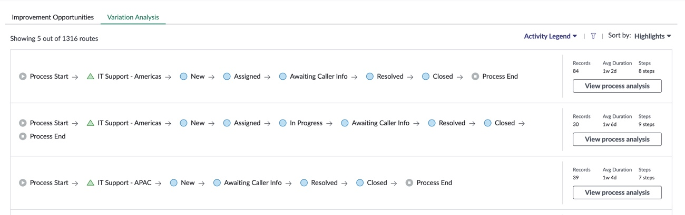

Clique no menu **Sort by** no canto superior direito da seção e selecione **Most Records** para entender o alinhamento do trabalho ao processo projetado.

  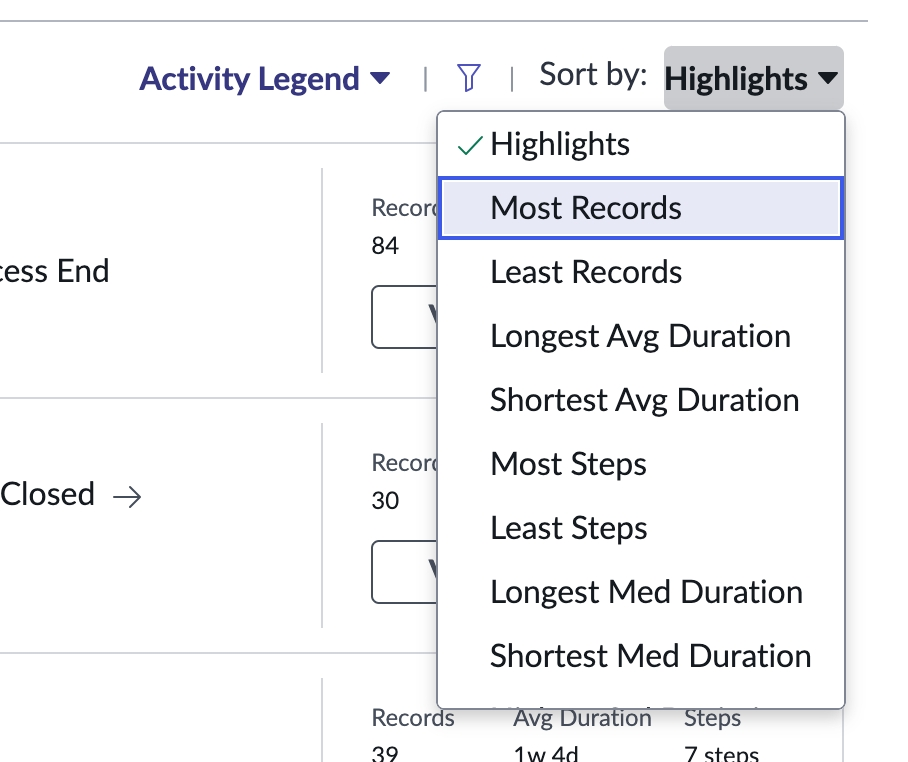

Aqui vemos que a maioria dos incidentes (166 registros) seguiu a rota: IT Support – Americas (Assignment Group) → New → Assigned → Resolved → Closed. A segunda rota mais comum (92 registros) foi: IT Support – Americas → New → Assigned → In Progress → Resolved → Closed.

Agora, selecione **Most Steps** no menu **Sort by**.

  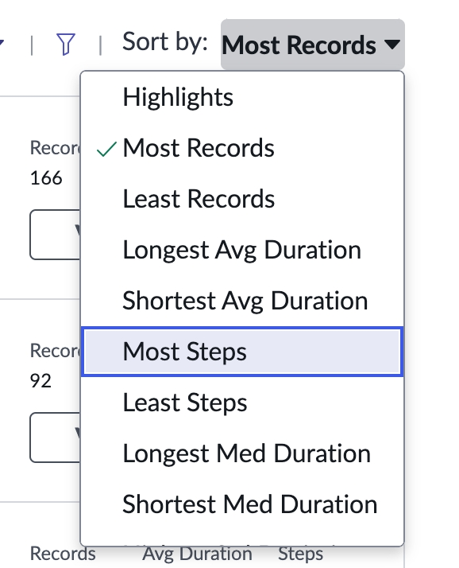

Essa visualização é útil para identificar outliers e possíveis quebras de regras de negócio ou roteamento.

  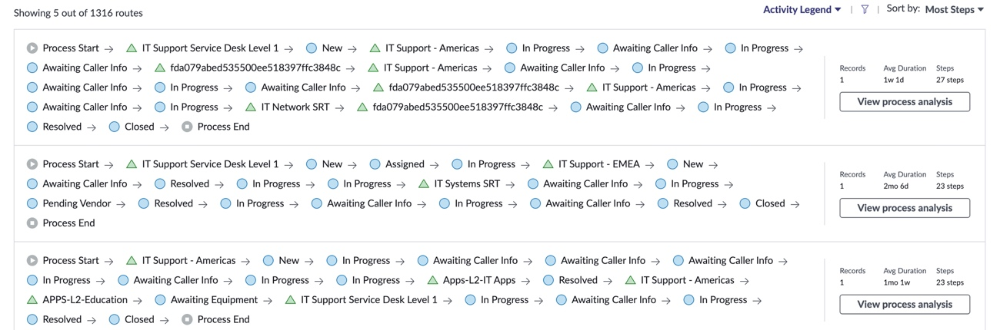

Se encontrar algo interessante, você pode clicar em **View process analysis** para abrir o Analyst Workbench com os registros daquela rota (não recomendamos clicar agora).

  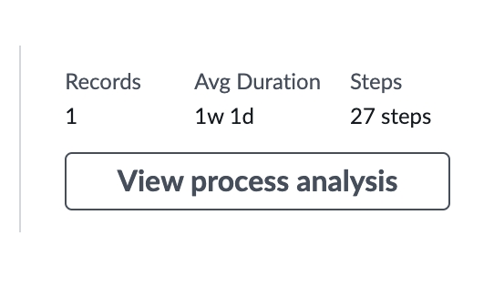

### Improvement Opportunities

1. Clique na aba **Improvement Opportunities**.

  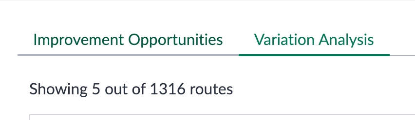

2. Role a tela até visualizar a seção **Opportunities overview** e a lista detalhada de Improvement Opportunities.

  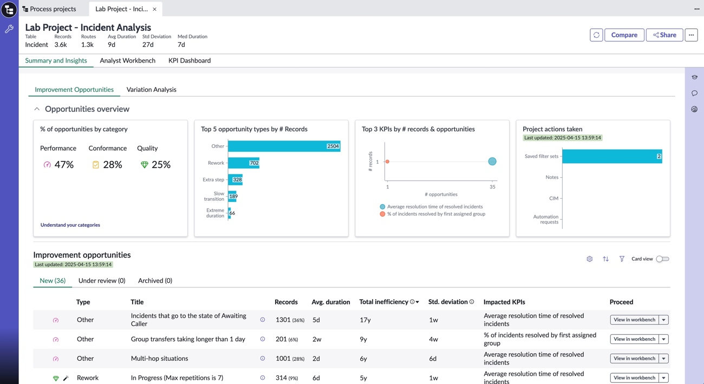

Esta é a parte principal da página Summary and Insights. Cada projeto inclui oportunidades de melhoria baseadas em regras e automáticas (indicadas por um ícone de varinha mágica). Elas ajudam a acelerar a análise.

- Oportunidades baseadas em regras podem ser configuradas para cenários específicos, como incidentes presos em "awaiting caller info" ou casos retidos por mais de 12 horas na equipe de nível 1 antes de roteamento.

- Os detectores automáticos identificam padrões de ineficiência:

  1. Rework – passo repetido no processo  
  2. Ping-Pong – registros que alternam entre dois passos sem interrupção  
  3. Extra step – rotas com um passo adicional  
  4. Slow transitions – grupos com duração anormalmente longa  
  5. Extreme duration – transições muito mais longas que o usual  
  6. Extreme repetitions – repetições excessivas em transições  
  7. Repeating pattern – sequências repetidas de passos  

Essas oportunidades ajudam a priorizar análises.

  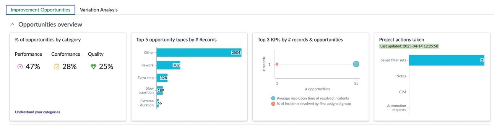

Na seção **Opportunities overview**:

- O primeiro gráfico agrupa por categoria (definida na configuração da oportunidade)  
- O segundo por tipo  
- O terceiro pelos KPIs do Platform Analytics vinculados (não obrigatório, mas oferece integrações para escalar o uso do Process Mining)  
- O quarto resume ações tomadas no projeto (filtros criados, notas adicionadas, iniciativas de melhoria contínua ou solicitações de automação)

Role até o final da lista de Improvement Opportunities.

  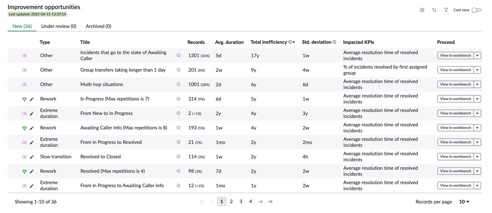

A maioria das colunas é autoexplicativa:

- O ícone da varinha indica oportunidade automática  
- A duração média e a ineficiência total são somatórios do tempo nos passos configurados na oportunidade. Por exemplo, para "Awaiting Caller", os 17 anos de ineficiência total representam a soma do tempo que os incidentes ficaram nesse estado.

  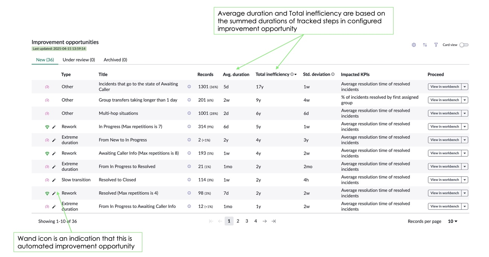

A última coluna, **Proceed**, permite ações na oportunidade. Clicando em **View in workbench**, você vai para o Analyst Workbench com filtro aplicado naquela oportunidade. Isso será explorado no Lab 2.

  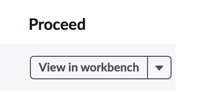

Localize a oportunidade intitulada **Resolved to Closed** e clique na seta na coluna **Proceed** para abrir o menu de ações.

  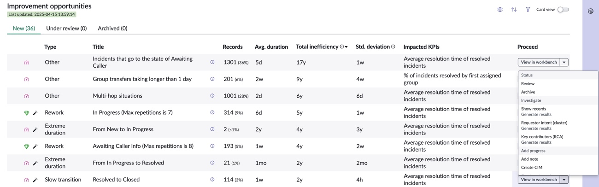

O menu possui três seções:

- **Status**: controlar o estado da oportunidade  
- **Investigate**: opções para obter lista de registros, rodar clustering em descrições (Requestor intent) e análise de causa raiz (Key contributors)  
- **Add progress**: adicionar nota, criar Continual Improvement Initiative ou solicitação no Automation Center (se disponível)

  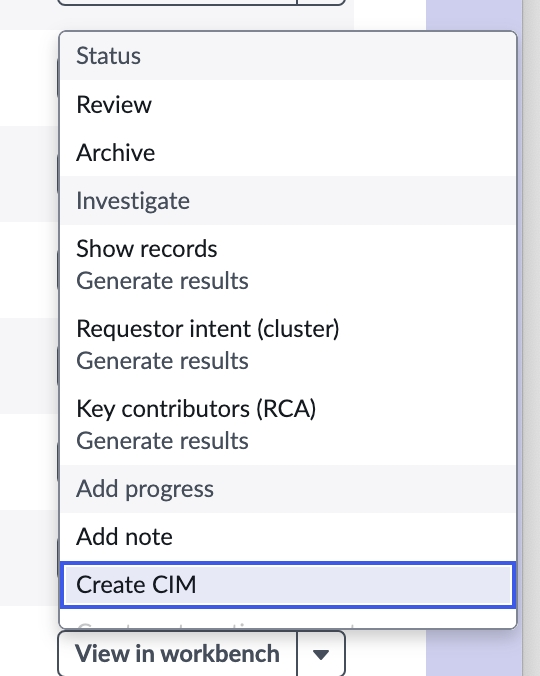

Como o tempo de "Resolved to Closed" não é de interesse agora, vamos arquivar essa oportunidade.

- Clique em **Archive** na seção Status.

  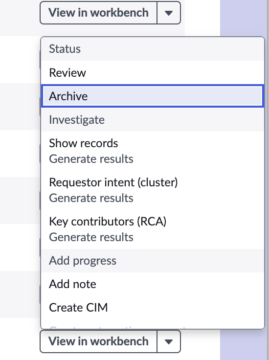

- Confirme clicando em **Proceed**.

  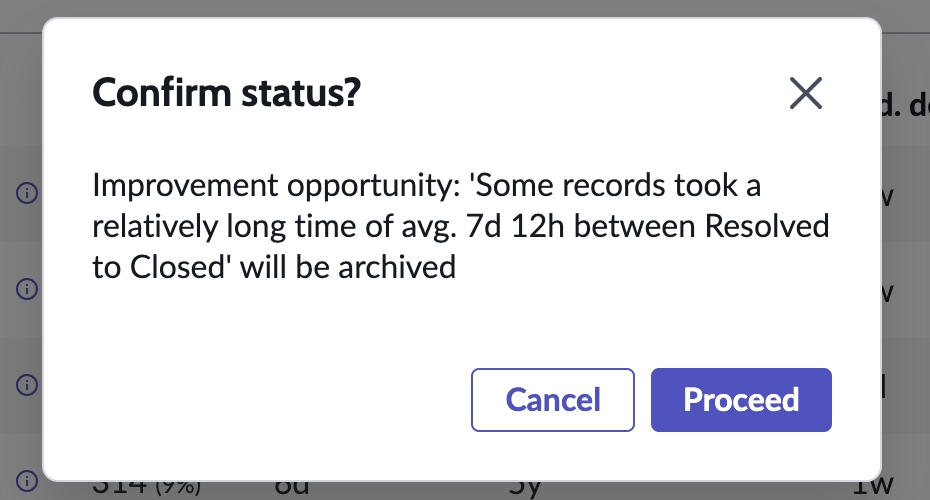

Agora, localize a oportunidade **From In Progress to Resolved**. Ela tem 21 registros que demoraram em média 1 mês para essa transição, totalizando 2 anos de ineficiência.

- Clique na seta na coluna **Proceed** e selecione **Show records**.

  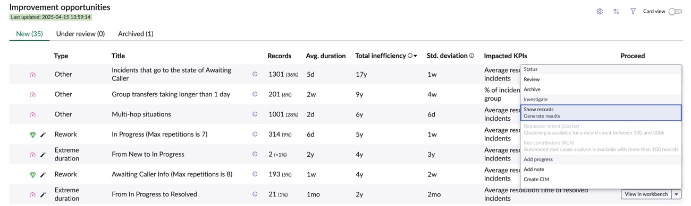

Se o menu desaparecer, abra novamente e aguarde o check indicando que os registros estão disponíveis, então selecione a opção.

  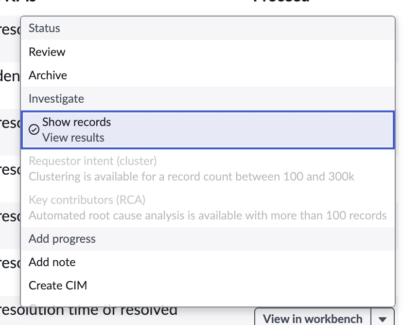

Você verá a lista dos 21 registros sinalizados nessa oportunidade. Poder acessar diretamente os registros facilita a análise. Feche a lista.

---

A aba Summary and Insights é uma ótima forma de iniciar sua análise de processo. No próximo laboratório, você terá conversas mais profundas com seus dados de processo.

Avance para o Lab 2, mas sem pressa.