Os canais de **self-service** como portal ou email permitem um atendimento rápido ao cliente ou colaborador. No entanto, diferente de telefone, walk-up ou uma experiência com **virtual agent**, é principalmente uma comunicação unilateral, o que dificulta o recebimento das solicitações. Nem todos sabem descrever seu problema ou necessidade de maneira precisa ou completa. Consequentemente, tickets criados por self-service frequentemente apresentam mais reatribuições ou exigem que retornemos ao solicitante para obter mais informações.

Essas situações, nas quais é necessário solicitar informações adicionais, são frustrantes para o cliente/colaborador e impactam negativamente tanto a satisfação quanto a produtividade da equipe de atendimento.

**Process Mining** pode ser utilizado para analisar o trabalho recebido por diferentes canais e identificar oportunidades para melhorar a experiência de intake, além de criar novas opções de self-service que aumentem a agilidade e produtividade da organização.

Você deve estar na aba **Summary and Insights** do projeto **Lab Project – Incident Analysis**. Se já estiver, avance alguns passos. Caso não esteja na página **Summary and Insights**, siga os passos abaixo.

## Como acessar o Process Mining Workspace

1. Localize o menu **Workspaces** no topo da tela e selecione **Process Mining Workspace**.
2. No **Process Mining Workspace**, localize **Lab Project – Incident Analysis**.
3. Clique nos três pontos no canto superior direito de **Lab Project – Incident Analysis** para abrir o menu. Selecione **Open** para abrir o projeto de Process Mining.
4. Na aba **Summary and Insights**, role até a lista de **Improvement opportunities**.
5. Encontre a oportunidade de melhoria intitulada **Incidents that go to the state of Awaiting Caller** (deve ser a primeira da lista). Como há 17 anos de ineficiência acumulada nesta etapa do processo, vamos investigar esses incidentes para verificar oportunidades de evitar perdas de tempo e melhorar a produtividade.
6. Clique em **View in workbench** na coluna **Proceed** para essa oportunidade.

  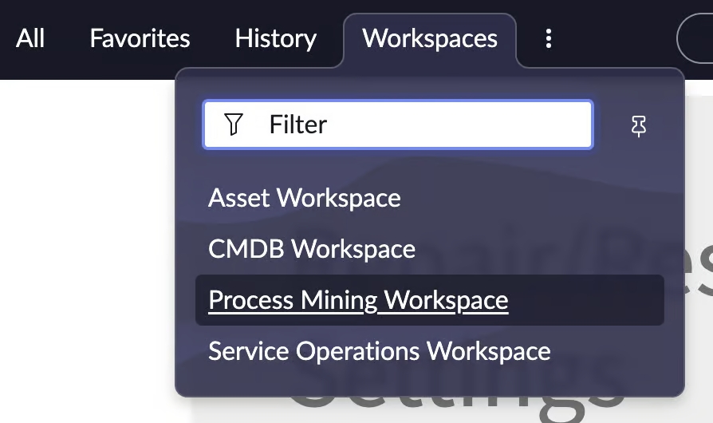
  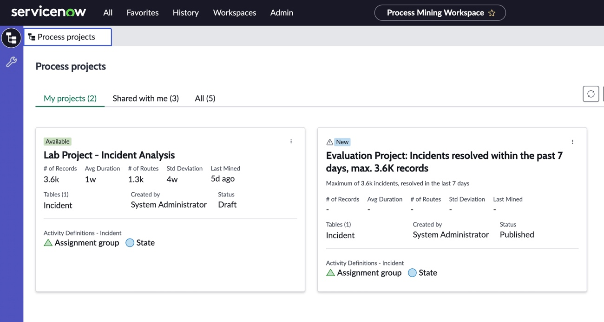
  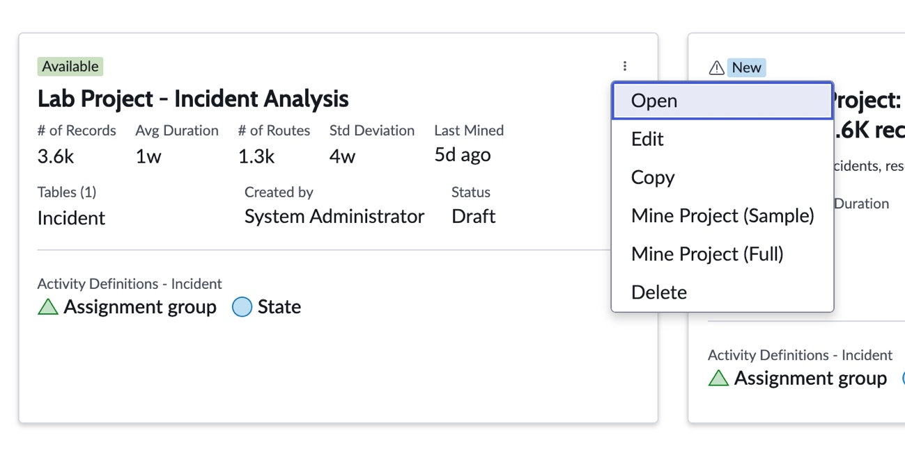
  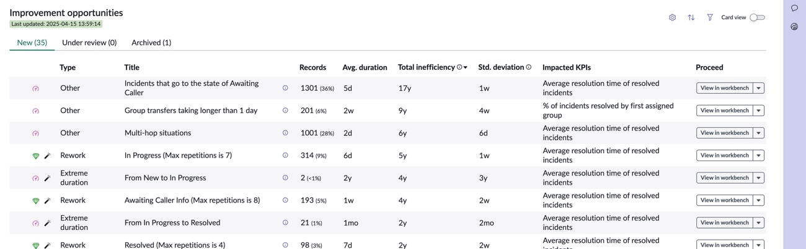
  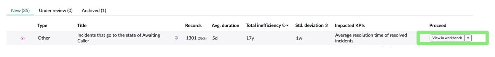

7. Você será direcionado para a aba **Analyst Workbench**.

  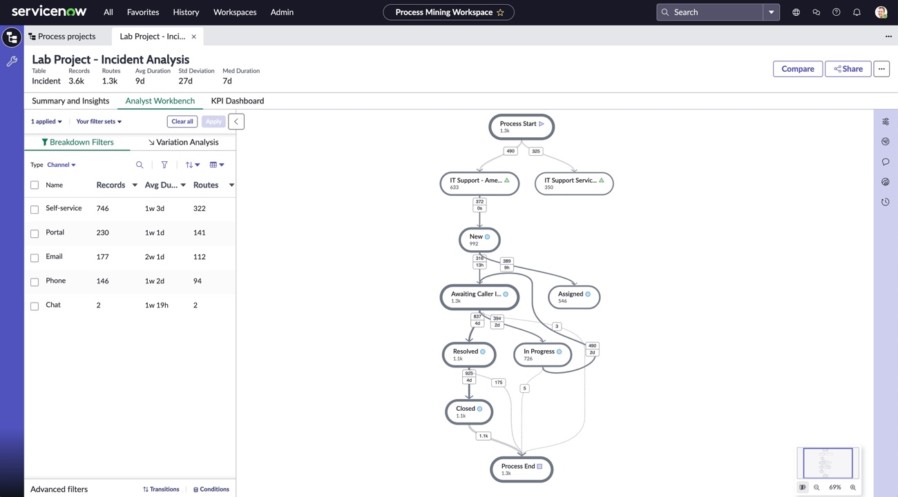

8. O primeiro passo é validar se estamos realmente visualizando os 1301 incidentes que, em algum momento do ciclo de vida, passaram pelo estado **Awaiting Caller**. Para isso, clique em **Global Metrics** na barra roxa, no canto direito da tela.

  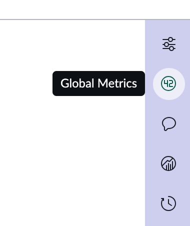

9. O painel **Global Metrics** permite ajustar as métricas primárias e secundárias exibidas no mapa, além de fornecer estatísticas sobre a visualização atual do process map. Ao passar o mouse sobre **1.3K records**, você verá que estamos analisando os 1301 incidentes esperados.

  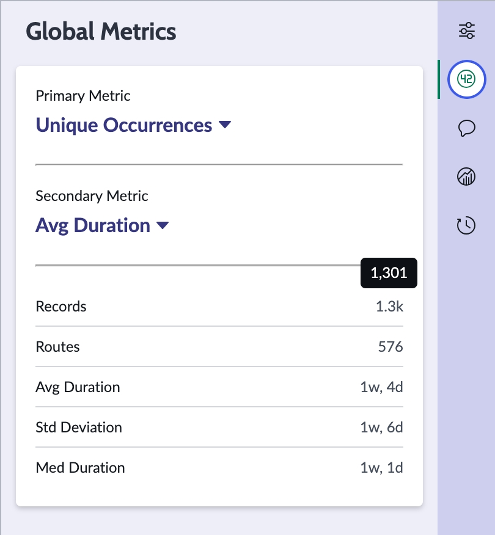

10. Clique em **Model Options** na barra roxa, no canto direito da tela, para abrir o painel **Model Options**.

  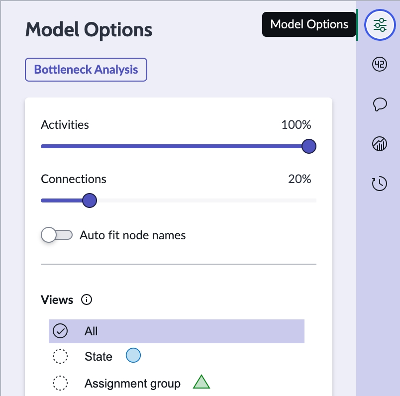

11. Usaremos o painel **Model Options** várias vezes neste laboratório, então familiarize-se com ele. O primeiro passo é usar o **Connections slider** para expandir o número de conexões exibidas no process map para 50%. Arraste o slider para 50% para revelar mais rotas individuais percorridas pelo trabalho.

  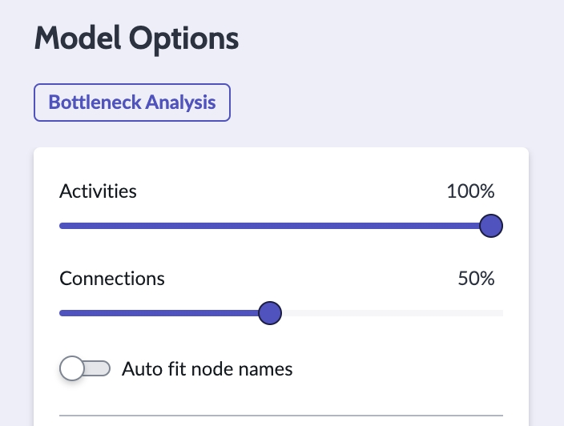

12. No canto inferior direito do process map, localize a opção **Zoom**. Clique uma ou duas vezes para aproximar o mapa.

  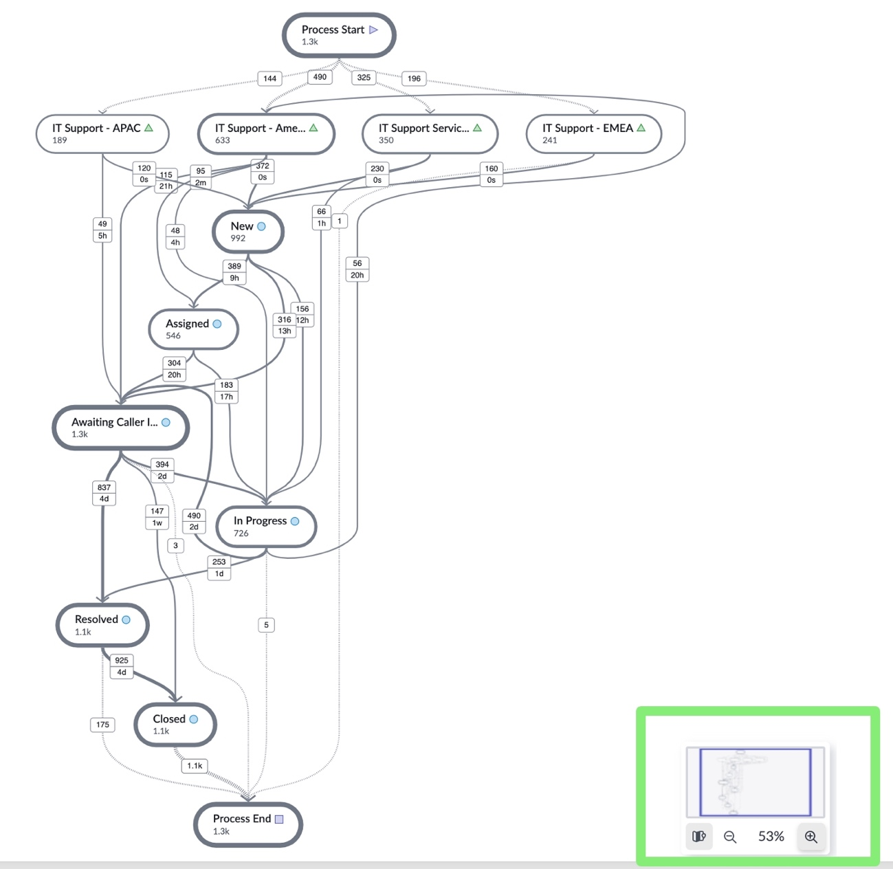

13. Após dar zoom, você verá que o process map mostra como os incidentes se movem de **Group** para **Group** e de **State** para **State**. Essas são chamadas de **Activities** e são configuradas na criação do projeto (veremos isso no Lab 3). O painel **Model Options** exibe uma legenda e permite selecionar uma visualização específica caso queira analisar apenas mudanças de **State** ou de **Assignment Group**. Utilizaremos essas opções em passos futuros, então não clique nelas agora.

  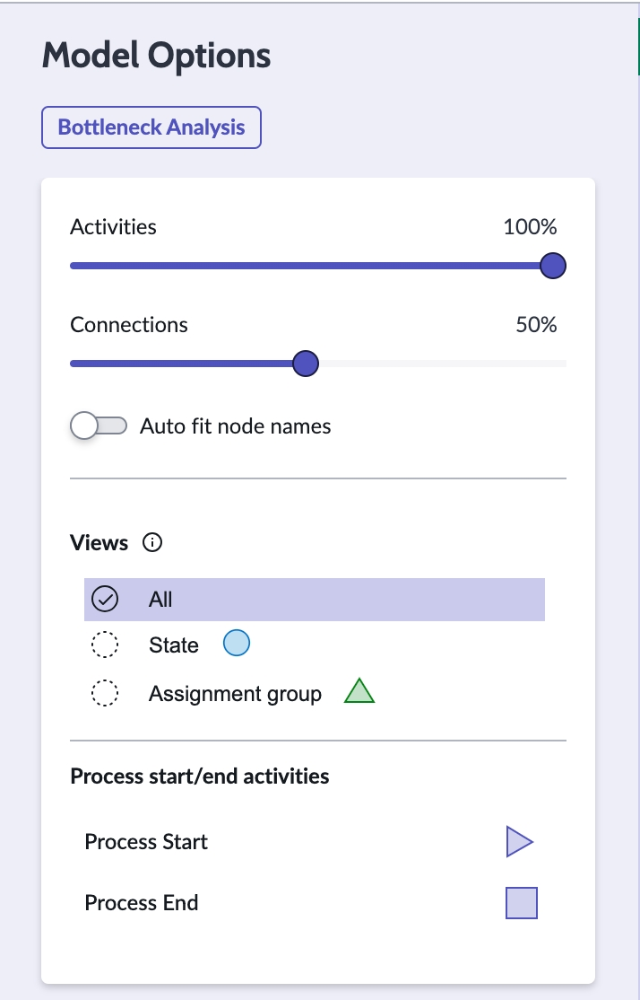

14. O mapa é composto por **nodes** que representam os diferentes valores de atividade (**States**, **Assignment Groups**) e **arcs** que conectam esses nodes. As caixas com números nos arcs mostram o volume de registros que fizeram aquela transição e a duração média dessa transição. Para exibir outras métricas, utilize o painel **Global Metrics**. O mapa é altamente interativo: ao clicar em qualquer node ou arc, você verá estatísticas e opções para investigar mais a fundo aqueles dados do processo. Clique no node **Awaiting Caller Info** no mapa.

  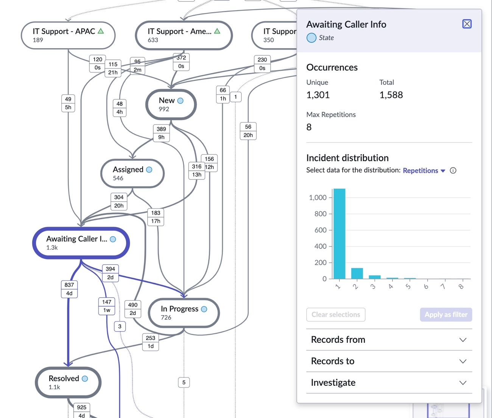

15. A janela pop-up exibe estatísticas sobre os incidentes que passaram pelo estado **Awaiting Caller Info**, um histograma para analisar quantas vezes incidentes passaram por esse estado, uma divisão **Records from** e **Records to**, além de várias opções de investigação. Usaremos essas opções em diversos momentos do laboratório.

  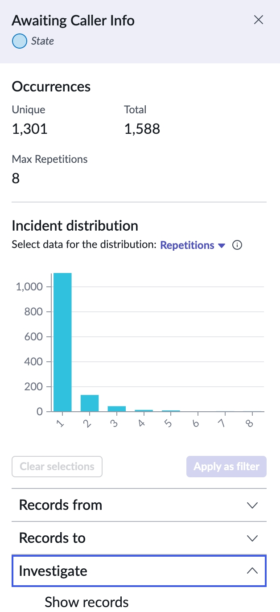

16. O próximo passo é utilizar o painel **Breakdown Filters** no lado esquerdo da tela para explorar diferentes aspectos desses incidentes que passaram pelo estado **Awaiting Caller Info** em seu ciclo de vida.

  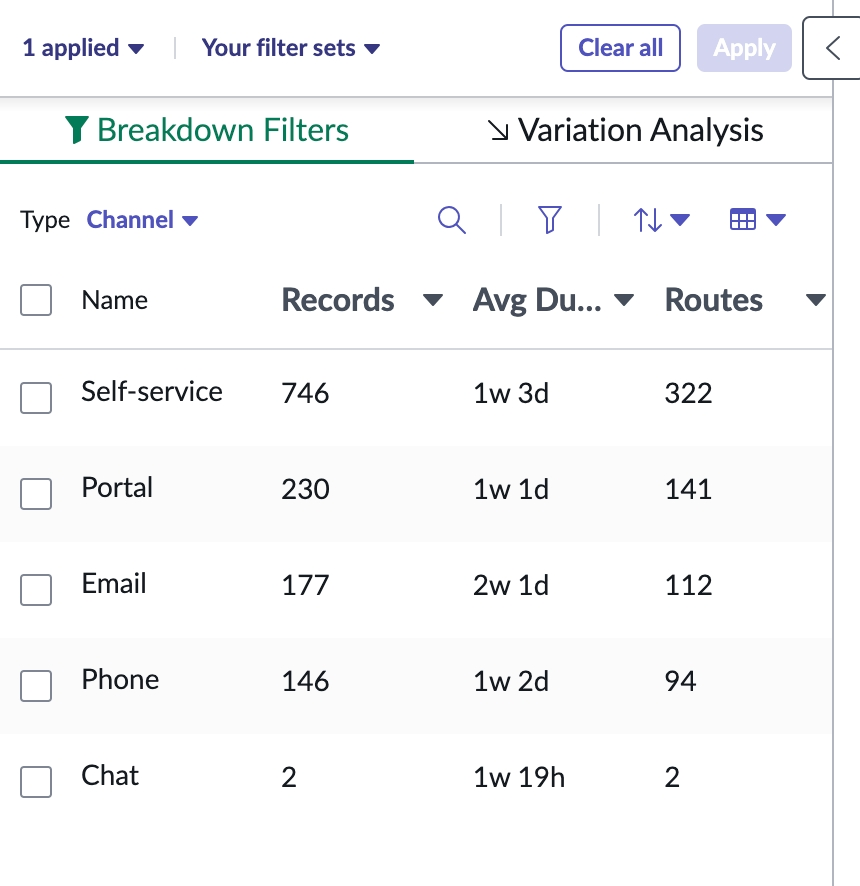

17. O **Breakdown** inicial selecionado é o **Channel** de entrada. É possível visualizar a lista de canais de entrada (Self-service, Portal, Email, etc.), quantos registros vieram por cada canal, a **Average Duration** para cada canal e o número de rotas únicas percorridas pelos registros de cada canal. Vamos analisar isso em detalhes, mas antes clique em **Channel** para expandir o menu e explorar as outras opções de breakdown.

  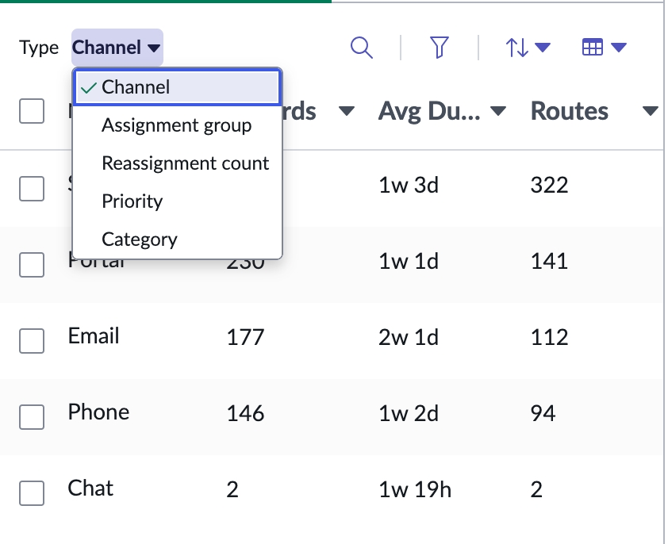

18. Os **breakdowns** disponíveis dependem da configuração feita ao criar o projeto de **Process Mining** (veremos isso no Lab 3). Após explorar as opções de breakdown, retorne para o breakdown **Channel**.

19. Note que, embora **Self-service** e **Portal** sejam os canais com maior volume, o canal **Email** apresenta uma **Average Duration** de 2 semanas e 1 dia, significativamente maior. Portanto, vamos investigar os 177 incidentes que vieram via Email. Para isso, marque o checkbox ao lado de **Email** na lista.

  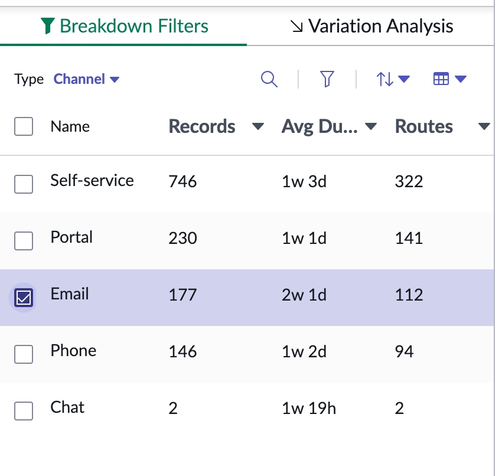

20. Clique em **Apply** no canto superior direito do painel **Breakdown Filters**.

  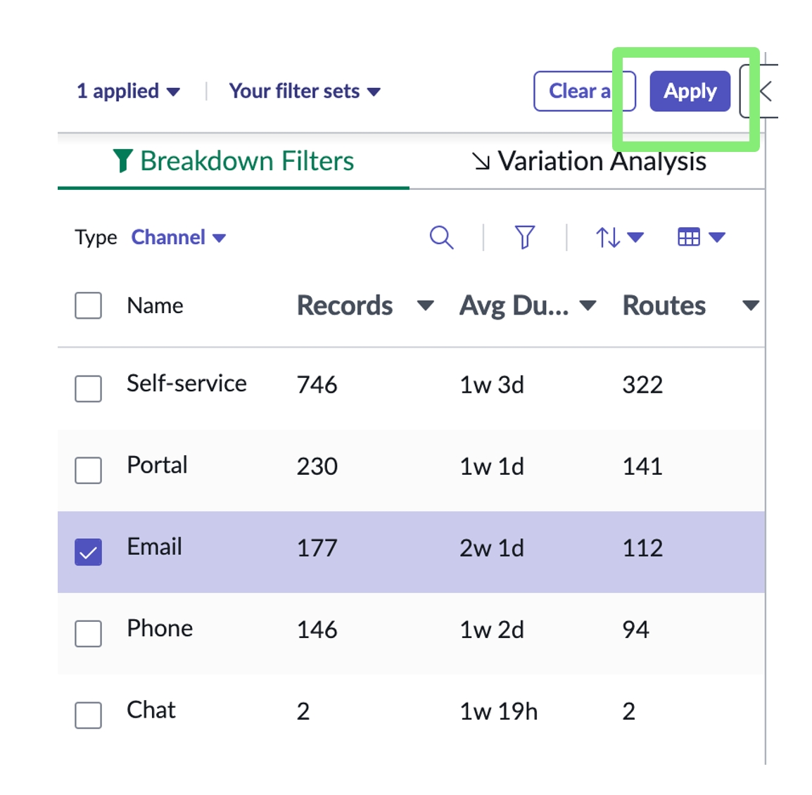

21. Isso irá isolar o process map apenas para os 177 incidentes que vieram via Email e, em algum momento, passaram pelo estado **Awaiting Caller Info**. O próximo passo é investigar esses incidentes em mais detalhes. Clique novamente no node **Awaiting Caller Info** no process map.

  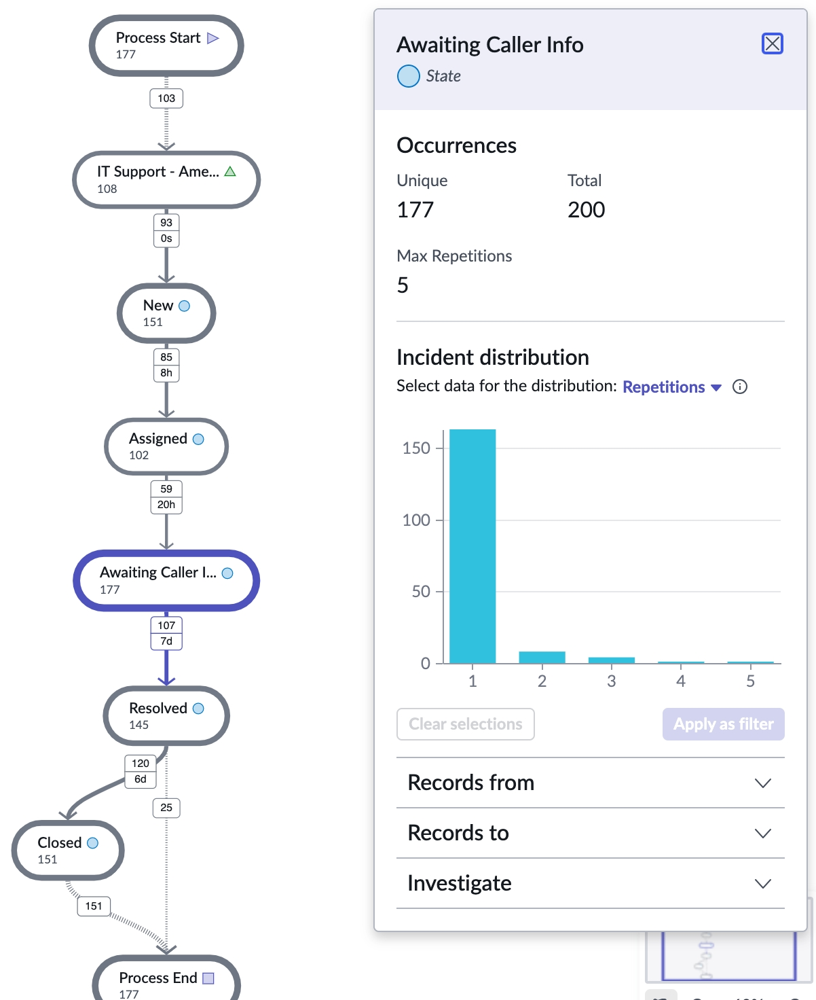

22. Na janela pop-up, expanda o menu **Investigate**.

  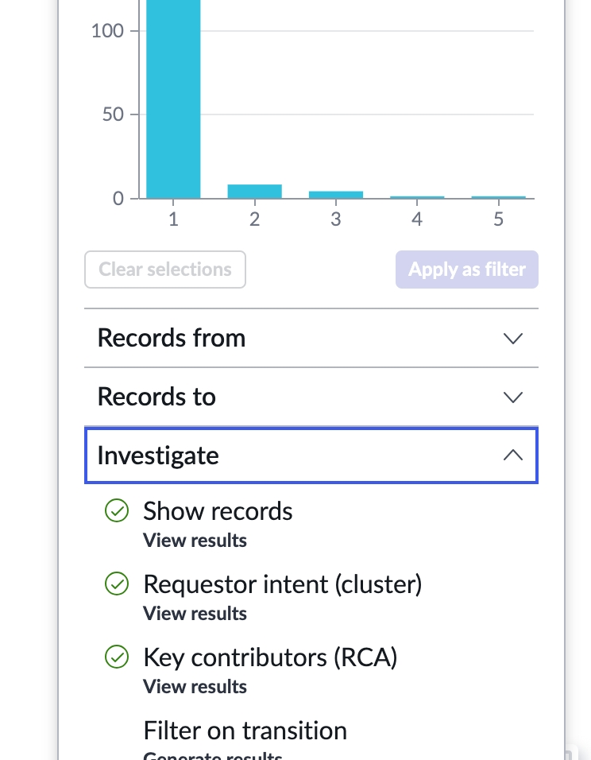

23. Clique em **Show records**. Isso exibirá uma lista dos 177 registros que vieram via Email e passaram pelo estado **Awaiting Caller Info**. Para explorar ainda mais essa lista, clique em **Column options** na coluna **Priority** e selecione **Launch Interactive Analysis**.

  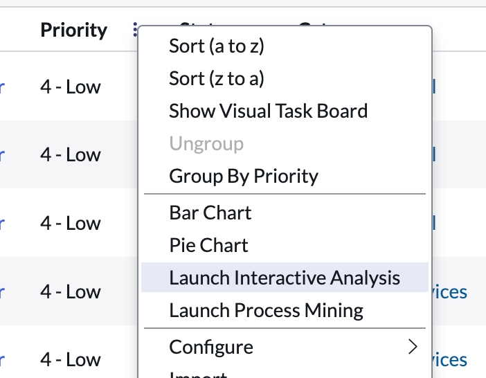

24. Isso gerará um **interactive dashboard** para explorar os dados e identificar oportunidades.

  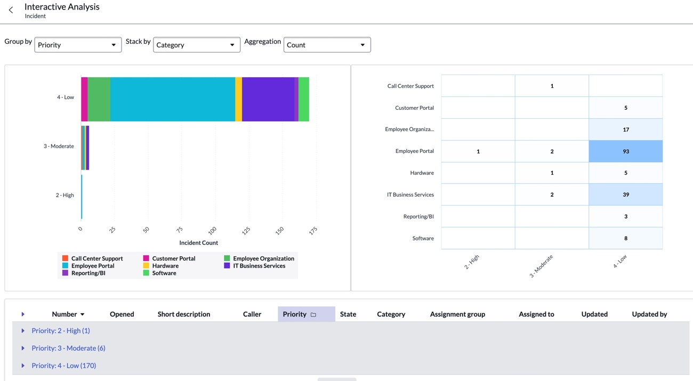

    Feche a aba do navegador que foi aberta com o dashboard.  

:::danger
**NÃO FECHE A ABA QUE CONTÉM O PROCESS MINING WORKSPACE.**
:::

25. No menu **Investigate** da pop-up **Awaiting Caller Info** no process map, selecione a opção **Key contributors (RCA)**.

  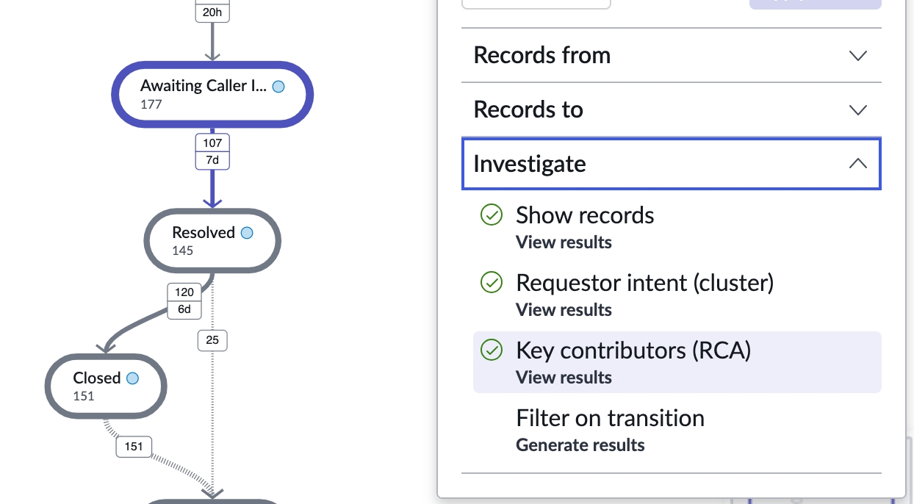

28. Se não aparecer um check verde ao lado da opção **Key contributors (RCA)**, aguarde enquanto o mecanismo de mineração processa os resultados. Sua tela ficará assim:

  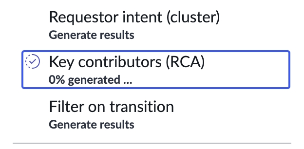

29. Aguarde pacientemente enquanto minera. Em alguns segundos (ou minutos, dependendo do número de usuários clicando em **mine** ao mesmo tempo), aparecerá um pop-up informando que a tarefa foi concluída.

  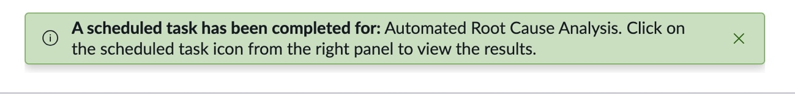

30. Clique no **X** nesta caixa verde para fechá-la.

31. Depois, clique novamente em **Key contributors (RCA)** na seção **Investigate** após a conclusão da mineração.

  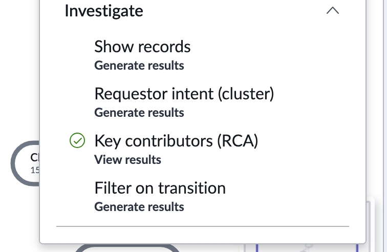

32. Você verá um pop-up com os resultados de **Automated root cause analysis**. Isso mostrará alguns dos principais fatores/influenciadores (**Assignment Groups**, **Categories**, etc.) associados aos incidentes que passaram pelo estado **Awaiting Caller Info**. Os dados de demonstração não destacam totalmente essa funcionalidade, mas é importante saber que ela existe.

  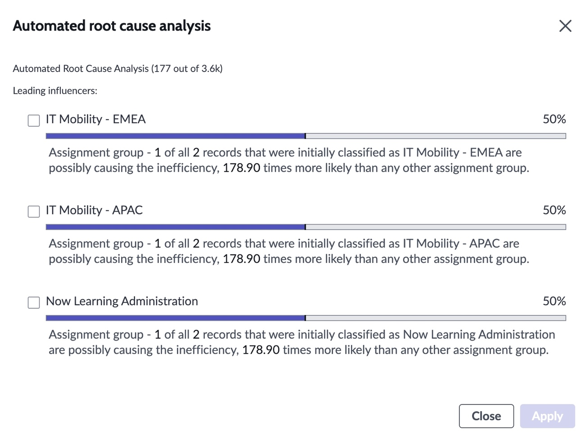

33. Clique em **Close** na janela de **Automated root cause analysis**.

34. Clique novamente no node **Awaiting Caller Info** no process map. Desta vez, expanda o menu **Investigate** e selecione **Requestor intent (cluster)**.

  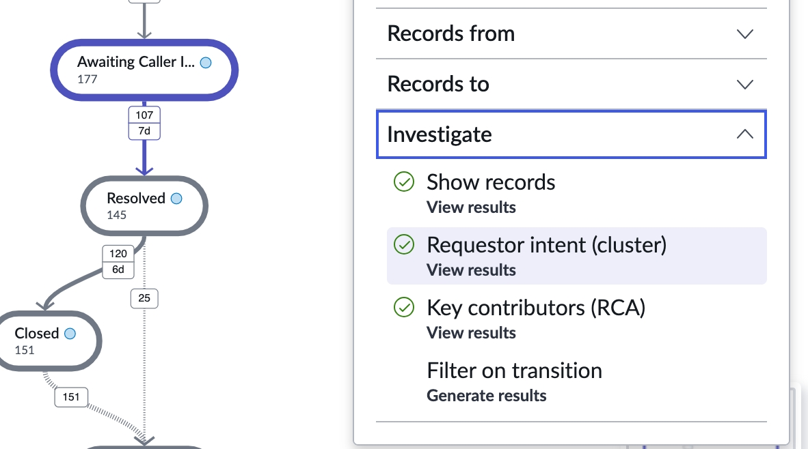

35. Assim como antes, se não houver um check verde, aguarde a mineração ser concluída.

  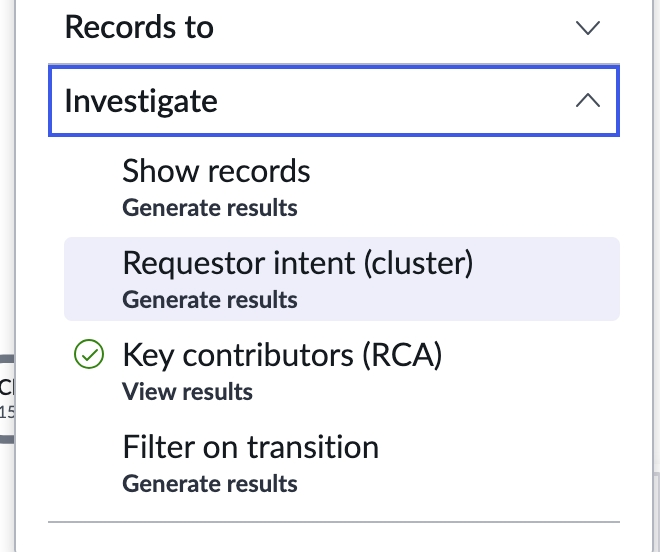

36. A mineração levará alguns segundos e, ao concluir, aparecerá uma caixa verde de conclusão.

  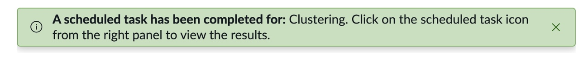

37. Clique no **X** na barra verde de status para fechar essa janela.

38. Clique novamente no node **Awaiting Caller Info** no mapa e expanda a seção **Investigate** do pop-up. Agora, a opção **Requestor intent (cluster)** deve exibir um check verde.

  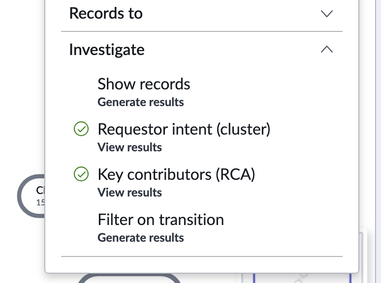

39. Clique em **Requestor intent (cluster)**.

40. Isso criará grupos ou clusters de incidentes com base nos dados não estruturados de suas **short descriptions** e **descriptions**. Assim, ao invés de analisar manualmente todos os 177 incidentes para identificar padrões, eles serão apresentados na janela de resultados de **Cluster analysis**.

  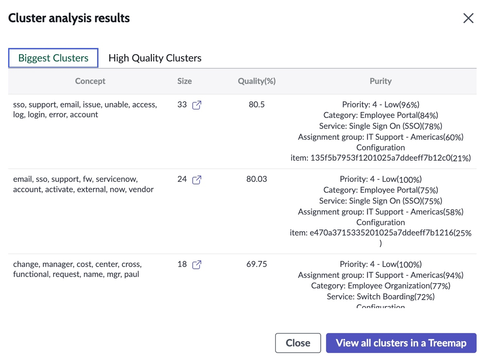

41. Enquanto a visualização inicial mostra os **Biggest Clusters**, às vezes pode ser mais interessante analisar os **High Quality Clusters**, ou seja, clusters onde as **short descriptions** são mais semelhantes. Clique na aba **High Quality Clusters**.

  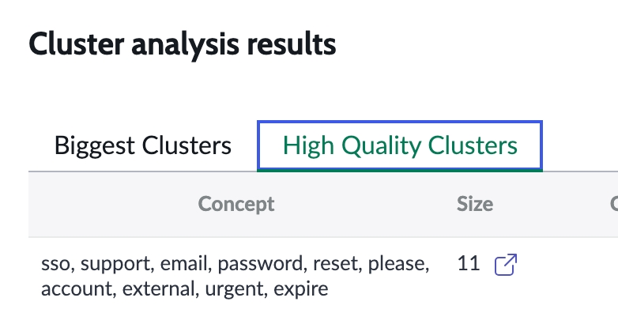

42. Na visualização **High Quality Clusters**, observe que o segundo conceito de cluster possui 14 incidentes relacionados a problemas ao atualizar o endereço de email no perfil.

  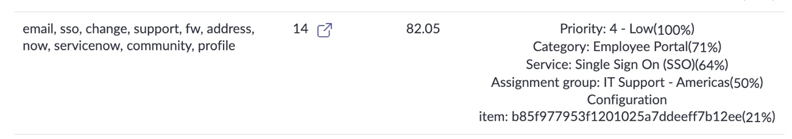

43. Clique na caixa com a seta à direita do número 14 para abrir a lista desses registros.

  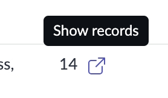

44. Após revisar a lista, feche a aba do navegador correspondente.  
**NÃO FECHE A ABA QUE CONTÉM O PROCESS MINING WORKSPACE.**

45. Clique em **Close** para fechar a janela de resultados de **Cluster analysis**.

  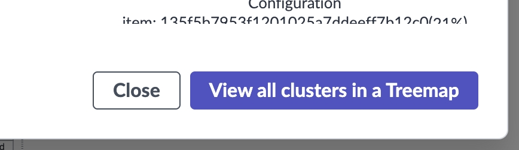

46. Atualizar o endereço de email em um perfil é algo que deveria ter uma opção de **self-service** (um item de catálogo, uma conversa com **virtual agent** etc.). Talvez essas opções já existam, e só precisamos promovê-las mais, evitando que pessoas abram incidentes por email, pois isso aumenta o tempo de resolução em uma semana. Agora que identificamos uma oportunidade de melhoria, precisamos capturá-la para garantir o acompanhamento. Para isso, vamos vinculá-la a uma **Continual Improvement Initiative** existente. Na barra roxa, no canto direito da tela, abra o painel **Improvement Initiatives**.

  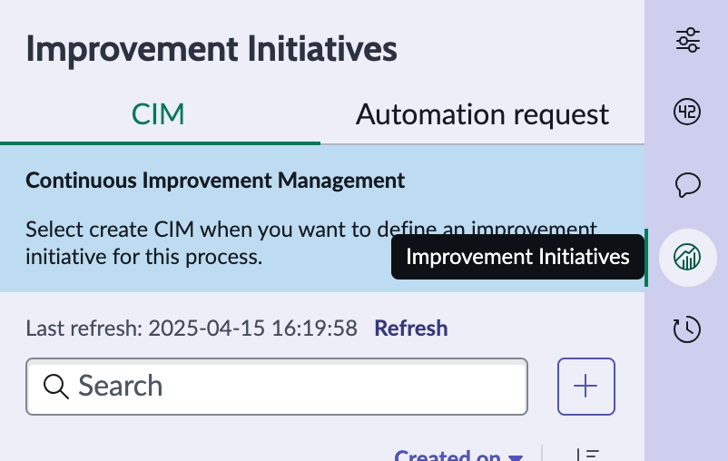

47. Na prática, provavelmente criaríamos uma nova **Improvement Initiative**, mas, para este laboratório, vamos vincular a uma já existente. Clique no botão **+** à direita da caixa de pesquisa e selecione **Link existing CIM**.

  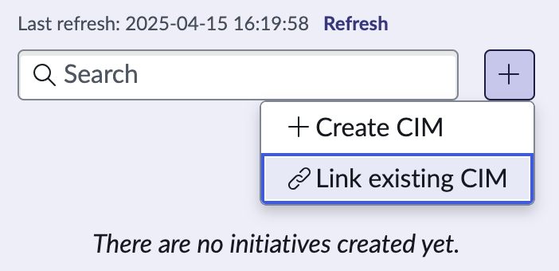

48. Na janela **Link existing CIM**, marque a caixa para **CIM0001004 – Improve average time to resolve an incident by 25%**. Em seguida, clique em **Link** no canto inferior direito da janela.

  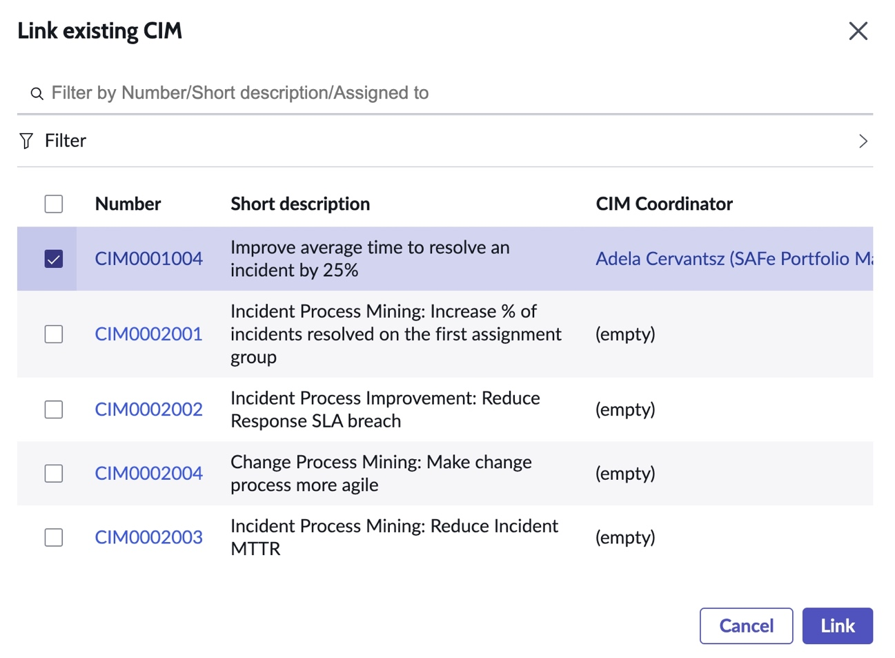

49. Pronto! Você vinculou a oportunidade de melhoria descoberta a uma **Improvement Initiative**. Caso não conheça o **Continual Improvement Management**, trata-se de um aplicativo da plataforma ServiceNow que permite capturar, acompanhar e priorizar iniciativas de melhoria, além de todas as tarefas e métricas associadas. A integração direta com o **Process Mining Workspace** agiliza o processo de melhoria contínua. Se aparecer uma janela amarela de notificação, clique no **X** para fechá-la.

  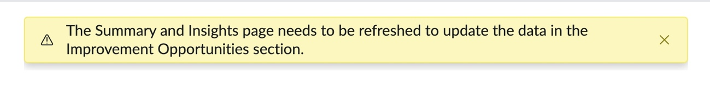

50. Você concluiu a análise inicial dos canais de intake! Também conheceu diversas funcionalidades investigativas disponíveis no **Analyst Workbench**.  
Mas ainda há mais para explorar — siga para a próxima seção para aprender uma técnica útil na identificação de oportunidades potenciais de automação.

