As organizações buscam constantemente automatizar tarefas manuais para reduzir custos operacionais, aumentar a eficiência e liberar colaboradores para atividades estratégicas ou de maior valor.

**Process Mining** pode ser uma solução valiosa nessa busca, ajudando a identificar oportunidades de automação.

Veja como utilizar o **Process Mining** para identificar oportunidades de automação ou até mesmo futuras ferramentas/skills para agentes de IA.

## Como identificar oportunidades de automação

1. **Resete o Analyst Workbench** clicando em **Clear all** no canto superior direito do painel **Breakdown Filters**. Familiarize-se com esse botão.

  

    Neste caso de uso, utilizaremos um **Transition filter** para isolar trabalhos que levam mais de 2 minutos, mas menos de 30 minutos, para passar do estado **In Progress** para **Resolved**. A lógica é: se leva menos de 2 minutos, provavelmente já está automatizado; se leva mais de 2 e menos de 30, ainda não está, mas não envolve solução de problemas complexos — ou seja, há oportunidades de self-service ou automação nesse subconjunto de dados.

    Vamos usar apenas a visualização **State** do process map para este caso.

2. Clique em **Model Options** na barra roxa à direita da tela para abrir o painel **Model Options**.

  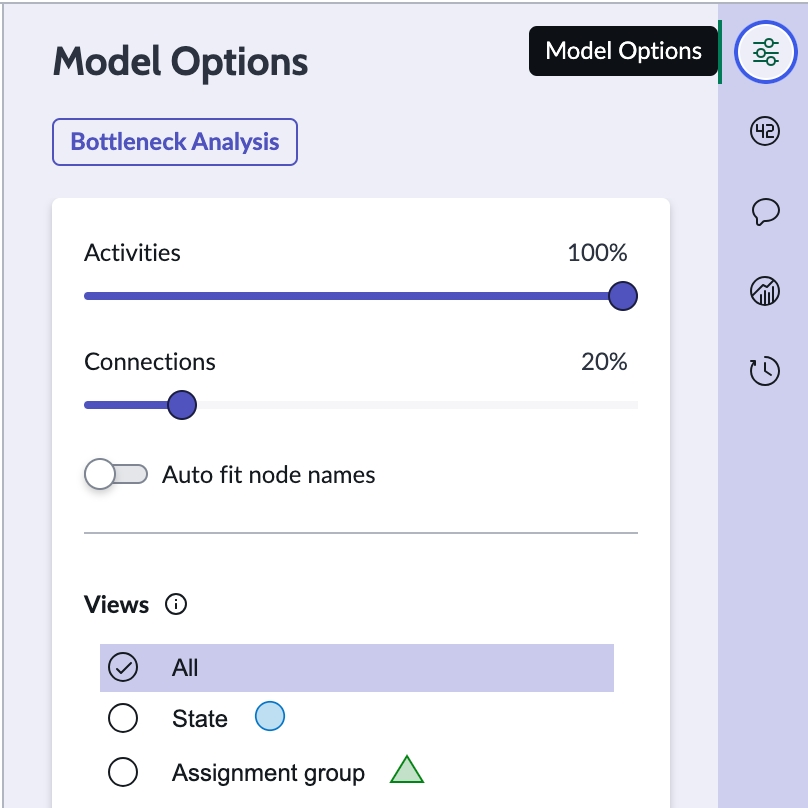

3. No painel **Model Options**, clique em **State view** para remover os nodes de **Assignment Group** do process map.

  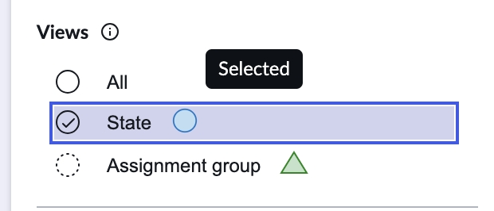

4. Ao contrário de relatórios e análises tradicionais, o **Process Mining** permite filtrar dados usando etapas do processo e o tempo entre elas. Clique em **Transitions** na seção **Advanced filters**, no canto inferior esquerdo da tela.

  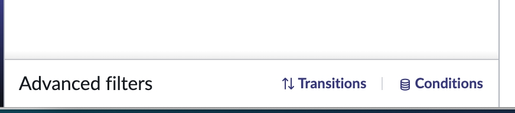

5. Na janela de **Transition Filters**, defina os seguintes critérios:
   - **State (Incident) is In Progress** – **Occurrence** é **First**.  
   Ou seja, buscamos situações em que o incidente entra no estado **In Progress** pela primeira vez. Certifique-se de que sua tela esteja igual à imagem abaixo.

  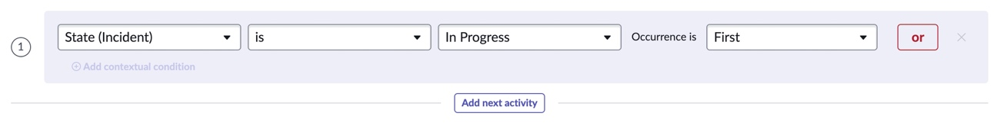

6. Clique em **Add next activity**.

7. Mantenha a opção **Directly followed by** (existem outras opções, como **Eventually followed by**, **Not directly followed by**, etc.).

  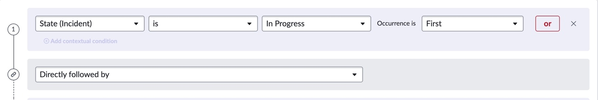

8. Em seguida, defina a condição para o passo 2 do filtro de transição:
   - **State (Incident) is Resolved** – **Occurrence** é **Last**.
    Ou seja, buscamos situações em que o incidente entra em **In Progress** (primeira vez) e, em seguida, é seguido diretamente por **Resolved** (última ocorrência).  
    Sua tela deve estar igual à imagem abaixo.  
    **Não se esqueça dos valores de Occurrence.**

  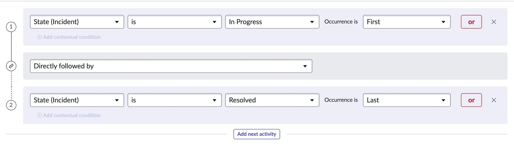

9. Agora que as etapas do processo estão configuradas, precisamos adicionar as restrições de tempo (entre 2 e 30 minutos para essa transição). Clique em **Add constraint** no painel **Constraints** no canto superior esquerdo.

  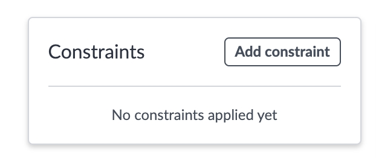

10. Defina os seguintes valores:
    1. **Start = 1**
    2. **End = 2**
    3. **Min Duration = Min 2**
    4. **Max Duration = Min 30**

    A seção de **constraints** deve ficar igual à imagem abaixo.

  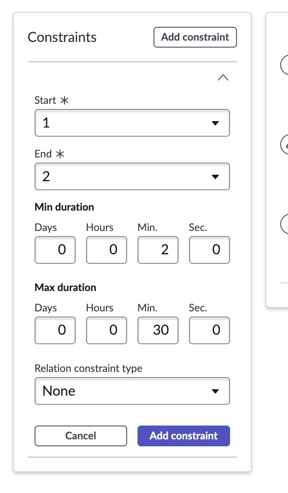

11. Clique em **Add constraint**

  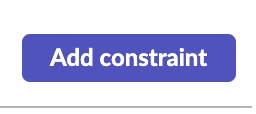

12. Clique em **Apply** no canto inferior direito da janela de **Transitions filter**.

  

13. O **process map** será filtrado para mostrar apenas os 143 incidentes que levaram entre 2 e 30 minutos para passar de **In Progress** para **Resolved**. Clique no **arc** entre **In Progress** e **Resolved** no mapa (deve exibir uma caixa com 143 e 11m).

  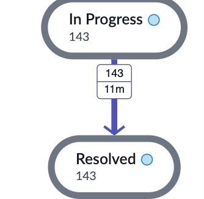

14. Na pop-up, você verá que a **median duration** desses incidentes é 9 minutos, e o histograma mostra a distribuição dos tempos entre 0 e 30 minutos.

  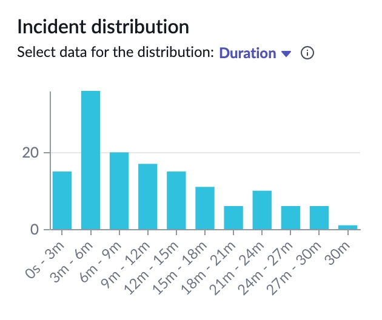

15. Role a pop-up para baixo, expanda a seção **Investigate** e clique em **Show records** para abrir a lista de registros.

  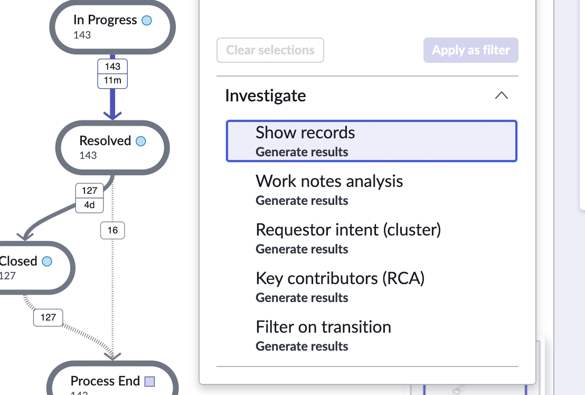

    Existem outras opções investigativas. Não as pré-processamos neste laboratório, mas você já viu em seções anteriores como funcionam. Caso clique nelas, será preciso aguardar os resultados, o que pode atrasar seu progresso.

    Esse conjunto de filtros que ajuda a identificar oportunidades de automação e self-service provavelmente será utilizado com frequência. Por isso, salve como um **filter set** para facilitar o acesso.  

16. No canto superior esquerdo da tela, localize a opção **Your filter sets** e abra-a.

  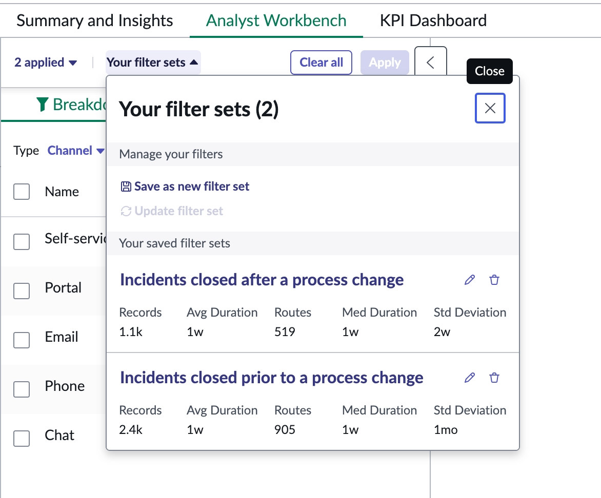

17. Clique em **Save as new filter set** no menu.

  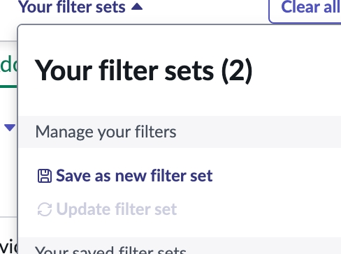

18. Na janela **Save new filter set**, digite **Potential automation and self-service opportunities** e clique em **Save** no canto inferior direito.

  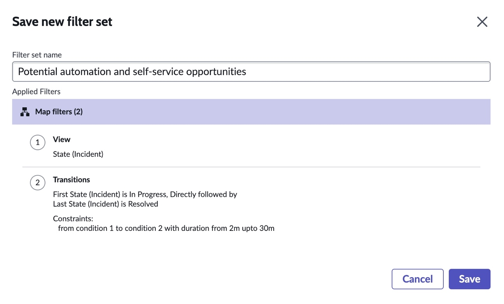

19. Após 5 segundos, uma caixa amarela de notificação aparecerá — feche-a.

  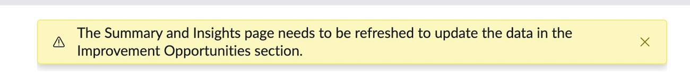

20. Na mesma área da tela onde estava **Your filter sets**, agora aparecerá **Potential automation a…**. Clique para abrir o menu de **Your filter sets**.

  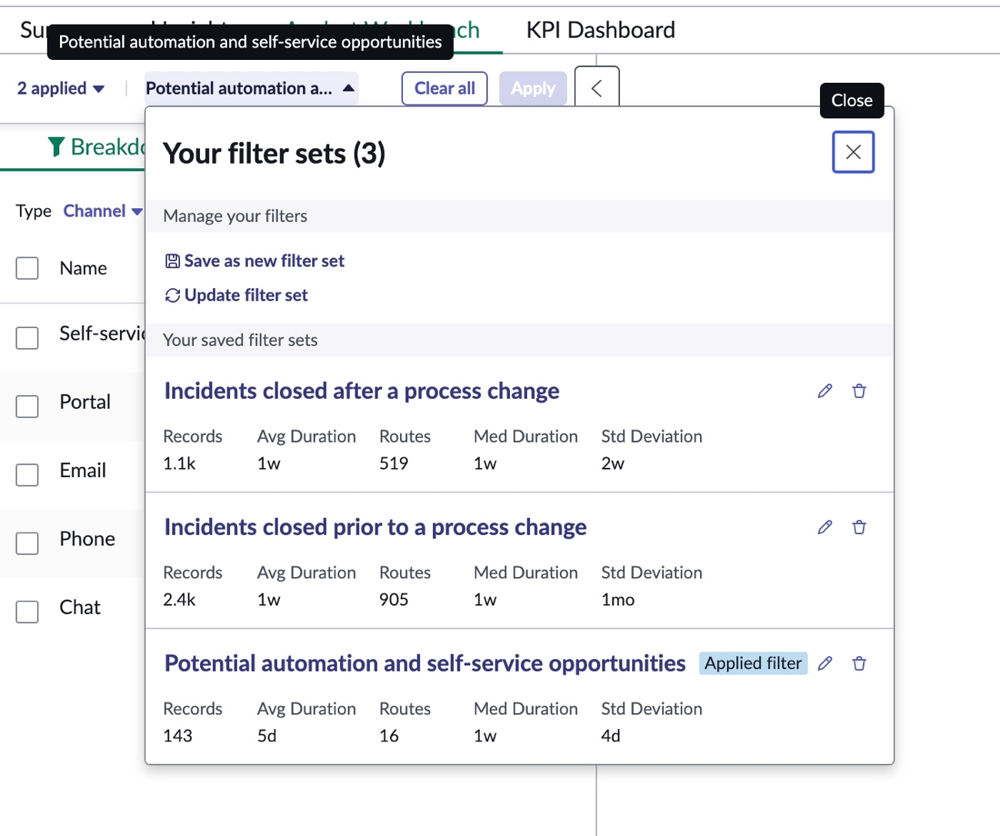

    Você verá o filter set **Potential automation and self-service opportunities**. Ele exibe estatísticas resumidas dos 143 registros que atenderam aos critérios e permite aplicar rapidamente esses mesmos filtros nas próximas análises do projeto.

Parabéns! Agora você sabe como usar o **Process Mining** para identificar oportunidades de automação e self-service.

No próximo laboratório, usaremos **filter sets** para entender o impacto de uma mudança de processo.