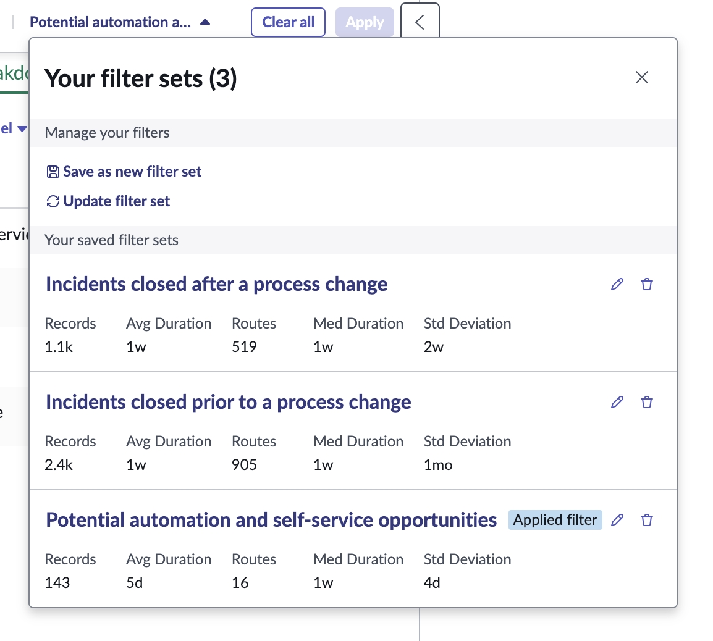
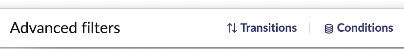
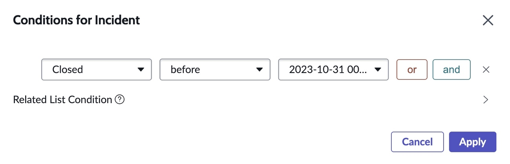
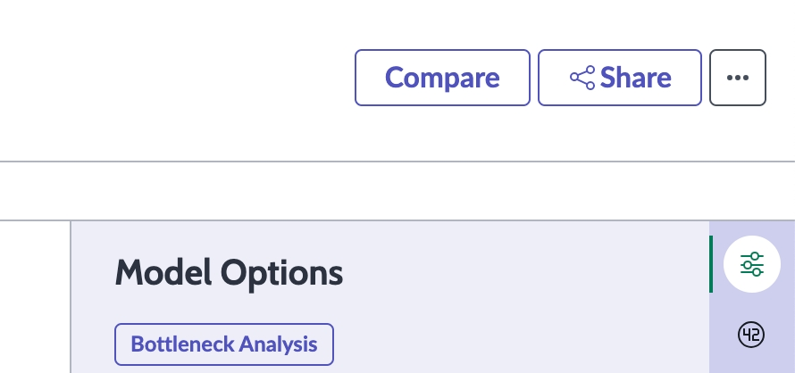
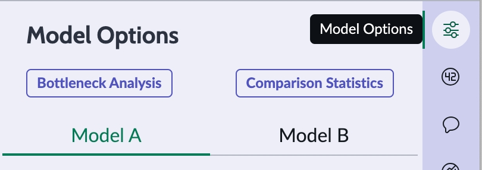
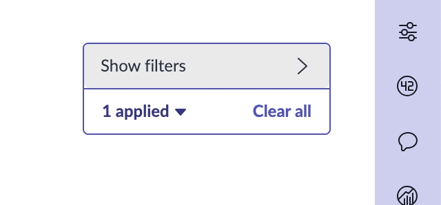
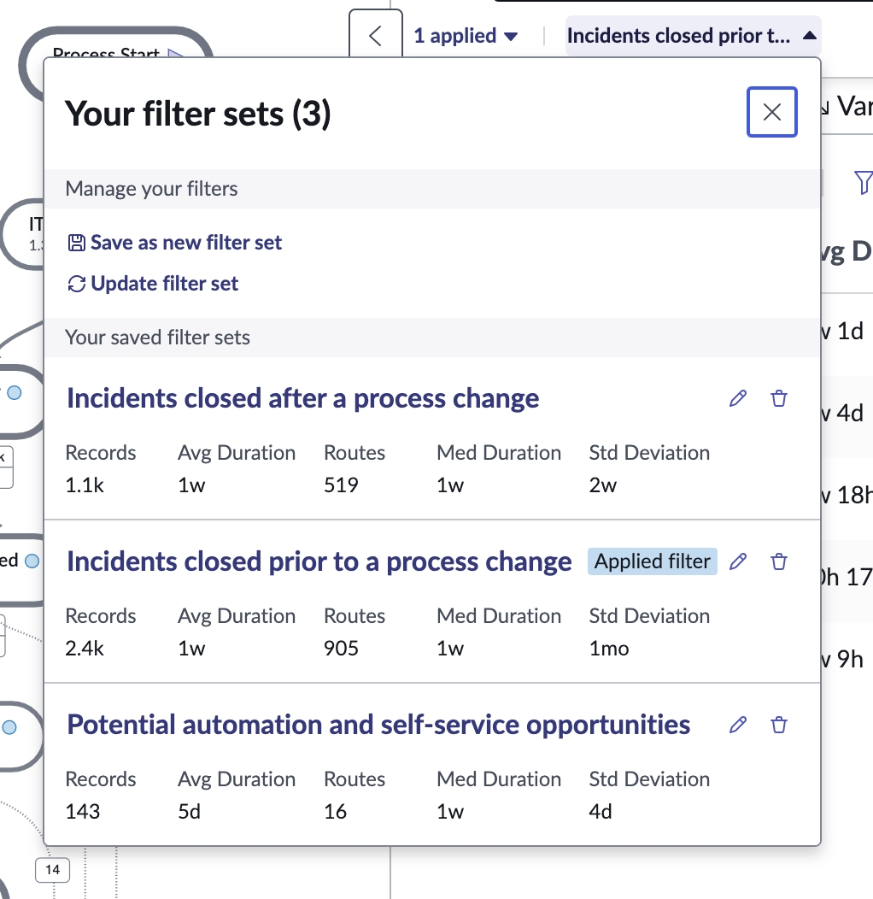
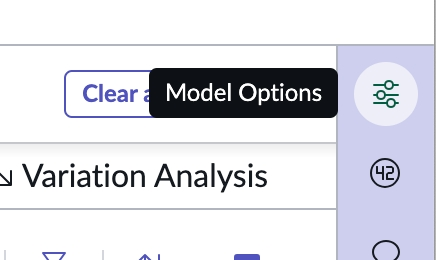
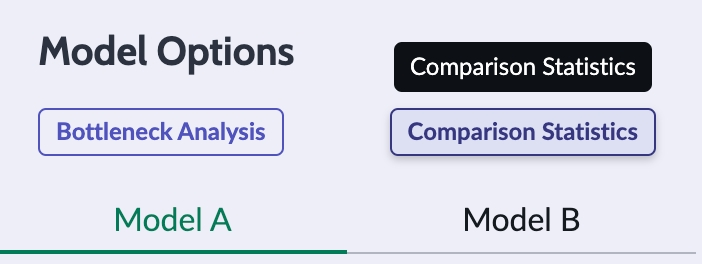
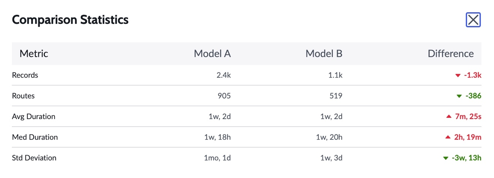

Neste laboratório, você analisará uma mudança implementada em um processo de gestão de incidentes. Antes da mudança, os chamados passavam pelas etapas tradicionais (New → Assigned → In Progress → Resolved → Closed), com grande variabilidade e rotas diferentes. Após a mudança, a etapa de atribuição manual foi removida, e os chamados passaram a ser automaticamente direcionados para as equipes, resultando em um fluxo mais direto.  
Utilizaremos o Process Mining para entender o impacto real dessa alteração nas métricas e no comportamento do processo.

O **Process Mining** foi desenvolvido para proporcionar visibilidade sobre oportunidades de melhoria nos processos.  
Mas, após implementar melhorias, como saber se elas tiveram o impacto esperado? Mudanças de processo podem afetar outras áreas?  
Você pode usar **KPIs** para acompanhar o impacto em métricas como tempo de fechamento e satisfação, mas para identificar efeitos adversos em outras áreas será preciso usar o **Process Mining**.

O **Process Mining** permite realizar comparações lado a lado e visualizar como o processo se comporta antes e depois de uma mudança, ajudando a identificar o que está funcionando e o que não está.

## Como comparar antes e depois de uma mudança de processo

Você deve estar com o menu de **filter sets** aberto.

1. Observe que há dois filter sets adicionais na lista. Selecione o filter set **Incidents closed prior to a process change**.

  

2. Na seção **Advanced filters** no canto inferior esquerdo da tela, clique em **Conditions**.

  

3. Na janela **Conditions**, observe que filtramos todos os incidentes fechados antes de **2023-10-31** (uma data hipotética de implementação da mudança de processo).

  

4. Clique no **X** no canto superior direito da janela para fechá-la.  
**Não clique no botão Apply.**

5. No canto superior direito da tela do workspace, clique em **Compare**.

  

6. Isso dividirá o workspace em duas partes.
Clique em **Model Options** na barra à direita para ocultar o painel **Model Options** (se estiver aberto).

  

7. Clique em **Show filters** no canto superior direito do lado direito da tela.

  

8. Abra o menu de **filter sets** no lado direito da tela clicando em **Incidents closed prior t…**

  

9. Selecione a opção **Incident closed after a process change**.  
Agora, à esquerda da tela (**Model A**) estarão os incidentes fechados antes da mudança de processo e, à direita (**Model B**), os incidentes fechados após a mudança.
Para obter um resumo do impacto e diferenças entre as métricas, abra o painel **Model Options** clicando em **Model Options** no lado direito.

  

10. Clique em **Comparison Statistics** no painel **Model Options**.

  

11. Uma janela de **Comparison Statistics** será exibida, mostrando as diferenças entre **Model A** e **Model B** (processo antes e depois da mudança).

  

12. Use o **X** para fechar a janela de **Comparison Statistics**.
Acabamos de usar essa funcionalidade para comparar dois períodos distintos de dados, mas ela também pode ser utilizada para comparar diferentes regiões, categorias, variantes de rotas ou versões de um projeto (ex: este mês vs. mês anterior).  
É um recurso poderoso do **Analyst Workbench**.

## 📝 EXERCÍCIO: Análise de Processos – Cenário Antes e Depois

Imagine que você trabalha na **área de operações** de uma empresa que utiliza o **ServiceNow** para gerenciar incidentes de TI.

Nos últimos meses, foram observadas reclamações recorrentes relacionadas a:

- ⏱️ **Lentidão na resolução** de chamados  
- 😩 **Sobrecarga da equipe de atendimento**  
- 🔁 **Alta variabilidade** nos caminhos seguidos por cada incidente

Para lidar com esses desafios, foi implementado um **conjunto de melhorias no processo**, com o objetivo de promover:

- 📏 **Padronização**
- 🤖 **Automação**
- ⚙️ **Eficiência operacional**

---

### 🔧 As principais mudanças implementadas foram:
:::tip
- Eliminação da etapa de **atribuição manual**, substituída por um sistema de **direcionamento automático** de chamados por meio do [AWA (Advanced Work Assignment)](https://www.servicenow.com/docs/bundle/yokohama-servicenow-platform/page/administer/advanced-work-assignment/concept/awa-overview.html).

- Expansão das opções de **autoatendimento**, com destaque para a utilização de **Virtual Agent** e articulação com a **base de conhecimento (KB)**.

- Redesenho da jornada de entrada, com adoção de **interfaces mais estruturadas**, integração com o Virtual Agent e estratégias de redirecionamento orientadas à **resolução autônoma**.

- Ajuste nos critérios de análise, excluindo chamados de **baixa complexidade** que não exigem ação humana, como aqueles resolvidos automaticamente ou via autoatendimento.
:::

Agora, com base nessas mudanças, vamos investigar como o comportamento do processo foi alterado — e o que isso pode nos revelar.

---

### 📈 Atividade de Observação

Abaixo estão os fluxos de processo e as métricas dos modelos **Model A (antes)** e **Model B (depois)**.  
Com base nas informações visuais e nos dados apresentados, **quais conclusões você consegue tirar sobre as mudanças realizadas no processo?**

---

### ✏️ Suas observações:

- 
- 
- 

---

import RevealAnswer from '@site/src/components/RevealAnswer';

## 📌 Hipóteses e Discussão (revelar após análise)

<RevealAnswer />

---

Avance para o caso de uso final (e um dos nossos favoritos) deste laboratório: **Multihop Analysis**.

