Ao projetar um workflow, buscamos completude e eficiência para garantir uma experiência ótima para todos.  
Parte desse design inclui a possibilidade de reatribuir tarefas ao time apropriado para garantir o sucesso da conclusão.

Mesmo que reatribuições façam parte do processo, elas consomem tempo e impactam a produtividade. Qualquer ação para reduzir o número de reatribuições, ou torná-las mais eficientes, é positiva.

O primeiro passo para melhorias é entender o que está acontecendo.

Muitos já foram questionados:  
*“Quem está segurando os tickets por mais tempo?”* (relatório de “finger pointing” ou, se preferir, relatório de oportunidade de melhoria)

Ou:  
*“Onde meus incidentes ou casos estão sendo ‘ping-pongados’ entre equipes?”*

O **Process Mining** pode ajudar a responder essas perguntas comuns.

## Como realizar Multihop Analysis

1. Clique em **Clear all** no canto superior esquerdo da tela para resetar o **Analyst Workbench**.

  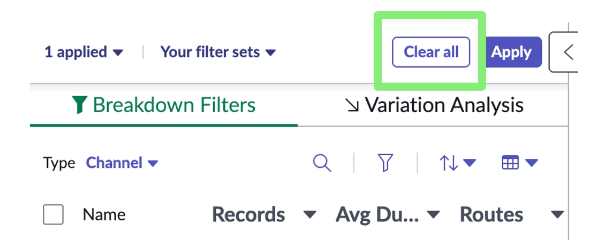

2. Clique em **Close comparison** no canto superior direito da tela.

  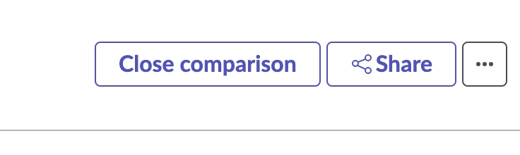

3. Abra o painel **Model Options** no lado direito da tela, se ainda não estiver aberto.

  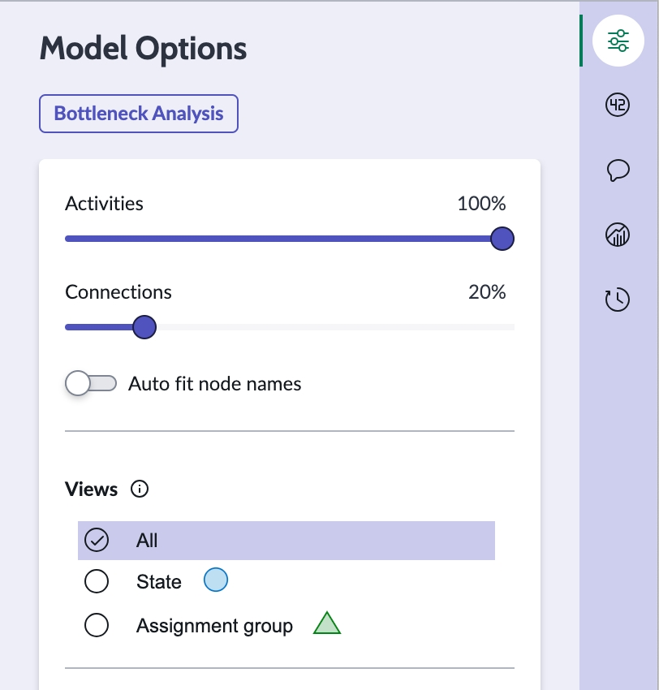

4. Clique em **Assignment group view** para remover os nodes de **state activity** do mapa.

  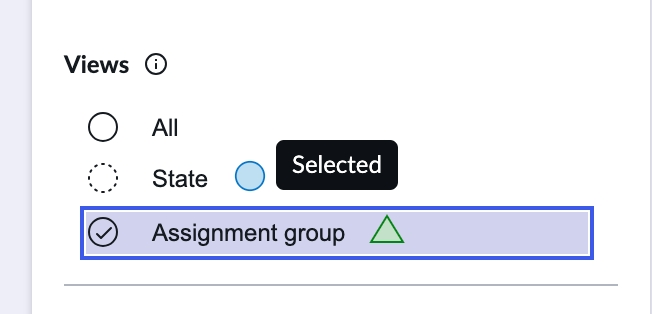

5. Arraste o **Connections slider** no painel **Model Options** para 70%.

  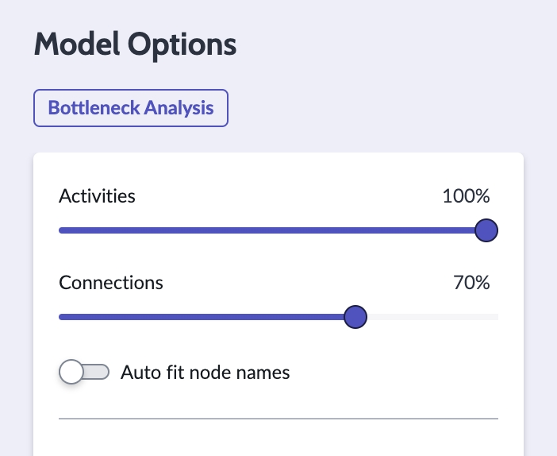

6. Neste ponto, o **process map** estará bastante carregado, com muitos trabalhos sendo transferidos entre equipes. Escolha um **arc** para clicar e visualizar as informações. Se encontrar o arc de **IT Support – Americas** para **IT Support – APAC** com 47 incidentes (tempo médio de um dia), utilize esse.

  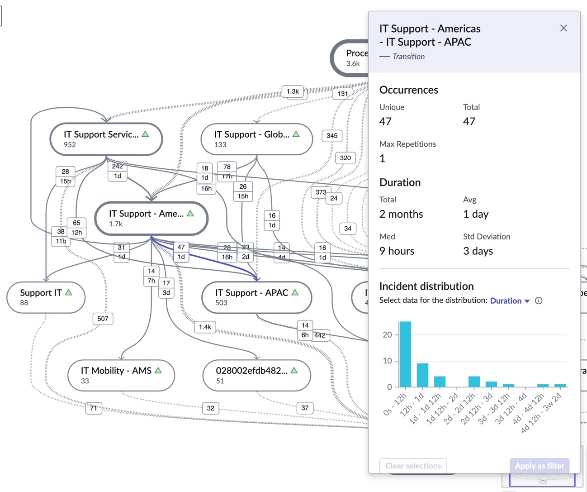

7. Com tantas rotas diferentes, como identificar rapidamente áreas problemáticas?  
A funcionalidade **Variation Analysis** pode ajudar.  
Clique em **Variation Analysis** no topo do painel à esquerda da tela.

  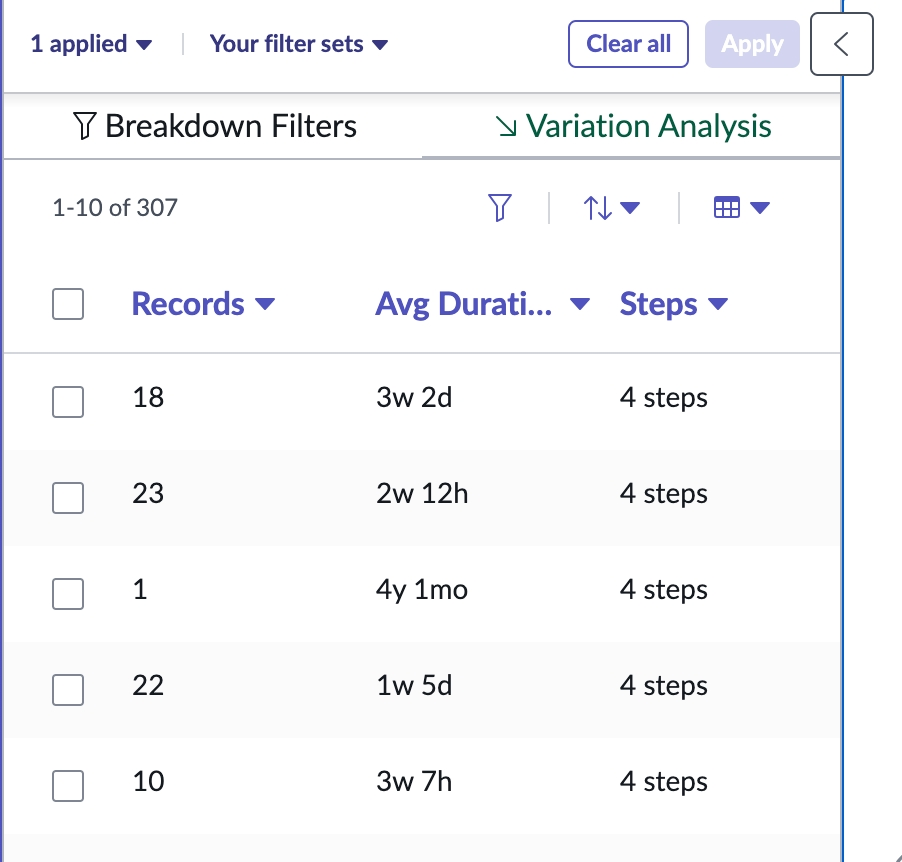

8. **Variation Analysis** mostra todas as combinações de rotas, o volume de registros por rota, a duração e o número de etapas. Passe o mouse sobre a lista de combinações de rotas para visualizar a rota correspondente na parte inferior da tela.

  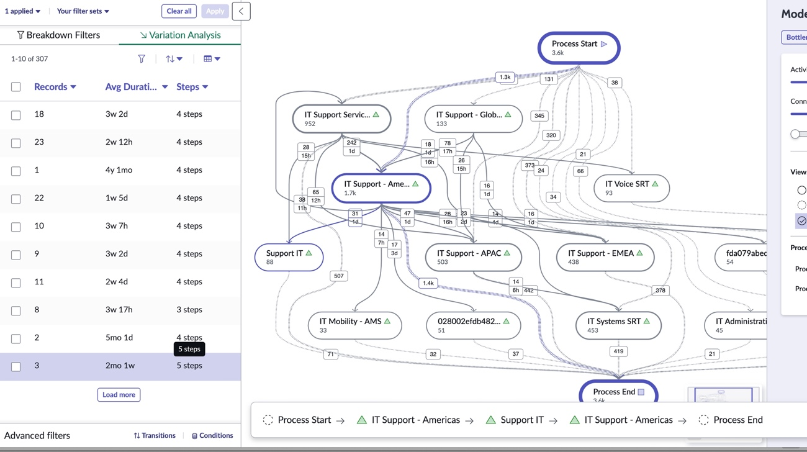

9. Uma análise possível é buscar situações em que 3 **Assignment Groups** participam até o fechamento do trabalho, para verificar se é possível eliminar etapas ou direcionar diretamente para o time correto.  
Para isso, filtre a lista do **Variation Analysis** para mostrar apenas rotas com mais de 4 etapas (**Process Start** e **Process End** contam como etapas). Clique em **filter routes** no painel **Variation Analysis**.

  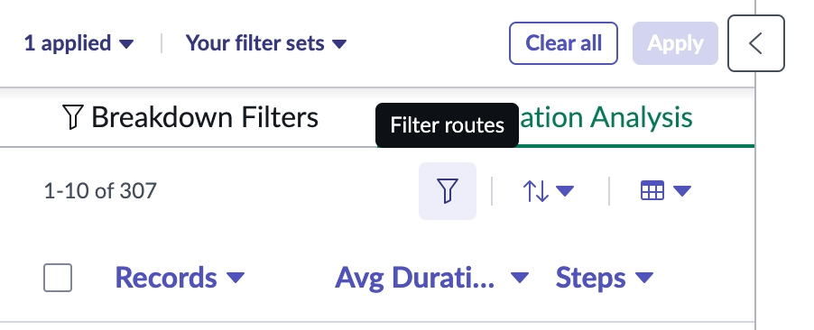

10. Na janela **Route filters**, defina o critério **Steps greater than 4** e clique em **Apply**.

  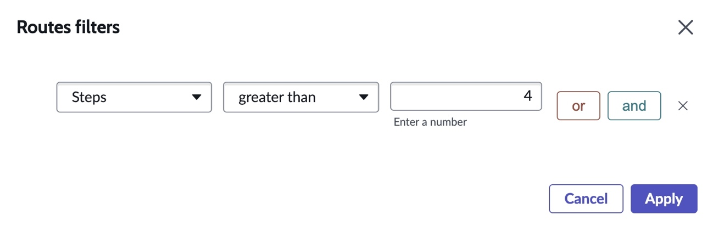

11. Nossa lista de rotas será filtrada para mostrar apenas rotas com mais de 4 etapas (ou 3 grupos). Ao passar o mouse sobre a lista, veja todas as combinações. Os dados de demonstração podem não ser tão interessantes quanto os seus.  
A primeira rota da lista deve ser 3 incidentes que foram de **IT Support Americas** para **Support IT** e depois de volta para **IT Support – Americas**, levando em média 2 meses e 1 semana.  
Mas quem está segurando o trabalho por mais tempo nesse cenário?  

12. Clique no checkbox para essa rota.

  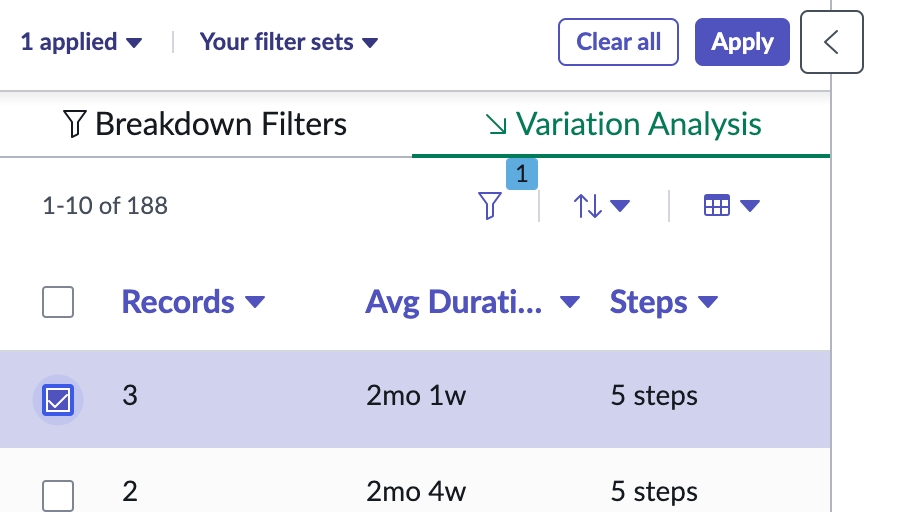

13. Clique em **Apply**.

  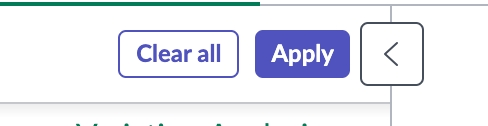

14. Agora, vemos apenas esses 3 incidentes: inicialmente vão para **IT Support – Americas** (que mantém por 2 dias em média), depois para **Support IT** (que mantém por 2 meses em média), antes de retornar para **IT Support Americas**. Assim, identificamos quem está segurando os tickets por mais tempo.

  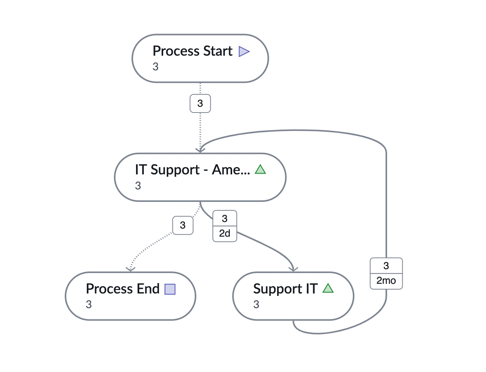

15. Obviamente, os dados de demonstração são limitados, mas fica clara a utilidade dessa análise.  
Recomendamos que você realize esse mesmo procedimento com seus próprios dados de processo, usando os **Process Mining Evaluation Projects** já ativados em sua instância.  
Use este [tutorial](https://www.servicenow.com/community/process-mining-blog/how-to-use-the-process-mining-evaluation-project-in-your/ba-p/3214970) como guia.

---

**Parabéns! Você completou os 4 casos de uso do Lab 2.**  
Agora você tem conhecimento e várias técnicas que pode aplicar assim que retornar à sua própria instância.

No **Lab 3**, criaremos nosso primeiro projeto de **Process Mining**.