Certo, agora você viu a incrível visibilidade que o Process Mining pode proporcionar e como você pode usar essa visibilidade para descobrir oportunidades de melhoria de processos.

Mas quão difícil é começar? A pergunta deveria ser quão FÁCIL é começar e você está prestes a descobrir como é fácil criar um projeto de Process Mining.

1. Você ainda deve estar no Process Mining Workspace, mas se por algum motivo não estiver, localize o menu Workspaces no topo da tela e selecione o Process Mining Workspace.

  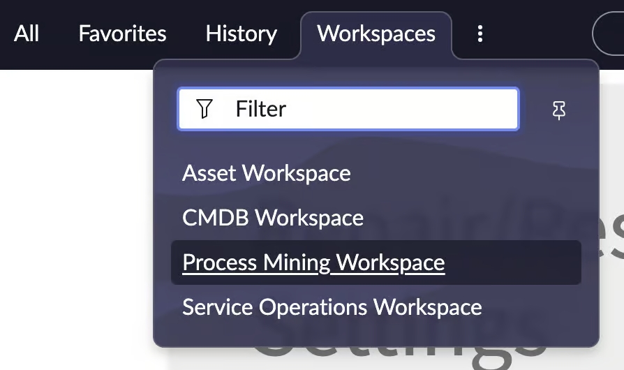

2. Se você já estiver no Process Mining Workspace, clique na aba “Process projects”.

  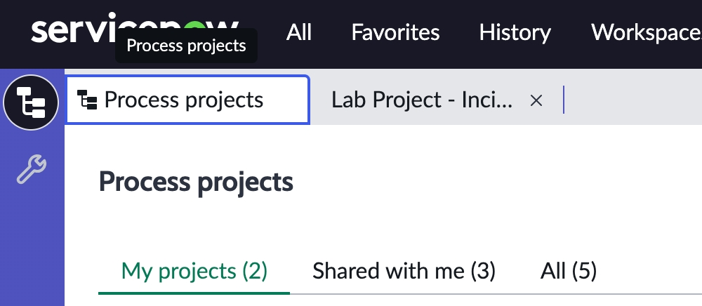

3. No canto superior direito da página Process projects, localize e clique no botão “Create New Project”.

  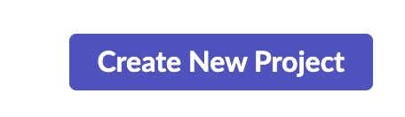

4. Você será direcionado para a Guided Setup Experience. Na página Set objectives, insira os seguintes valores:

    1. Name – My first Process Mining project
    2. Short description – Wow! This is easy
    3. Table – Incident

  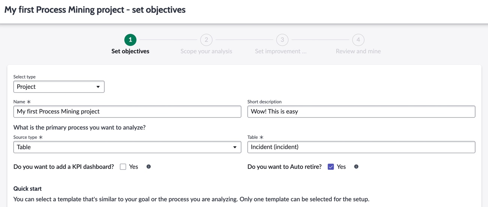

5. Existem várias outras opções que não teremos tempo para cobrir hoje neste laboratório introdutório. Você também notará que há bastante conteúdo de suporte disponível na seção de ajuda para quando você voltar para casa. Clique no botão Create project no canto inferior direito da tela.

  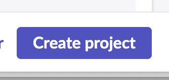

6. Na seção Scope your analysis faremos a maior parte da configuração. O primeiro passo é aplicar alguns filtros para extrair apenas os dados que nos interessam. Clique no link “Filter conditions” no menu à esquerda.

  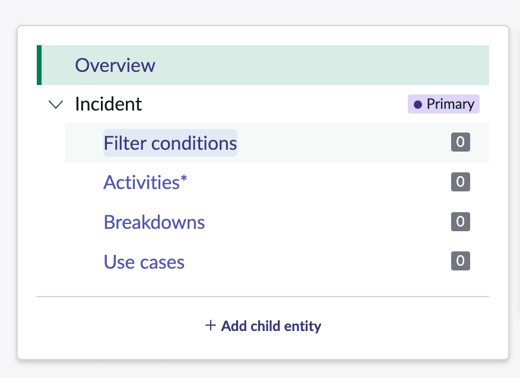

7. Adicionar condição de filtro é como adicionar condições para um relatório. Podemos querer isolar nossos dados de processo para uma determinada região, período de tempo, local, trabalho gerado por humanos vs trabalho gerado por máquinas. Isso depende de você e o que você inserir será baseado nos seus casos de uso e nas perguntas que está tentando responder. Para nossa situação hoje neste laboratório, não temos um caso de uso, então vamos adicionar apenas dois filtros. O primeiro será Active is false. O motivo é que o Process Mining é melhor usado para analisar trabalho que completou um processo; você poderia minerar trabalho aberto, claro, mas se quisermos melhorar um processo, vamos olhar para trabalho que já passou completamente pelo processo. O segundo filtro que adicionaremos será Channel is not Alert para focar nossa análise em incidentes gerados por humanos. Será um “And”, então preencha Active is false.

  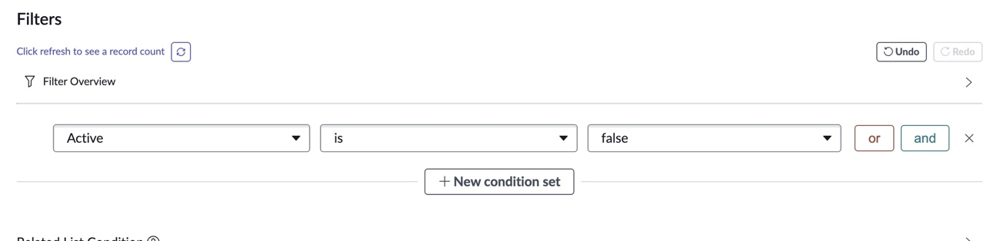

8. Clique no botão verde “and” à direita das condições

  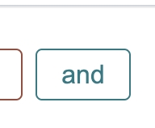

9. Depois preencha Channel IS NOT Alert

  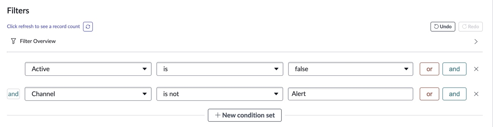

10. Clique no ícone “Click refresh to see a record count” para ver quantos registros atendem aos nossos critérios.

  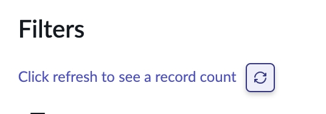

11. Agora que temos nossas condições, clique no botão Save no canto inferior direito. Você provavelmente precisará rolar a tela um pouco para baixo.

  

12. A próxima coisa que precisamos fazer é adicionar uma ou mais Activities ao nosso projeto. Lembre-se que uma Activity é o que está mudando ao longo do tempo, os passos no processo que queremos usar para nos ajudar a identificar oportunidades. Frequentemente são States ou Assignment Groups, mas há outras possibilidades dependendo das perguntas que você quer responder. Clique no link Activities no menu à esquerda.

  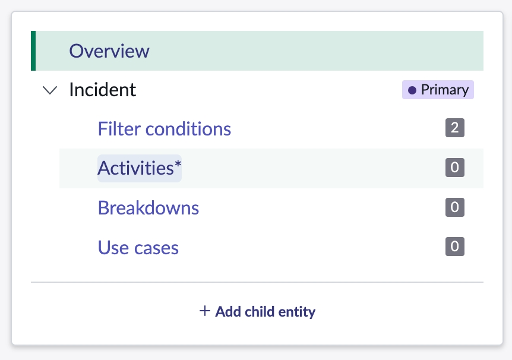

13. Clique no botão New no canto superior direito da lista de Activities.

  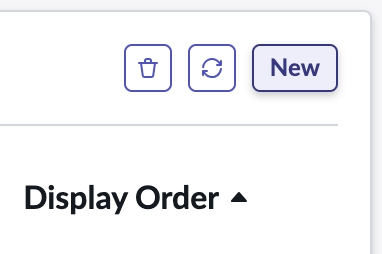

14. Clique no botão “Get recommend fields”. As recomendações podem ser configuradas por um SME de processo para facilitar que outros na organização criem seus próprios projetos de Process Mining.

  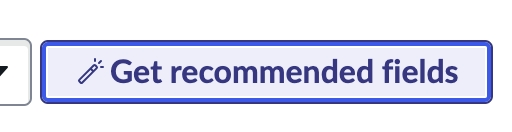

15. Na janela Select one of the recommended fields, selecione o campo State e clique no botão Select no canto inferior direito.

  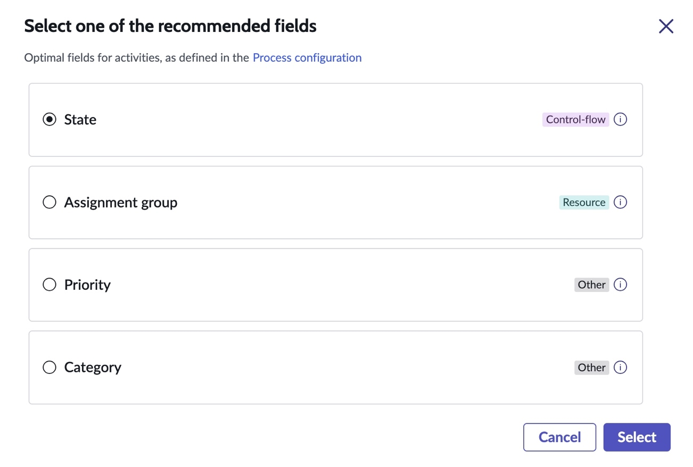

16. Clique no botão Save no canto inferior direito (pode ser necessário rolar a tela dependendo da sua resolução)

  

17. Poderíamos adicionar Activities adicionais como Assignment Group, como você viu no projeto que usamos para o Lab 2, mas para este laboratório manteremos apenas uma.

18. Agora vamos adicionar alguns Breakdowns para segmentar nosso mapa de processo. Clique em Breakdowns no menu à esquerda.

  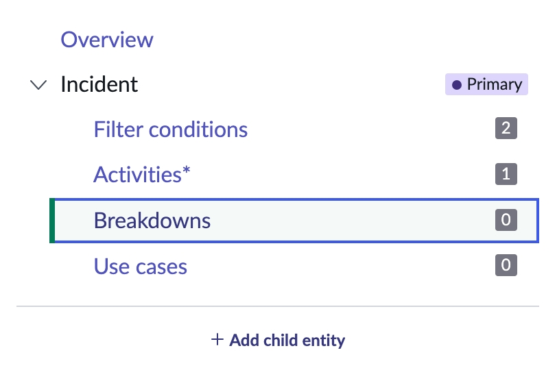

19. Clique no botão New no canto superior direito da lista de Breakdowns.

  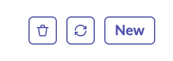

20. Na janela Select breakdown fields, você verá todos os campos disponíveis que pode usar como breakdowns. Note que você pode navegar para campos adicionais se necessário. Também verá campos recomendados no topo da lista. Novamente, esses foram configurados por SMEs de processo para ajudar usuários iniciantes. Selecione todos os campos recomendados (Assignment Group, Category, Contact Type, Priority, Reassignment Count). Depois clique no botão Save.

  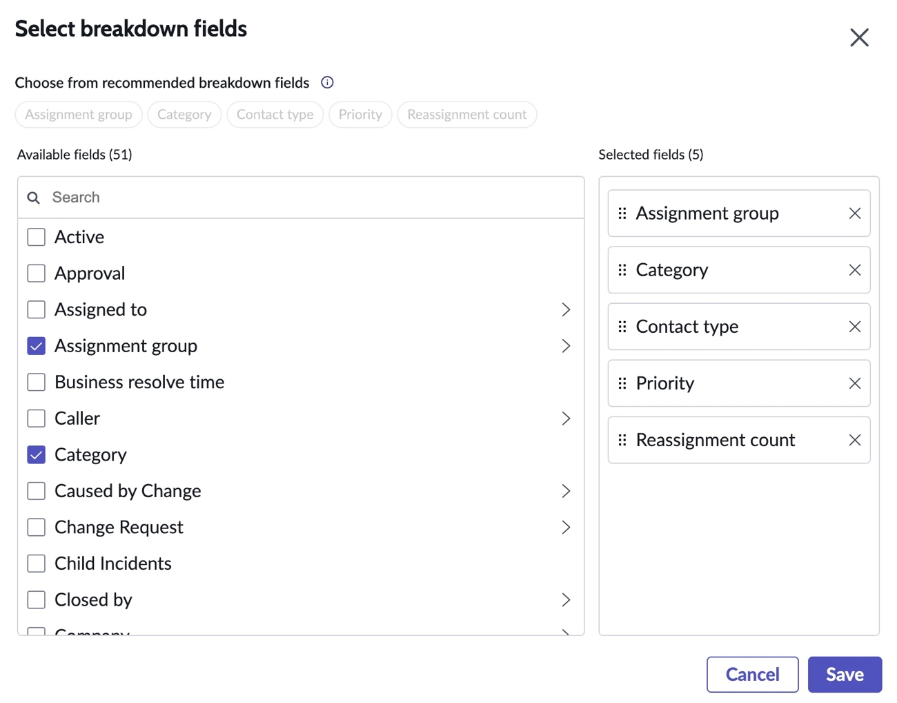

21. Poderíamos terminar aqui, mas claro que queremos adicionar algumas dessas poderosas Improvement Opportunities ao nosso projeto. Clique no botão Set improvement opportunities no canto inferior direito da tela.

  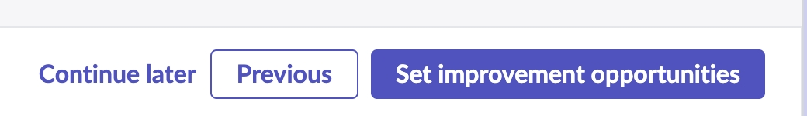

22. Na seção Set improvement opportunities, temos duas opções – podemos criar novas improvement opportunities ou adicionar existentes da biblioteca. O ServiceNow fornece content packs para alguns de nossos fluxos de trabalho padrão como ITSM, CSM e HR. Esses content packs vêm com algumas Improvement opportunities de exemplo que podem ser importadas. Vamos passar por ambos os cenários – adicionando da biblioteca e criando uma nova improvement opportunity. Clique no botão “Add from library” no centro da tela.

  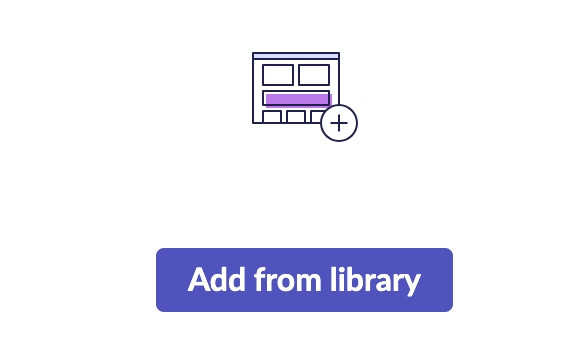

23. Na caixa de diálogo Library, clique na caixa de seleção ao lado de Message para selecionar todas as 5 improvement opportunities baseadas em regras. Depois clique no botão Apply to project.

  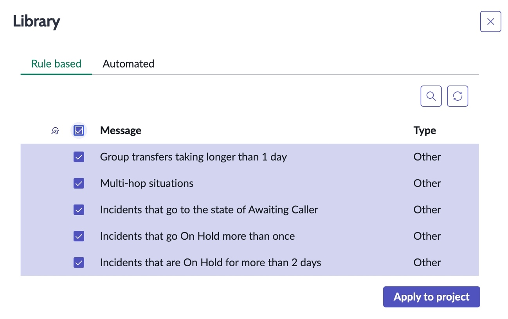

24. Você verá uma mensagem dizendo que apenas 3 das 5 foram adicionadas ao projeto. O motivo é que apenas 3 das 5 Improvement opportunities eram baseadas no campo State, que foi o que escolhemos como nossa Activity. As outras duas requerem Assignment Group como Activity para serem adicionadas, então a configuração não as importou. Feche as notificações.

  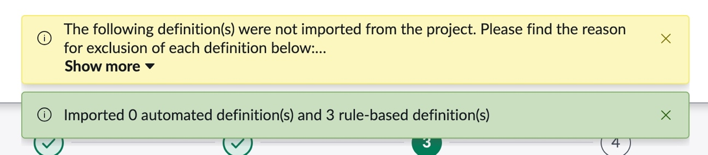

25. Agora vamos adicionar uma nova improvement opportunity automatizada. Clique no botão New no canto superior direito da lista de Improvement opportunities.

  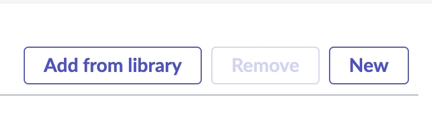

26. Observe todas as opções diferentes que você tem para escolher. Depois clique no botão Create no card Rework.

  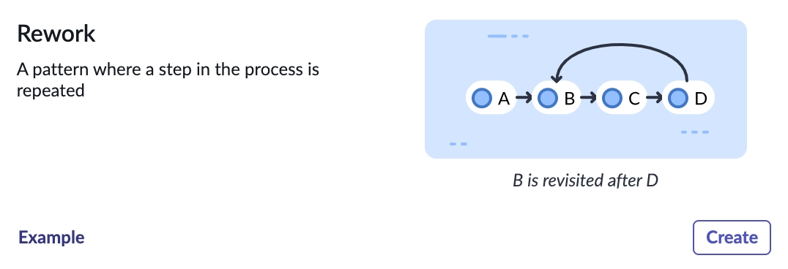

27. Preencha o formulário Rework com as seguintes informações:

    1. Name – Rework
    2. Pattern type – Rework
    3. Field to detect the pattern on – State
    4. Category – Quality

    Hoje deixaremos o campo Impacted KPI em branco, mas saiba que você poderia vincular essas Improvement opportunities a KPIs do Platform Analytics e assim poderíamos exibir essas Improvement opportunities em dashboards que contenham esses KPIs.

  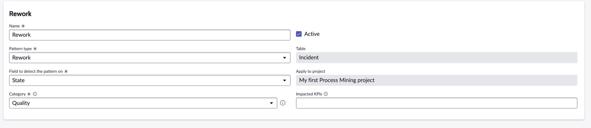

28. Clique no botão Configure no canto inferior direito da tela.

  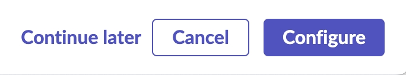

29. Existem algumas configurações adicionais que poderíamos fazer, mas vamos pular essas hoje. Clique no botão Save and exit no canto inferior direito da tela.

  

30. Clique no botão Review and mine no canto inferior direito

  

31. Você verá todos os detalhes de tudo que configuramos. Clique no botão Mine Project no canto inferior direito.

  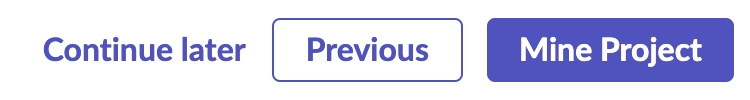

32. Na caixa de diálogo Mine project, você verá duas opções: Sample mine e Full mine. Sample mine minerará 3600 registros que atendem às condições que você configurou no projeto. Normalmente, isso é usado para testar seu projeto antes de minerar o conjunto completo de dados. Full mine obviamente executa a mineração completa. Para nosso laboratório, por favor use a opção Sample mine. A mineração ocorre em infraestrutura de machine learning compartilhada para proteger sua instância de qualquer impacto de performance. Portanto, se todos no laboratório minerarem ao mesmo tempo, podemos ter alguns atrasos se todos fizerem Full mine. **Clique em Sample mine.**

  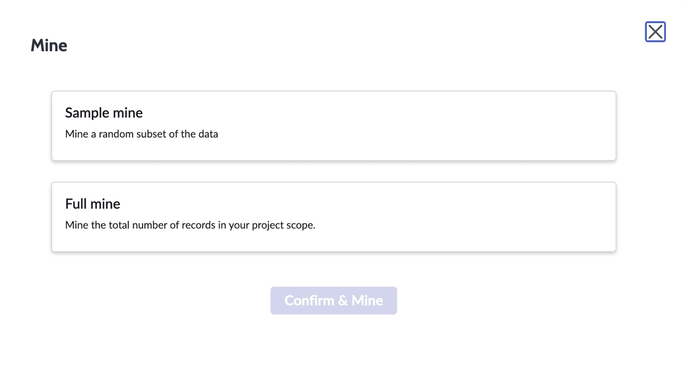

33. Clique no botão Confirm & Mine

  

34. Neste ponto, você precisará ser um pouco paciente. Como mencionado acima, a mineração ocorre na infraestrutura de machine learning no seu data center para proteger a instância de qualquer impacto de performance. Como não vamos misturar dados nessa infraestrutura, cada cliente espera sua vez para minerar.

35. Se você ficar travado no Passo 2 em 25% por um tempo, isso é comportamento esperado. **Se a sua organização já atualizou para a release Xanadu, este pode ser um bom momento para acessar sua própria instância e explorar o Evaluation Project no Process Mining Workspace.**

  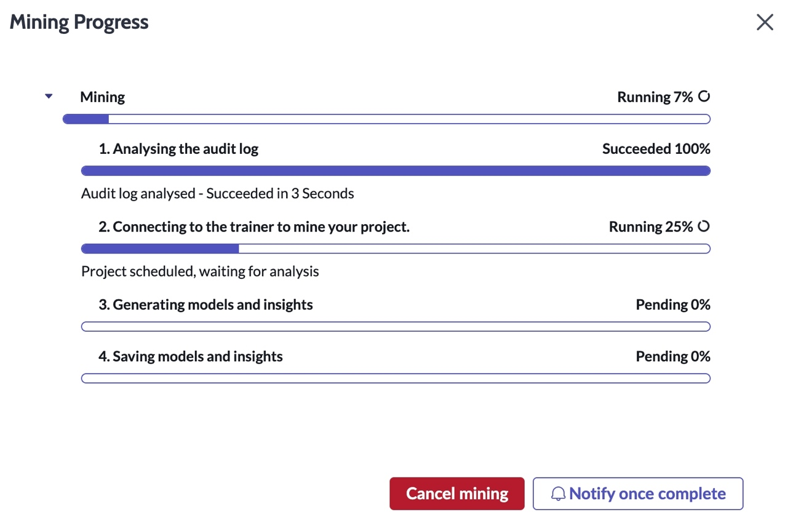

36. uando a mineração for concluída, clique no botão View in workspace.

  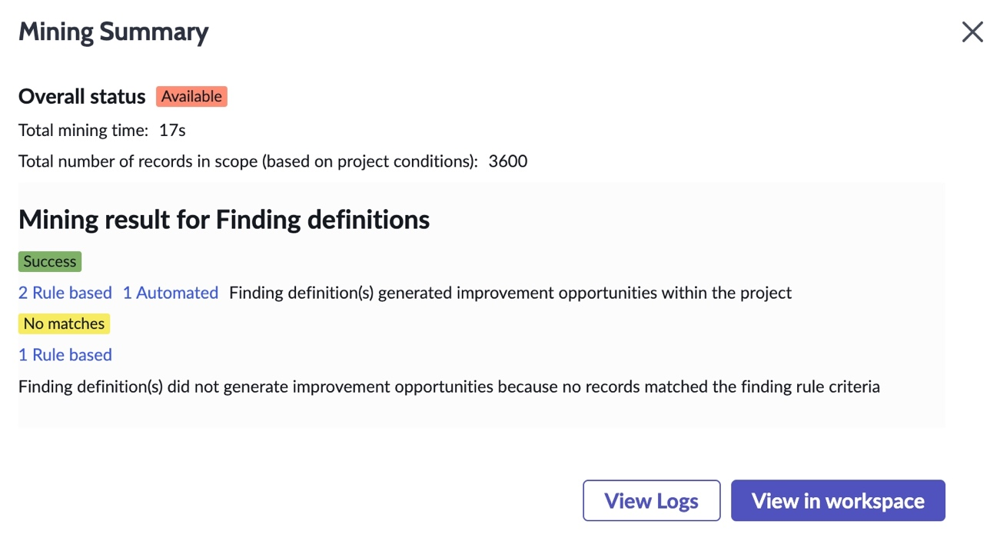

37. Neste ponto, você está familiarizado com muitas das opções na página Summary and Insights e no Analyst Workbench.

  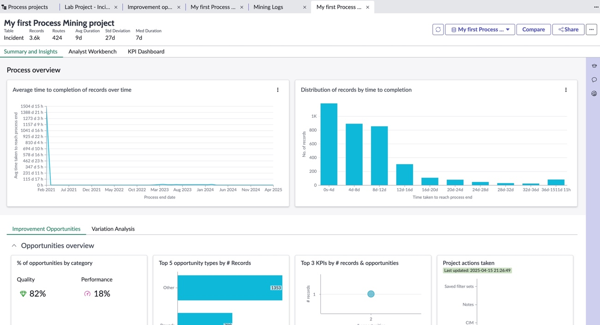

Parabéns! Você acabou de criar seu primeiro projeto de Process Mining. Essa facilidade e rapidez é o que deixa a maioria dos clientes super empolgados. Eles veem o poder do Process Mining e reconhecem que já possuem as habilidades necessárias para começar imediatamente após ativar os plugins.
