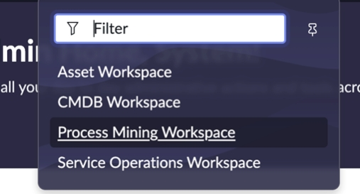
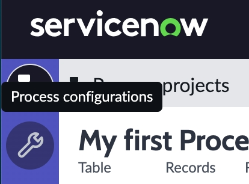
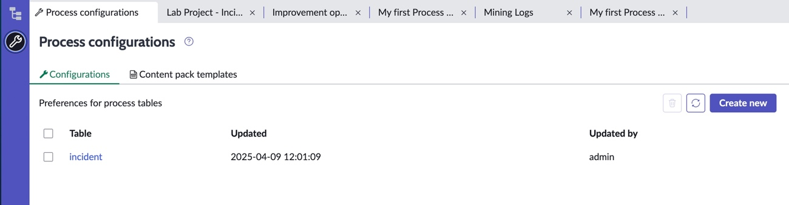
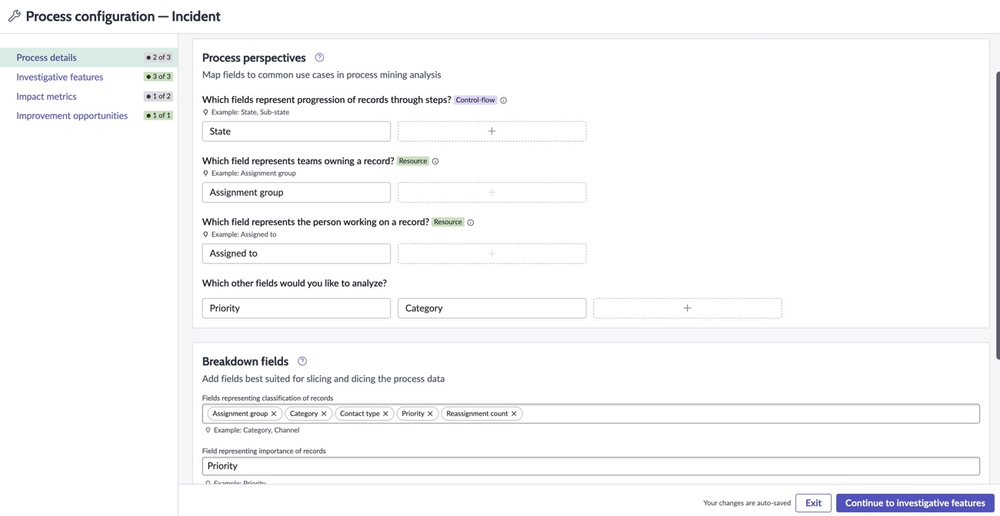
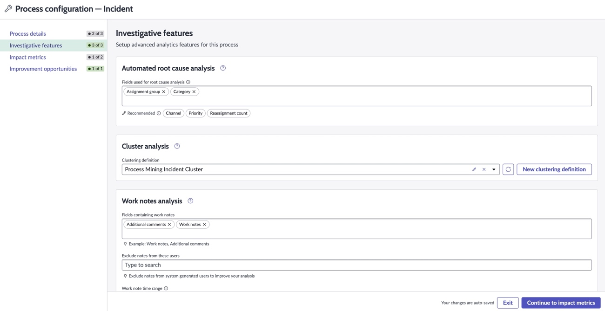
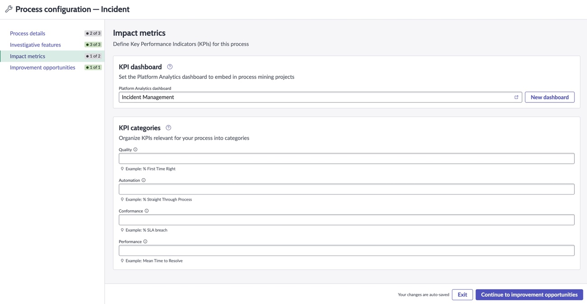
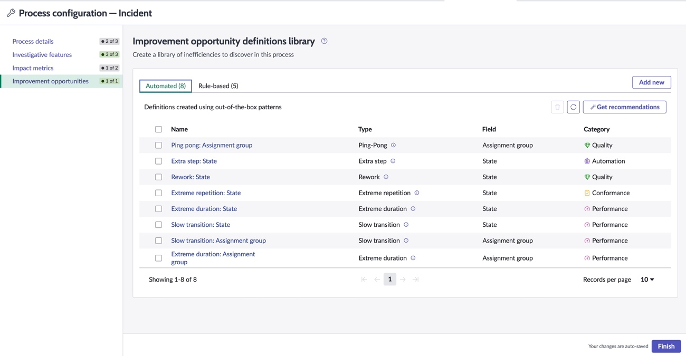

## Introdução

No último laboratório, criamos nosso primeiro projeto de Process Mining. Durante o processo de criação do projeto, utilizamos algumas recomendações e importamos algumas Improvement opportunities de uma biblioteca. Essas configurações e outras estão armazenadas nos registros de Process Configuration.

Cada tabela que você planeja minerar deve ter um registro de Process Configuration.

## Importância das configurações de processo

As configurações de processo incluem preferências que ativam recursos no espaço de trabalho de Process Mining e auxiliam na criação de projetos. Ter configurações completas permite que você crie projetos de forma independente e obtenha insights rapidamente, mesmo sem conhecimento prévio em Process Mining. Isso aumenta a escalabilidade do Process Mining na organização.

Se você não tiver uma configuração, não poderá criar um projeto e minerar com sucesso, além de perder configurações importantes para recursos como Root Cause Analysis, Cluster Analysis e Work notes analysis. Você também não terá Improvement opportunities para importar, precisando criá-las individualmente para cada projeto.

## Explorando o registro de Process Configuration

Neste laboratório, vamos explorar os diferentes componentes do registro de Process Configuration.

1. Você deve estar no Process Mining Workspace, mas se por algum motivo não estiver, localize o menu **Workspaces** no topo da tela e selecione o **Process Mining Workspace**.

  

2. No canto direito da tela, clique no ícone da chave inglesa para abrir a lista de Process Configurations.

  

3. Você verá a lista de registros de Process Configuration.

  

4. Clique no registro **Incident** para abri-lo.

## Seção Process Details

A seção **Process Details** é onde você descreve o processo, o que ajuda nas configurações futuras e melhora a qualidade da configuração e análise do projeto.

- **Process perspectives** fornecem diferentes pontos de vista para analisar um processo de negócio. Adicionar campos às process perspectives oferece recomendações para as definições de atividade mais adequadas ao criar um projeto. Além disso, as perspectivas são usadas na configuração para recomendar definições automatizadas e baseadas em regras de Improvement opportunities e campos para Root Cause Analysis automatizado.

- **Breakdown fields** são usados para segmentar o processo, permitindo a análise de subconjuntos específicos dos dados do processo. Configurar breakdown fields possibilita a análise de subconjuntos do processo, fornece recomendações para as segmentações mais adequadas em seus projetos e apresenta recomendações para campos de Root Cause Analysis automatizado nesta configuração.

- **Child tables** incluem dados de subprocessos dependentes importantes para a execução do processo principal. Analisar child tables ajuda a identificar ineficiências em subprocessos que impactam o desempenho do processo principal. Incluir child tables na configuração fornece uma lista de processos relacionados para adicionar como uma dimensão extra de análise ao seu projeto.

  

Após revisar os diferentes atributos que você pode configurar, clique no botão **Continue to investigative features** no canto inferior direito.

## Seção Investigative features

A seção **Investigative features** é onde você configura os campos que deseja usar ao aprofundar a análise dos dados do processo via o Analyst Workbench.

  

Após revisar a página, clique no botão **Continue to impact metrics** no canto inferior direito.

## Seção Impact metrics

Já mencionamos algumas vezes que o Platform Analytics não é um pré-requisito para Process Mining, mas se você estiver usando o Platform Analytics, existe a possibilidade de integrar as duas soluções para obter benefícios adicionais.

A seção **Impact metrics** é onde você começa a configurar algumas dessas conexões.

- Você pode configurar um dashboard padrão para ser incluído nos projetos de Process Mining que usam essa tabela, fornecendo ao usuário contexto/informações adicionais além do que é exibido na página Summary and Insights e no Analyst Workbench.

- Também é possível vincular Improvement opportunities a KPIs. Se esses KPIs forem usados em um dashboard, você terá a capacidade de exibir Improvement opportunities relacionadas a eles no painel Insights desse dashboard.

- A seção **KPI Categories** deste formulário permite definir KPIs padrão para as diferentes categorias de Improvement Opportunities.

  

Clique no botão **Continue to improvement opportunities**.

## Seção Improvement opportunities

A biblioteca de Improvement opportunity definitions permite configurar Improvement opportunities padrão para uma determinada tabela. Isso torna possível importá-las para um projeto que utiliza essa tabela, acelerando a criação do projeto e ajudando a escalar o Process Mining para outros na organização.

  

Clique no botão **Finish**.

## Conclusão

Parabéns! Você acabou de concluir seu laboratório final. Este laboratório foi mais para conscientização.

Os registros de Process Configuration são uma peça chave para uma implantação de Process Mining. Nem todos precisarão saber como configurar esses registros.

Apenas usuários com o papel de **process mining admin** ou **process mining power user** podem configurar registros de Process Configuration.

É importante lembrar que existem registros de Process Configuration prontos para uso via content packs para workflows como ITSM, CSM e HR. Esses content packs estão disponíveis na ServiceNow Store.
