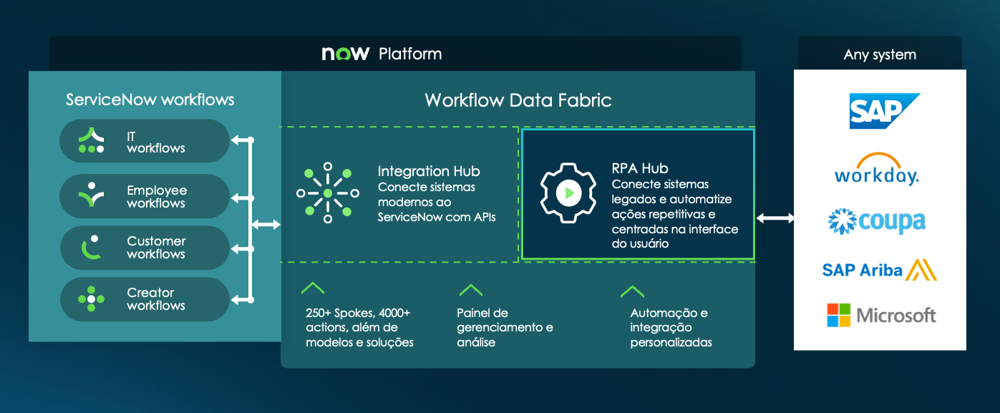
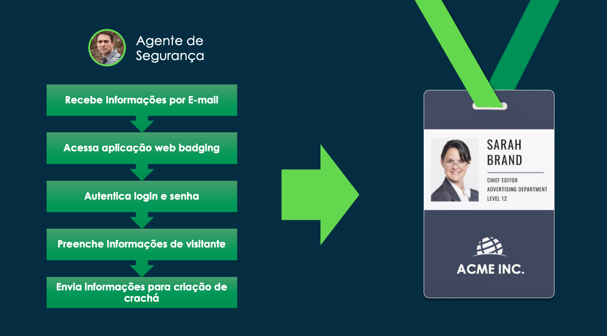

# Introdução ao Laboratório de RPA com ServiceNow

## O que é RPA?

A **Automação de Processos Robóticos (RPA)** é uma tecnologia que permite automatizar tarefas rotineiras e repetitivas, geralmente executadas por humanos. Esses processos são baseados em regras e seguem um fluxo estruturado — como preencher formulários, copiar dados entre sistemas e interagir com aplicações desktop ou web.

Na ServiceNow, a solução de RPA é conhecida como **RPA Hub**. Ela permite a automação de ponta a ponta combinando:
- **Interações com interface gráfica (UI)** em aplicações legadas ou que não possuem APIs;
- **Automação baseada em componentes reutilizáveis**;
- **Integração com qualquer Workflow da plataforma ServiceNow**.

O RPA Hub possibilita, por exemplo, acionar um robô automaticamente a partir de um fluxo de trabalho do Flow Designer para executar tarefas em sistemas que não suportam protocolos como REST, SOAP, SSH ou PowerShell.

---

## Objetivo do Laboratório

Neste laboratório, você aprenderá como:

- Gravar uma automação usando o **RPA Desktop Design Studio**;
- Automatizar a tarefa de impressão de crachás para visitantes;
- Integrar essa automação com um Workflow do ServiceNow;
- Configurar os componentes administrativos essenciais no **RPA Hub Workspace**, incluindo:
  - Bots e seus respectivos processos;
  - Gestão de credenciais seguras para execução da automação.

> 💡 A funcionalidade de **gravação automática** é ideal para iniciantes, pois elimina a necessidade de construir manualmente a automação usando conectores ou scripts.

---

## Caso de Uso: Impressão de Crachá de Visitantes

A empresa **ACME Inc.** está em uma jornada de transformação digital e deseja automatizar processos operacionais para aumentar a eficiência e reduzir custos.

### Cenário Atual:
- O processo de **"Acesso de Visitantes"** é altamente manual;
- Um agente de segurança recebe as informações por e-mail;
- Em seguida, acessa um sistema legado baseado na web (sem API) para preencher o formulário e gerar o crachá;
- Esse fluxo gera:
  - Erros de digitação;
  - Repetição desnecessária de tarefas;
  - Atraso no atendimento ao visitante.

### Solução Desejada:
Automatizar esse processo com RPA, de forma que:
- A automação seja **acionada a partir de um Workflow no ServiceNow**;
- O robô preencha automaticamente os dados no sistema web do crachá;
- A experiência do visitante seja mais fluida, ágil e sem erros.

---

## Resultado Esperado

Ao final deste laboratório, você terá construído uma automação funcional que:
- Executa uma tarefa real utilizando gravação de interações;
- Elimina a necessidade de APIs;
- É integrada diretamente ao ecossistema da Now Platform;
- Está pronta para ser escalada para outras automações similares.

> 🛠️ **Pré-requisitos recomendados**:
> - Acesso ao **RPA Desktop Design Studio**;
> - Permissão de admin para configurar Bots e Credenciais;
> - Acesso a um ambiente sub-produtivo do ServiceNow com o RPA Hub ativado.