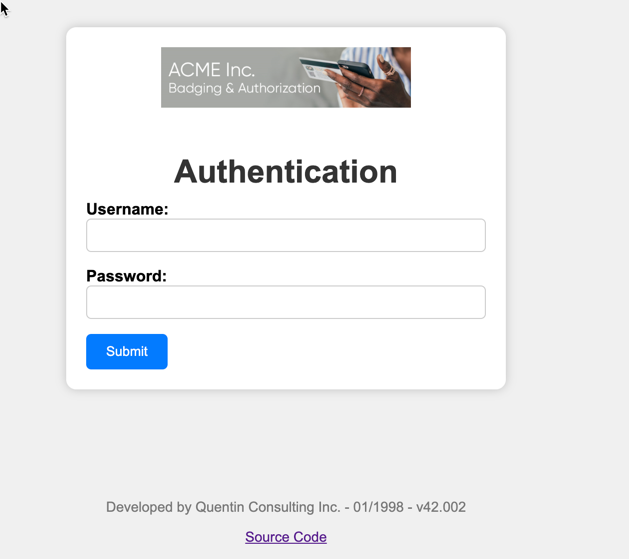
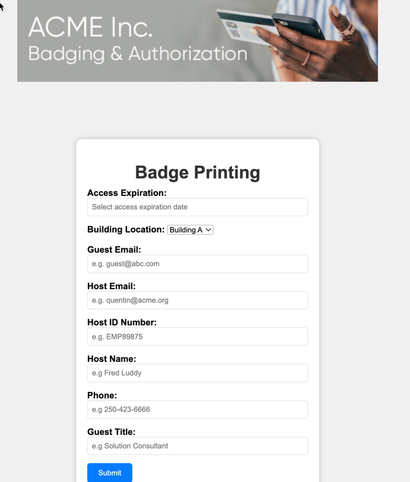

# Revisando o Aplicativo de Badging

Neste passo, você irá explorar a interface do sistema que será automatizado com RPA. Trata-se de um **aplicativo web de emissão de crachás** utilizado pelo Agente de Segurança da ACME Inc.

## Acesso ao Aplicativo

1. Abra um navegador da web e acesse o seguinte link:  
👉 [https://sncrwf.azurewebsites.net/badgingapp](https://sncrwf.azurewebsites.net/badgingapp)

2. Você verá uma tela de login como esta:
    

3. Insira as credenciais abaixo e clique em **Enviar**:

    | Campo    | Valor        |
    |----------|--------------|
    | Username | `badgeadmin` |
    | Password | `badgeadmin` |

---

## Tela de Impressão de Crachá

Após o login, você será redirecionado para a tela principal utilizada pelo Agente de Segurança para **registrar os dados do visitante e imprimir o crachá**:

---

## O que será automatizado?

No nosso projeto de automação com o **RPA Hub**, iremos automatizar todas as etapas abaixo:

- Abrir o navegador;
- Acessar a URL do sistema;
- Autenticar com as credenciais fornecidas;
- Preencher o formulário de badging com dados do visitante;
- Submeter o formulário automaticamente.

> 🧠 Essa abordagem elimina a necessidade de interação humana com um sistema que não possui APIs disponíveis, demonstrando o poder do RPA para automações em sistemas legados.

Você está pronto para gravar sua primeira automação!