Uma Máquina Virtual (VM) Windows é necessária para completar este laboratório. O endereço IP e as credenciais de login foram fornecidos durante a inscrição. Se você estiver usando um laptop Mac, certifique-se de que o Microsoft Remote Desktop App esteja instalado como pré-requisito para este laboratório.

## macOS
:::danger
Se estiver usando um laptop com **Windows**, vá para a próxima sessão deste guia para conectar-se à VM usando o **RDP do Windows**.
:::

1. Acessando Máquina Virtual (VM) Windows utilizando **macOS**
   
	1.	Abra a App Store e pesquise por: `Windows App`
	3.	Clique em “Obter” e depois em “Instalar”.
      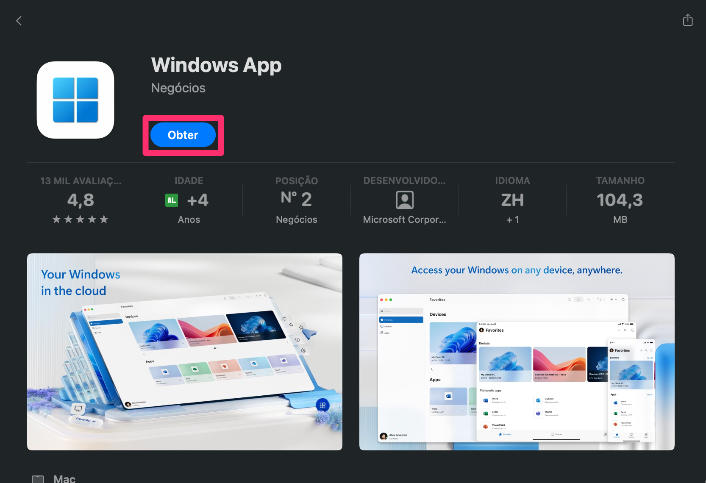
	4.	Após a instalação, abra o app `Windows App`.

   1. Clique no **sinal de mais** e depois clicando em **Adicionar PC**.

        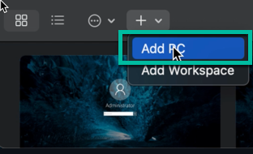

   2. Copie o **endereço IP** da página de registro e insira-o em **Nome do PC** (1) e insira **Lab VM** em **Nome Amigável** (2). Em seguida, clique em **Adicionar** (3).

          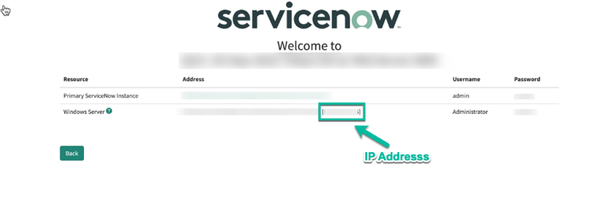
          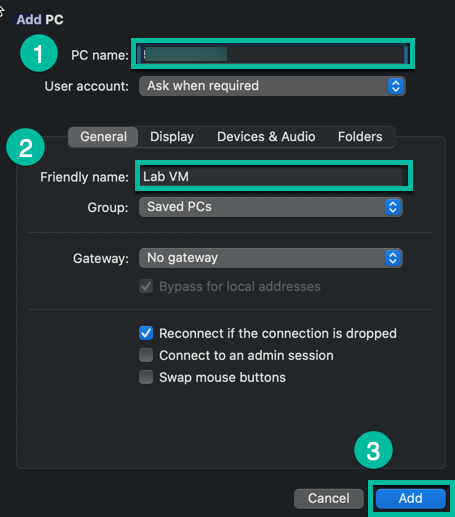

       > O **endereço IP** é apenas o valor dentro dos colchetes **[]** na linha do Windows Server.

   3. Clique duas vezes na nova VM que foi adicionada ao RDP.

       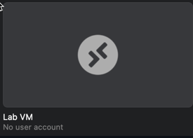
       
       Em seguida, clique em **Continuar**.

   4. Insira as credenciais de login do Windows Server fornecidas durante o registro em **Nome de usuário** (1) e **Senha** (2) e depois clique em **Continuar** (3).

       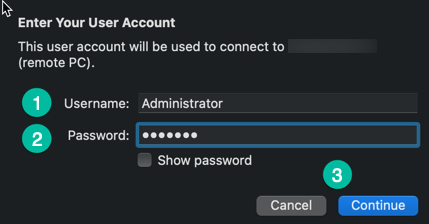

       > Clique em **Mostrar Senha** para garantir que a senha inserida está correta.
       
   5. Clique em **Continuar** mais uma vez para conectar à VM. Após conectar-se à VM, vá para o **Passo 11** para concluir a configuração inicial.

       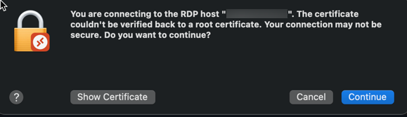

## Windows

2. Acessando Máquina Virtual (VM) Windows utilizando **Windows**

   1.	Verifique se o RDP está disponível:
      Pressione `Win + R`, digite `mstsc` e pressione `Enter`. Se a janela “Conexão de Área de Trabalho Remota” abrir, o recurso está disponível.
      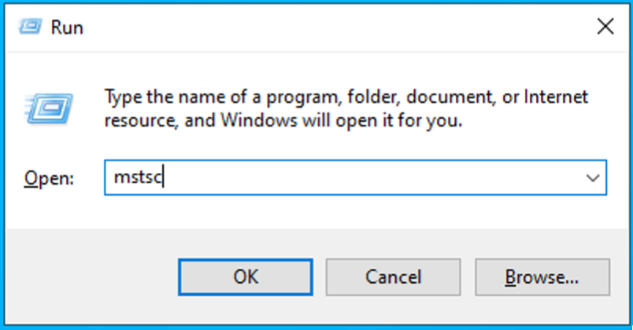
      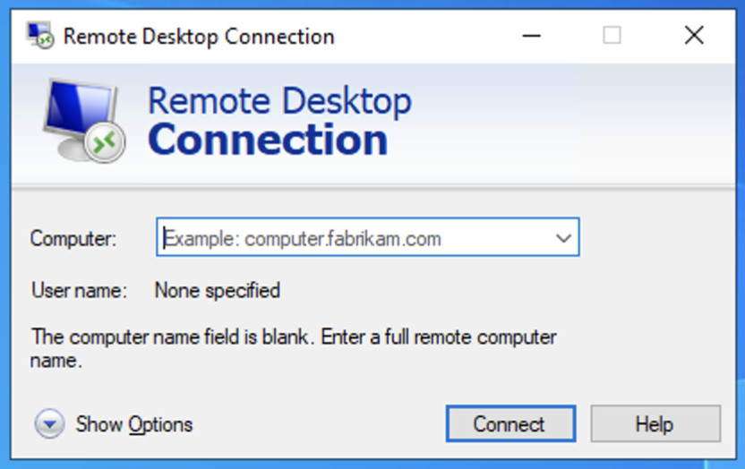

    2. Abra o Remote Desktop Protocol (RDP). Em seguida, copie o **endereço IP** da página de registro e insira-o em **Computador** (1) e clique em **Conectar** (2).

       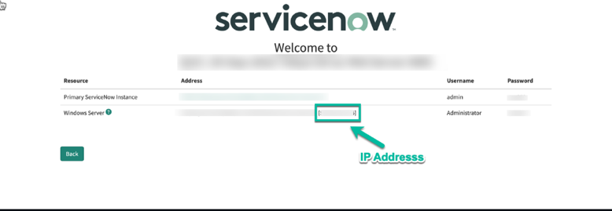

       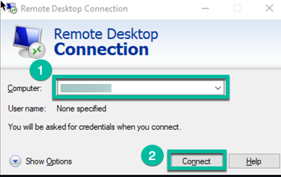
       > O **endereço IP** é apenas o valor dentro dos colchetes **[]** na linha do Windows Server.

    2. Clique em **Mais opções**.

       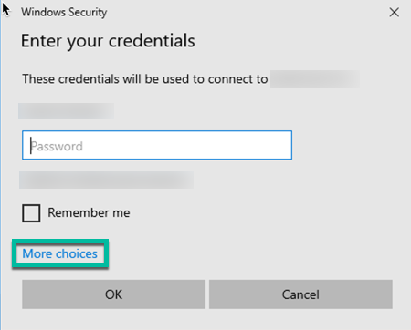

    3. Clique em **Usar uma conta diferente**.

       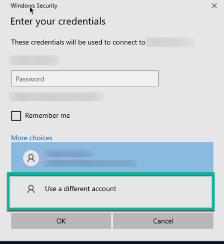

    4. Digite **Administrador** para Nome de usuário (1) e a **senha do laboratório** para Senha (2). Em seguida, clique em **OK** (3).

       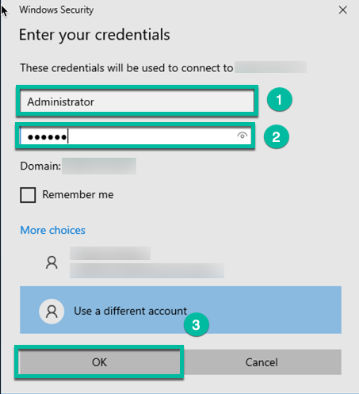

    5. Clique em **Sim** para confirmar a conectividade com a VM.

       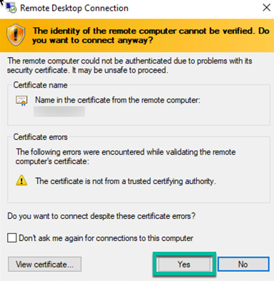

Uma vez conectado à VM do laboratório, observe que o software RPA já está pré-instalado e acessível na Área de Trabalho. Se você não ver o ícone do RPA Desktop Design Studio, por favor, informe seu instrutor, pois você precisará disso para construir a automação RPA.

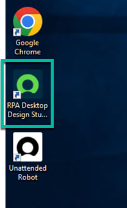

Antes de começar, é recomendado alterar o navegador padrão para o Chrome. Isso pode ser feito digitando **Navegador Padrão** (1) na Barra de Pesquisa do Windows e clicando em **Escolher um navegador da web padrão** (2).

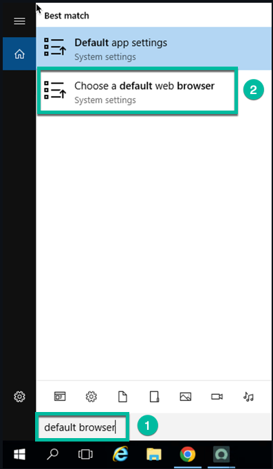

 Clique em **Internet Explorer** sob **Navegador da Web** e selecione **Google Chrome**. Em seguida, feche a janela.

 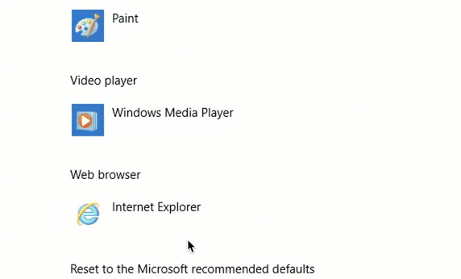
