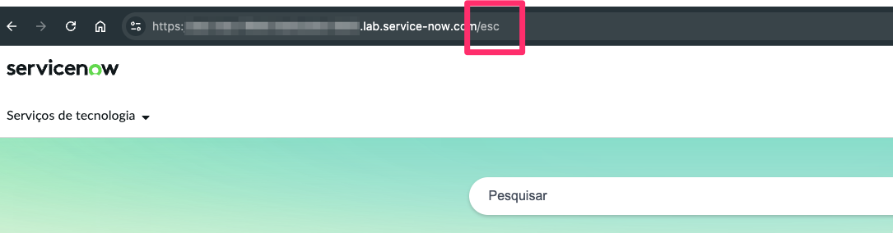
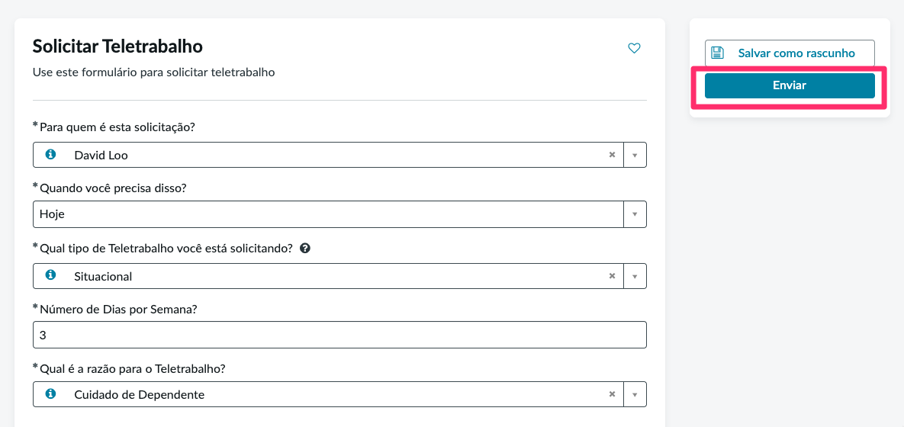

## Visão Geral

Nesta seção, vamos testar o fluxo que acabamos de criar e garantir que ele funcione conforme o esperado. Precisamos testar com um usuário que tenha um gerente. Felizmente, o ServiceNow permite que administradores se infiltrem em outros usuários autenticados para fins de teste.

No cenário do nosso caso de uso, você assumirá o papel de 'David Loo'. Ele recentemente descobriu que seu filho está com uma pequena doença e precisará ficar em casa por alguns dias.

Ele está animado para usar o novo formulário digital no Employee Center para enviar sua solicitação, em vez de levar seu formulário em papel pelo escritório.

## Instruções

1. Vá para a aba do navegador que tenha a barra de menus.

:::tip
Caso tenha fechado ou não encontre você sempre pode digitar a URL raiz da sua instância para abrir novamente a home da plataforma ServiceNow. 
Ex: `https://<NOME DA SUA INSTÂNCIA>.service-now.com/`
:::

2. Clique na foto do avatar no canto superior direito da página.

3. **Impersonate 'David Loo'.**
   1. Selecione **Impersonate User**.
   
   2. Procure por `David Loo` e clique em seu nome nos resultados da pesquisa.
   
   3. Clique em Impersonate User.

4. Digite `/esc` ao final da sua instância para acessar o portal **Employee Center.** 
   

3. **Procure o formulário 'Apply for Telework' Record Producer.**
   1. Digite `Teletrabalho` na caixa de pesquisa.
   2. Pressione ENTER no teclado.
    

4. Clique em 'Solicitar Teletrabalho' nos resultados da pesquisa.

7. Preencha o formulário com os seguintes valores: (💡 clique duas vezes, copie e cole no formulário).

    | Nome do Campo                      | Valor do Campo
    |-----------------------------------|------------------------------
    | **Para quem é esta solicitação?**       | David Loo
    | **Quando você precisa disso?**         | Hoje
    | **Qual tipo de Teletrabalho você está solicitando?** | Situacional
    | **Número de Dias por Semana?**       | 3
    | **Qual é a razão para o Teletrabalho?** | Cuidado de Dependente

    
    Clique em Enviar.

1. Vá para a aba do navegador que tenha a barra de menus.

:::tip
Caso tenha fechado ou não encontre você sempre pode digitar a URL raiz da sua instância para abrir novamente a home da plataforma ServiceNow. 
Ex: `https://<NOME DA SUA INSTÂNCIA>.service-now.com/`
:::

**Bud Richman é o gerente de David Loo e aprovará o Caso de Teletrabalho dele.**

10. **Impersonate 'Bud Richman'.**
    1. Clique em **Representar outro usuário**.
    
    2. Procure por `Bud Richman` e clique em seu nome nos resultados da pesquisa.
    
    3. Clique em Representar usuário.

11. Feche o pop-up **Welcome to Service Operations**.

12. **Como Bud, aprove a solicitação de Caso de Teletrabalho de David.**
    1. No menu **Todos**, pesquise e selecione **Minhas Aprovações**.
    
    2. Clique com o botão direito em **Requested**.
    3. Selecione **Aprovar**.
    

Lembre-se de que no Fluxo, um e-mail deve ser enviado para o usuário **Opened by** após a aprovação do gerente.

13. **Veja se o e-mail foi enviado.**
    1. No canto superior direito, clique na foto do perfil para abrir o menu do usuário.
    2. Selecione **Encerrar representação**.
    
    3. No menu **All**, pesquise e selecione **Outbox**.
    
    4. Clique no nome da coluna **Created** para mostrar os mais recentes no topo.
    
    5. Clique na coluna **Created** para abrir o e-mail para david.loo@example.com.
    
    6. Role para baixo até o final da página e clique no link relacionado **Preview Email**.
    
    Você pode ver que o e-mail inclui as informações dos Data Pills que você colocou no corpo do e-mail.
    

## Recapitulação do Exercício

Neste exercício, você testou o Fluxo Automatizado, se infiltrou como um usuário, enviou um registro e garantiu que as etapas automatizadas foram realizadas.
