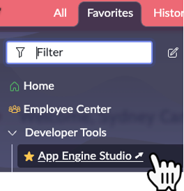
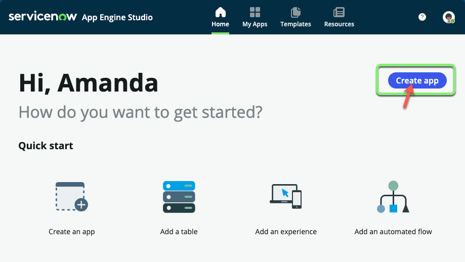
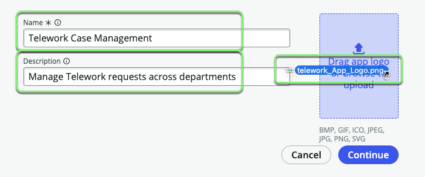
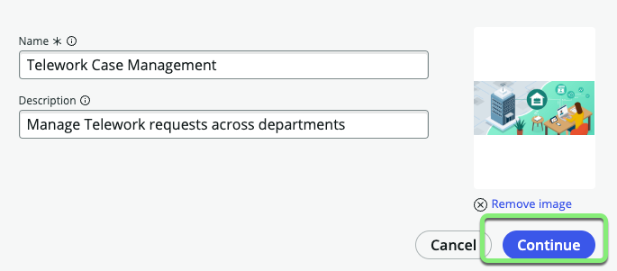
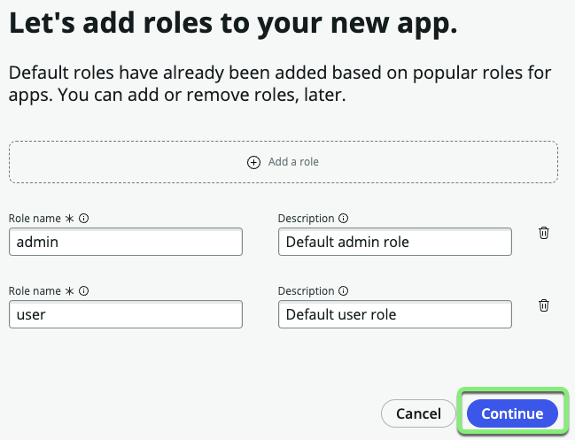
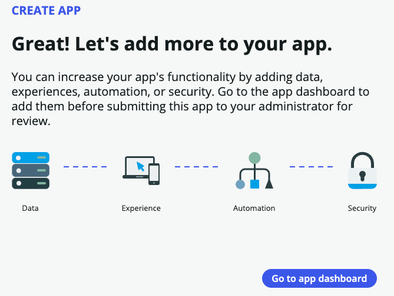

## Visão Geral

Neste exercício, você criará um aplicativo com escopo chamado "Telework Case Management" no ServiceNow.

Um aplicativo com escopo, ou "app" para abreviar, atua como um contêiner para todos os ativos que constituem um aplicativo, incluindo tabelas, formulários, fluxos e recursos de segurança.

Somente o Proprietário do aplicativo e Colaboradores convidados podem fazer alterações no aplicativo.

## 🛠️ Tempo de Desenvolvimento!  

⚠️ Os próximos passos devem ser realizados apenas na instância de Desenvolvimento (Dev) ⚠️ 
 

1. Acesse a instância de **Desenvolvimento (Dev)**.  
2. Impersone **Sydney**.  
3. Clique em **Favorites**, depois clique em **App Engine Studio**.  
   

4. **Criar o Aplicativo:**
   - Clique no botão Create App.
   

5. **Preencher o Formulário:**
   - Preencha o formulário com os seguintes detalhes:

     |Campo|Valor 
     |--|--
     |**Name** | `Telework Case Management` 
     |**Description**| `Manage Telework requests across departments`

   - Faça o upload do arquivo **App_Logo.png** que você baixou.
   
   - Clique em Continue.
   

6. **Funções:**
   - Na tela "Let's add roles", clique em Continue.
   

   

7.  **Ir para o Painel do App:**
   - Clique em Go to app dashboard.
   

## Resumo do Exercício

Parabéns! Você criou com sucesso um aplicativo ServiceNow chamado "Telework Case Management."

Nos próximos exercícios, construiremos sobre esta base, adicionando dados, experiências, lógica e segurança para tornar este aplicativo verdadeiramente funcional.
