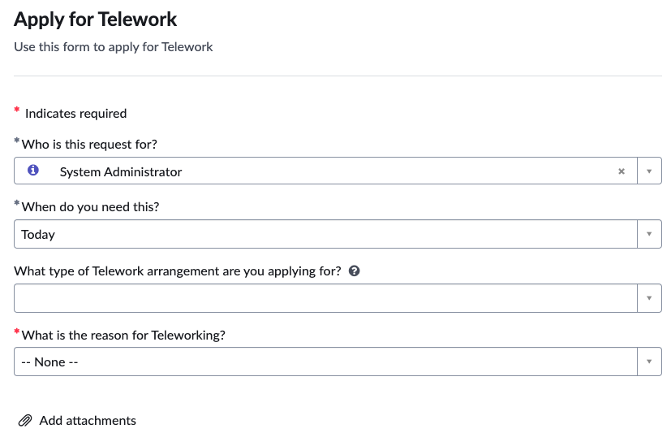
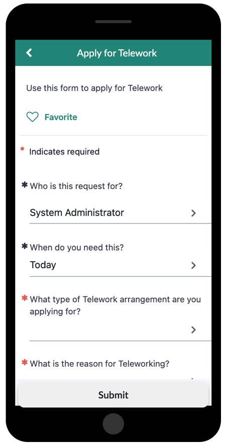
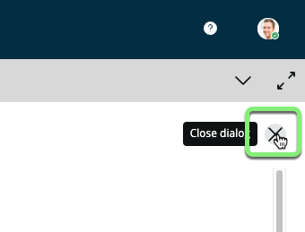

## Visão Geral

Visualize o formulário no App Engine Studio antes de publicá-lo e confirme se os campos do formulário estão funcionando como esperado.

## Instruções

1. Clique em Preview.

2. A página **Preview** permite visualizar como nosso formulário ficará em diferentes experiências.  (Você pode interagir com o item, mas não enviá-lo.)

    |**Portal Preview** |
    |---|
    | |

    |**Now Mobile Preview**|
    |---|
    ||

3. Feche a Visualização clicando no X no canto superior direito.

## Recapitulação do Exercício

**Parabéns!**

O formulário está publicado no aplicativo. Os usuários poderão usá-lo para enviar solicitações de Teletrabalho quando o aplicativo for promovido para o ambiente de Produção do ServiceNow.
