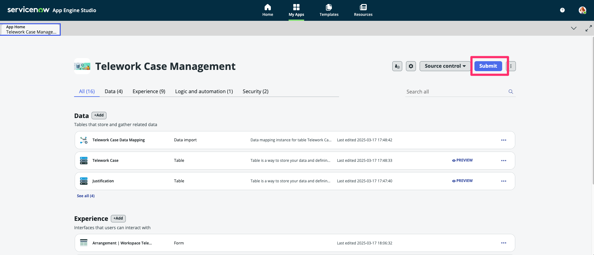
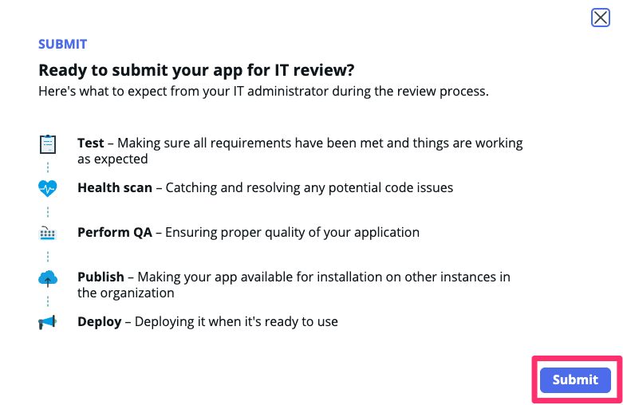
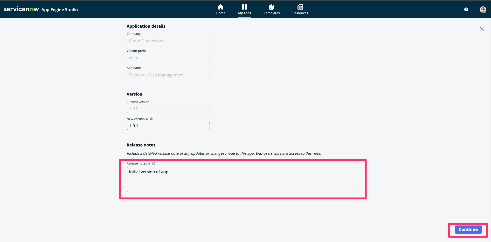

# Exercício 3 – App Engine Studio (10 min)

Neste exercício, **Sydney** irá submeter o app para revisão do time de gestão no **App Engine Studio** e o enviará para implantação.  

## 🛠️ Tempo de Desenvolvimento!  

⚠️ Os próximos passos devem ser realizados apenas na instância de Desenvolvimento (Dev) ⚠️ 

1. Acesse o Dashboard da sua aplicação no **App Engine Studio**.  
2. Clique em **Submit**.  
   
3. Clique em **Submit** novamente. 
    
4.  No campo **Release notes**, digite: `Initial version of app`.  
5.  Clique em **Continue**.  
   
6.  Clique em **Close**.  
7.  Feche a aba do navegador com o **App Engine Studio**.  

## 🎯 Recapitulação  

Assim como no exercício anterior, **Sydney** conseguiu rapidamente criar seu aplicativo e enviá-lo ao **App Engine Management Center** para implantação.  

Mais tempo normalmente seria gasto na construção do aplicativo, mas o foco deste laboratório é demonstrar **como implantar aplicativos a partir do AES**.  
