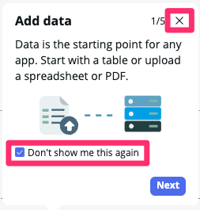
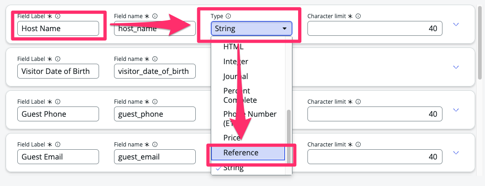
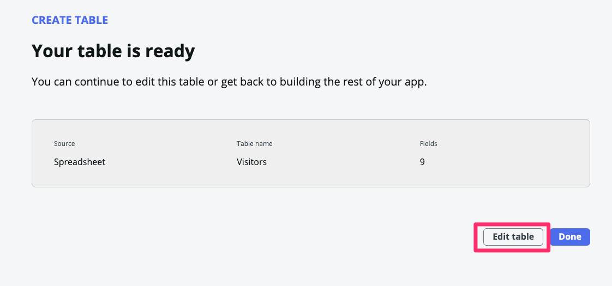

## Visão Geral

Neste exercício, vamos importar dados do arquivo `Visitors.xlsx` diretamente para novas tabelas.

## Instruções

1. **Fechar o tour guiado.**
   * Marque "Don't show me this again"
   * Clique no 'X' no canto.
  

2. Ao lado de **Data**, clique em +Add.
   

3. - Selecione "Import a spreadsheet".
   - Clique em Continue.
   

4. - Arraste e solte o arquivo `Visitors.xlsx` na caixa 
   :::note
   _Se você tiver problemas com o arrastar e soltar, clique em '..browse to upload a spreadsheet' e selecione o arquivo._
   :::

   - Marque 'Import spreadsheet data'.
   - Clique em Continue.
    

1. Deixe selecionado 'A new table'.
   - Clique em **Create new table**.
   - Clique em Continue.
    

2. **Altere o tipo de dado do campo `Host Name`.**
   - Na linha `Host Name` altere o campo `Type` de "String" para "Reference"
    
   - No campo `Reference table` digite "sys_user" e selecione o campos corresponte.
    
   - Revise os demais campos 
   - Clique em Continue.
    

3. **Nome da Tabela**:
   - Defina a "Table label" como `Visitors`.
   - Marque a opção "Auto Number"
   - Clique em Continue.
   
   - Observe que "Table name" foi preenchido automaticamente com 'visitors'.

4. **Definir as Permissões da Tabela.**
   - Para o papel **admin**, marque "All".
   - Para o papel **user**, marque todos exceto "Delete".
   - Clique em Continue.
    

5.  Clique em Edit table.
    

## Recapitulação do Exercício

Muito bem! Você importou a planilha pela equipe de segurança para gerenciar os acessos dos visitantes.

