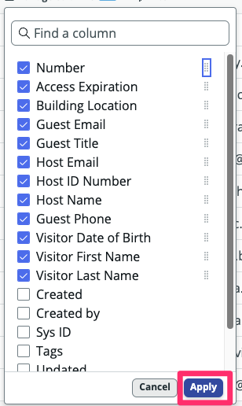
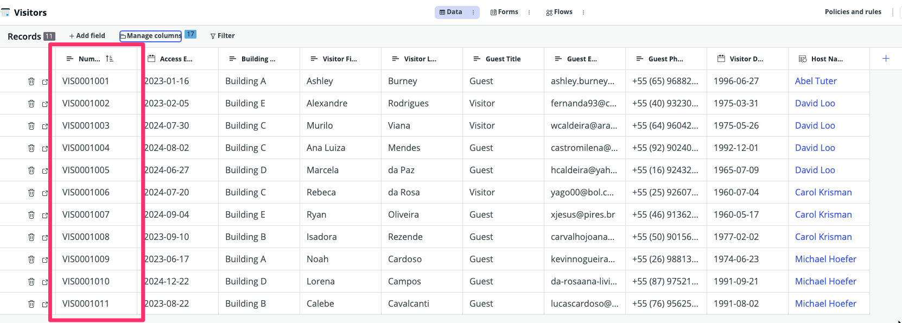
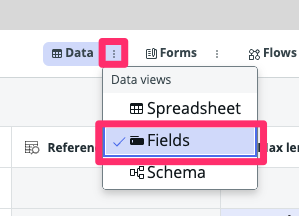

## Visão Geral

O Table Builder é uma ferramenta poderosa para projetar e personalizar tabelas, formulários e elementos de formulário dentro do ServiceNow. Neste exercício, você aprenderá a editar a tabela `Visitantes` usando a visualização **Spreadsheet** na aba **Data** do Table Builder.

Além disso, você explorará a visualização **Fields** para modificar as propriedades e a estrutura da tabela.

## Instruções

1. Você deve estar agora na aba `Visitantes`. _(Se não estiver, clique nela.)_
   * Feche o pop-up **Welcome to Table Builder** clicando no 'X' no canto.

2. Marque a opção 'Do not show again' e, em seguida, clique no 'x' para fechar o próximo pop-up.
   

   :::info
   A visualização padrão no Table Builder é a visualização "Spreadsheet".
   Nesta visualização, você pode visualizar e editar dados.
   :::

   

1. **Rearranjar as colunas exibidas.**
   1. Clique em **Manage columns**.
   2. Role para baixo e marque a caixa ao lado de 'Number'.
   :::tip
   O botão com oito pontos é chamado de **Handle icon**.
   :::
   3. Clique e segure o **Handle Icon** ao lado de 'Number', e arraste para o topo da lista.
   
   4. Clique em Apply.
   
   

:::info
Você pode reordenar colunas através de arrastar e soltar com o **Handle icon**.
Se você reorganizar as colunas na visualização de planilha, o sistema manterá esta visualização personalizada da disposição das colunas para você.
:::

1.  **Mude para a visualização 'Fields' do Table Builder.**
    - Clique nos três pontos ao lado de **Data** e selecione 'Fields'.
    

2.  **Verifique os campos e tipos de dados**
    - Valide os campos importados e os tipos de dado
    - Você pode a qualquer momento criar novos campos ou editar os existentes

## Recapitulação do Exercício

Neste exercício, você aprendeu a usar o **Table Builder** para visualizar e editar dados na visualização **Spreadsheet** e configurar seus Campos na visualização **Fields**. O próximo exercício envolverá o uso do recurso **Form** para visualizar e personalizar o formulário usado para exibir registros individuais (linhas) dentro da tabela.

Para mais informações e recursos avançados, você pode consultar a [Documentação do Produto ServiceNow: Table Builder](https://docs.servicenow.com/csh?topicname=tb-landing-page.html&version=latest).
