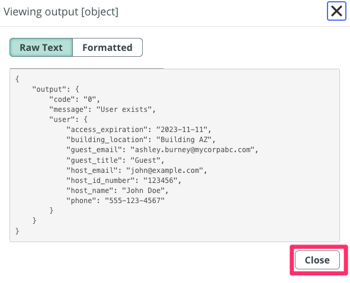

## Visão Geral

Nesta atividade, você testará o novo spoke.

## Instruções

1. É hora de testar a Spoke Action! Clique no botão **Test** 
   

2. Você será solicitado a inserir algumas informações do usuário, **dateofbirth** (1), **firstname** (2), **lastname** (3). Por favor, use os seguintes valores:
    * Depois clique em **Run Test** (4)

    | Campo        | Valor     |
    |--------------|-----------|
    | dateofbirth  | 1984-01-25|
    | firstname    | Ashley    |
    | lastname     | Burney    |

   

   :::note
   Normalmente, esses valores serão passados para a ação via um Workflow. Estamos apenas testando a ação manualmente agora.
   :::

3. Após a execução da ação, clique em **Your test has finished running. View the Action execution details** (1) para inspecionar a resposta que recebemos do sistema externo.
   

4. Na página **Execution Details**, role para baixo até ver a seção **ouput Data** e clique no detalhe da saída (1)
   .png>)
   Você deve ver uma tela semelhante a esta. Observe a resposta retornada pela API. Ela contém o código de retorno, a mensagem e informações adicionais do usuário. Nossa nova Spoke Action funciona!

5. Clique em **Close**.
   

6. Feche a aba do navegador e retorn para a plataforma.
   

## Recapitulando

🎉 Parabéns você acaba de criar uma Spoke em ServiceNow!

Neste laboratório, utlizamos o Spoke Generator, permitindo integrar o ServiceNow com um aplicativo externo que possui uma API utilizável. Na seção opcional deste laboratório, abordaremos conceitos mais avançados do Flow Designer/Ihub e demonstraremos como utilizar o valor recuperado da Spoke Action para atualizar um registro no ServiceNow.

:::note
Com o Spoke Generator, você não precisa mais configurar manualmente o REST Step e o JSON Parser Step; a Spoke Action gerada pelo Spoke Generator lida com isso automaticamente para você.
:::
