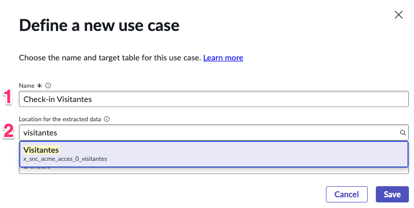
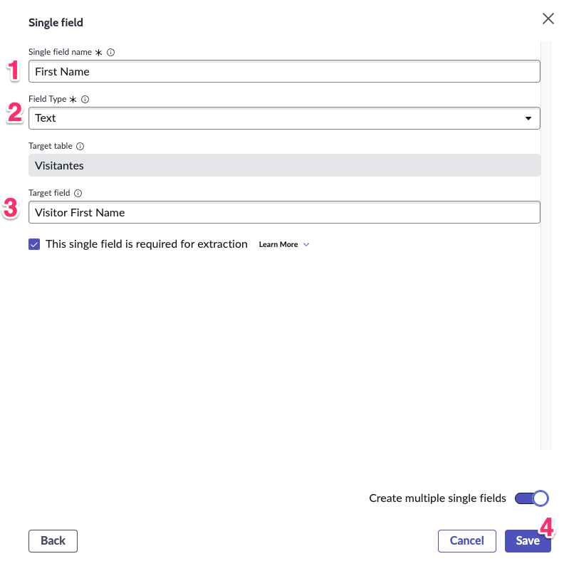
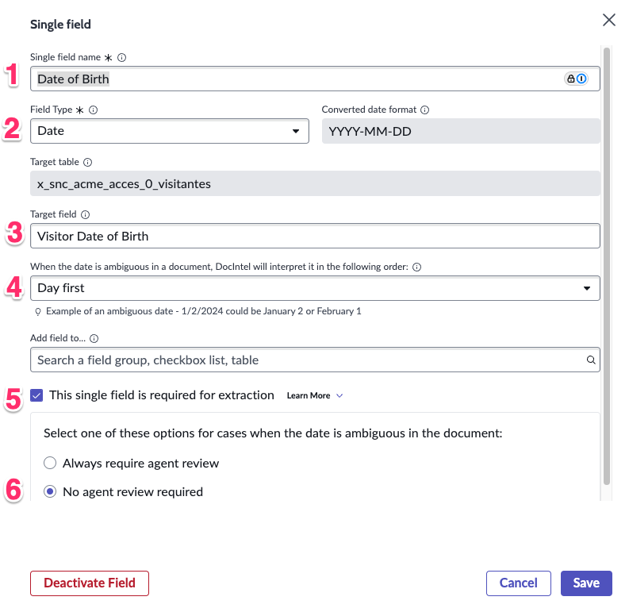
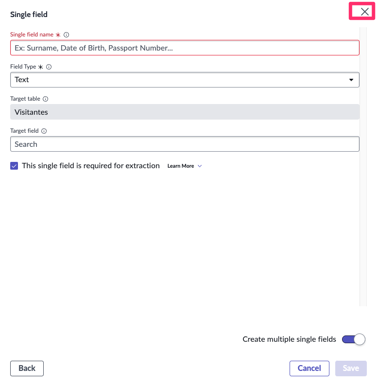
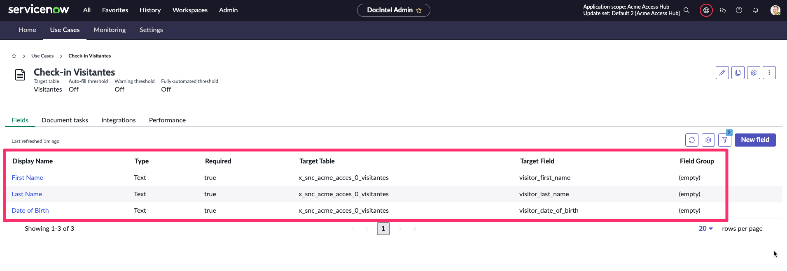

1. Volte para a plataforma e navegue para **Document Intelligence > Document Data Extraction Administration > Home**.

    

   - Nota: A página será aberta em uma nova aba do navegador. Se isso não acontecer, verifique se o seu navegador não está bloqueando a abertura.
2. Vá para a aba **Use Cases** e selecione New use case. 

    **OBS: Caso não exista nenhum caso cadastrado utilize o botão** Define your first use case.

      

   - Preencha o formulário:

    | Campo                        | Valor                                      |
    |------------------------------|--------------------------------------------|
    | **Name**                     | Check-in Visitantes                        |
    | **Location for the extracted data** | `Visitantes [x_snc_acme_acces_0_visitantes]` |
    | **Language Model**                  | Default |

    

    :::caution
    Verifique se a selecionar corresponde a aplicação que criamos anteriormente. A aplicação terá o prefixo x_snc_acme_acces_ 
    :::

   - Clique em **Save**.
  
    

3. Abra o Use Case na lista.
    
    - Na aba **Fields**, selecione **Define your fields**.
    - Selecione `Single Field`
    

4. Crie 3 campos (First Name, Last Name, Birth Date) conforme mostrado abaixo:
    :::tip
    Selecione a opção “Create multiple single fields” para manter a janela pop-up aberta após cada campo ser adicionado.
    :::
   
    | Field Name  | Field Type | Target Field | 
    |-------------|---------------|---------------|
    | **First Name**    | Text | `visitor_first_name`   |
    | **Last Name**     | Text | `visitor_last_name` |

    
    

5. Para o campo "Date of Birth" existem alguns campos adicionais para definir
   
    | Campo                        | Valor                                      |
    |------------------------------|--------------------------------------------|
    | **Single field name**        | Date of Birth                       |
    | **Field Type**               | Date |
    | **Target field**             | `visitor_date_of_birth` |
    | **When the date is ambiguous in a document, DocIntel will interpret it in the following order:**             | Day First |
    | **This single field is required for extraction**             | ✅ |
    | Select one of these options for cases when the date is ambiguous in the document: | `No agent review required` |

    

6. Feche a janela `Single Field`

    

## Verificação do Lab

Verifique se criamos um campo para cada valor que precisa ser extraído de nossas faturas.

