Com o caso de uso aberto na página de administração do **Document Intelligence**:

1. Crie o Flow para criar uma nova tarefa de Documento a partir de uma tarefa de Fatura:
   - Na aba **Integrations**, selecione **Set up your first integration**.

    

   - Preencha o formulário para criar a integração de Process Task:

    | Campo                       | Valor                         |
    |-----------------------------|-------------------------------|
    | **Name your Integration:**  | Check-in Visitantes Process     |
    | **What type of integrations you want to set?** | Process Task |
    | **Condition:**              | Deixe vazio                  |
    | **Create Flow:**            | Checked (True)                |

    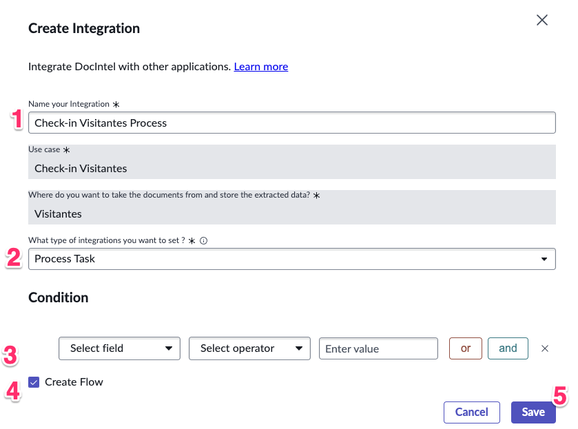
   - Clique em **Save**.
   - Abra no **Flow Designer** (clicando no valor na coluna **Flow**).

    

   - Ative o Flow. Em seguida, feche a aba do navegador.

    

2. Crie o Flow que preenche os campos da tarefa de Fatura uma vez que a tarefa de Documento é concluída:
   - Clique em **New integration**.
    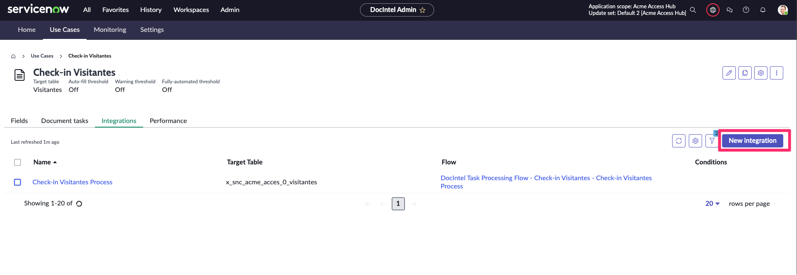
   - Preencha o formulário para criar a integração de **Extract Values**:

    | Campo                       | Valor                         |
    |-----------------------------|-------------------------------|
    | **Name your Integration:**  | Check-in Visitantes Extract   |
    | **What type of integrations you want to set?** | Extract Values |
    | **Create Flow:**            | Checked (True)                |

    
   - Clique em **Save**.
   - Abra no **Flow Designer** (selecionando o valor na coluna **Flow**).
    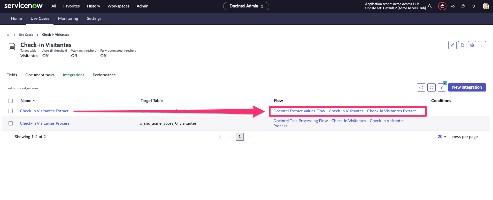

   - Ative o Flow. Em seguida, feche a aba do navegador.
    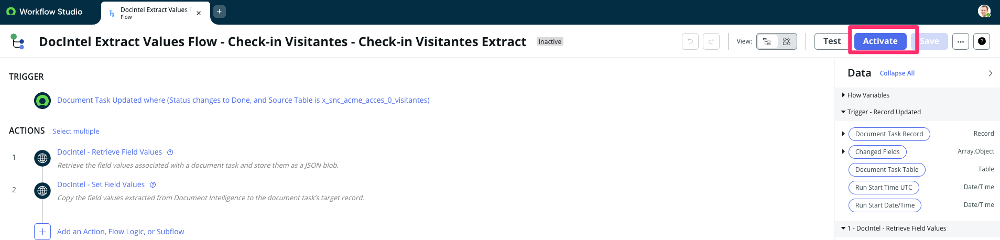

## Verificação do Lab

1. Abra a aba `Document tasks` e selecione "Create a document task".

    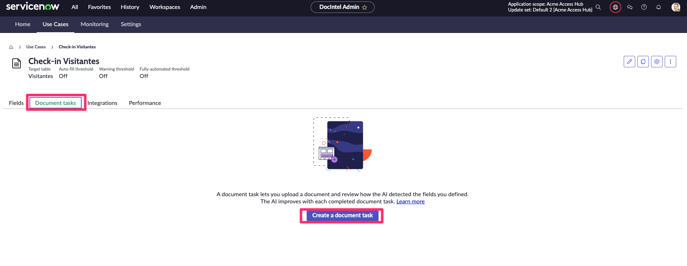

2. Digite o nome `Passaporte`.
    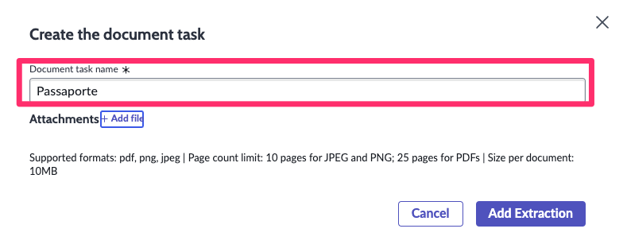

3. Adicione um anexo clicando no link `+ Add file` ao lado de Attachments e selecione o arquivo na pasta extraída `Rodrigo_Passaporte.png` e "Upload".
    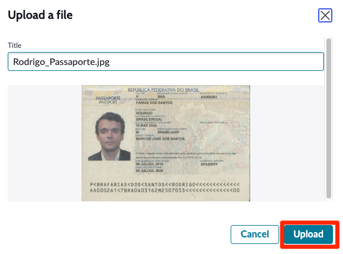

4. Clique em "Add Extraction".
   

5. Clique no link da coluna "Display Name".
   

6. Clique em "Open in Document Intelligence".
   

7. Caso apresente a mensagem "We recommend you wait until the task is ready and DocIntel suggestions are available". Clique em `No, I ca wait`.
   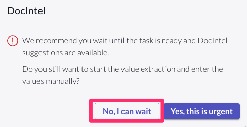

8. Aguarde até que o processamento finalize, isso pode demorar alguns minutos. Clique no botão atualizar para validar se o processo foi finalizado.
   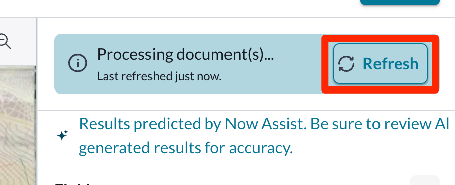
   

:::info
O tempo de processamento para os primeiros documentos do caso de uso tendem a demorar mais. A medida que o modelo recebe treinamento, a tendência é que os tempos diminuam e a taxa de acerto aumente.
:::

## Verifique as Ações

1. Verifique se você vê os campos e a tabela. Comece a digitar o valor a ser extraído e observe as sugestões com um nível de confiança (0%). Clique em uma sugestão para selecioná-la como o valor a ser extraído.

   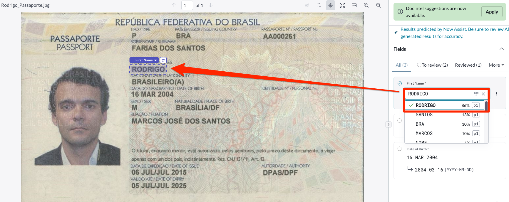
   
   

2. Verifique que como o tipo do campo foi definido como "Date" e o solução já adequa ao formato da plataforma.

   

3. Clique em submit para processar os valores extraidos e feche a janela no navegador.

   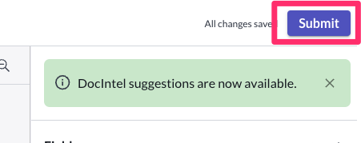

4. Verifique que a tarefa foi alterada para o status `Done`

   

5. Vamos definir os thresholds de confiança para que o processo fique mais automático. Clique no ícone de engrenagem.

   

:::info
As sugestões são geradas de forma assíncrona, e pode levar alguns minutos para que o processamento ocorra.
:::

6. Selecione a opção **"Auto-fill mode (agent review required for all fields)"** e **"Fully Automated mode (no agent review required)"**

   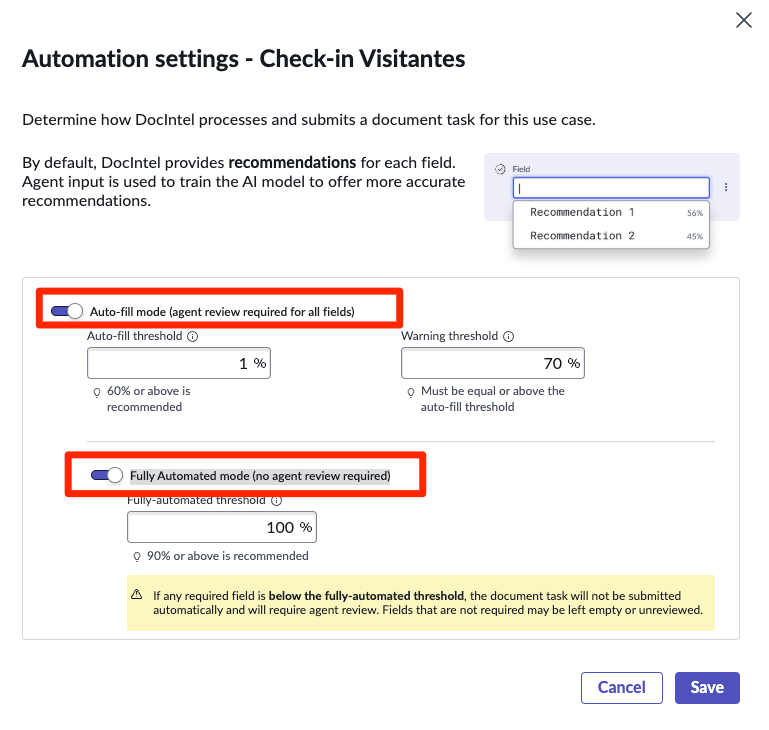

7. Vamos alterar os thresholds apenas para teste. Ajuste os thresholds conforme a seguir:

    | Campo                       | Valor                         |
    |-----------------------------|-------------------------------|
    | **Auto-fill threshold**     | 1%                            |
    | **Warning threshold**       | 40%                           |
    | **Fully-automated threshold** | 50%                         |

8.Clique em **Save**.
:::info
Em ambiente produtivo devem ser definidos threshold maiores afim de reduzir falsos positivos. A tendência é de aumentar os níveis de confiabilidade da AI.
:::
