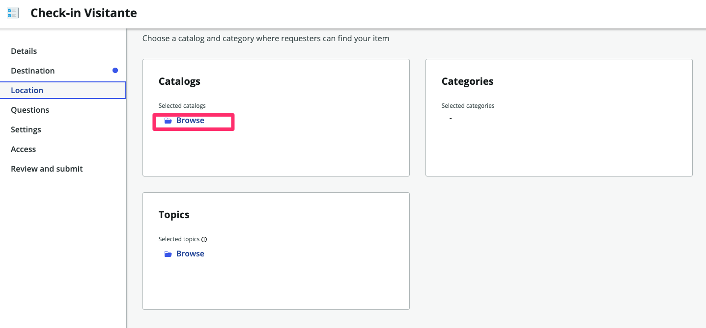
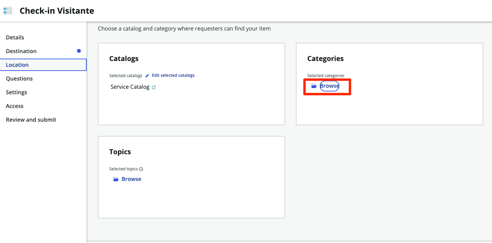
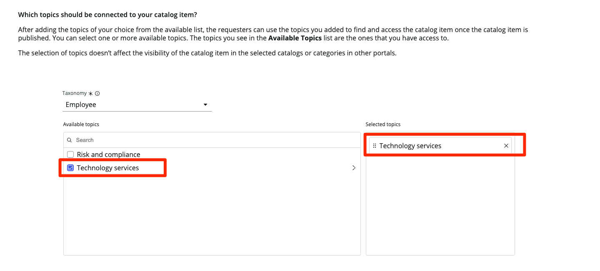
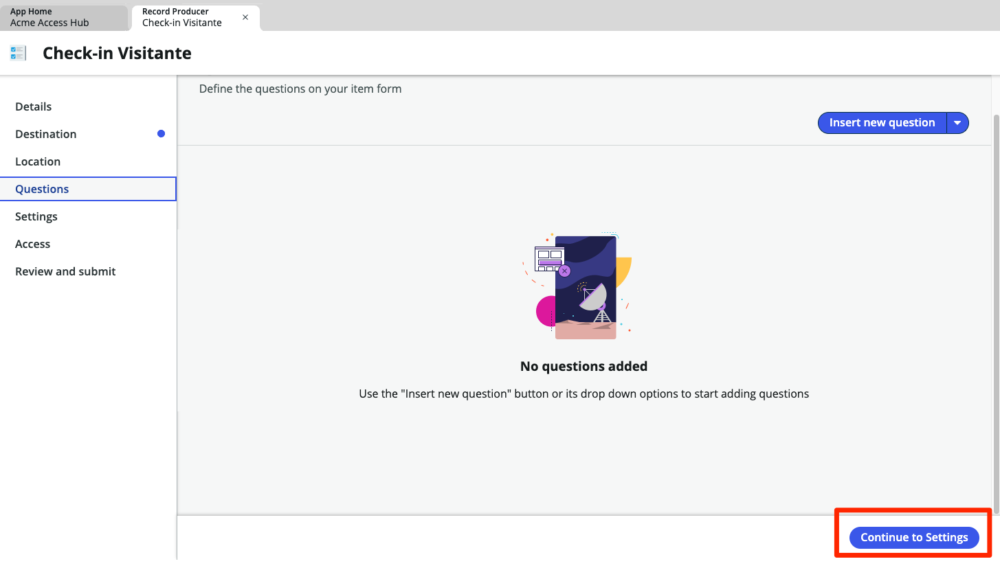
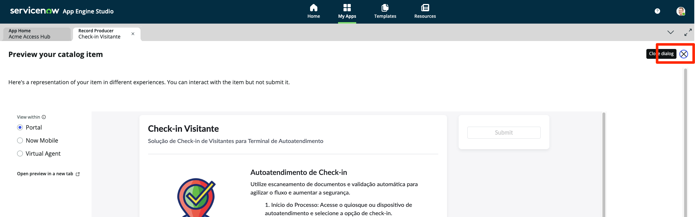
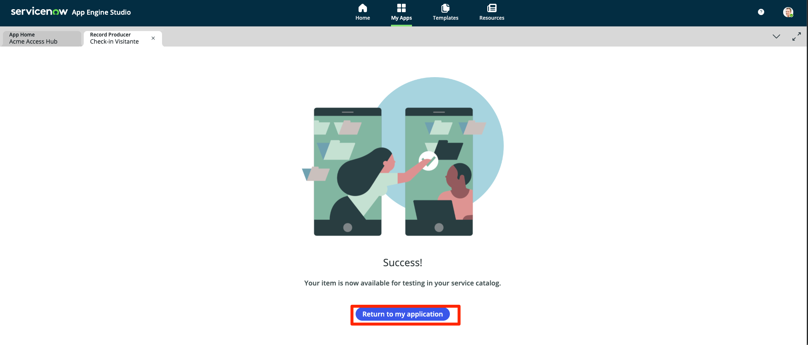

## Visão Geral

Agora iremos criar uma interface mais amigável para que os visistantes façam o check-in.

Para isso, iremos criar um **Record Producer** diz respeito a onde os registros serão criadas. Elas devem ser criadas na nossa tabela 'Visitantes'.

Siga as instruções abaixo para aprender a criar um **Record Producer** que atenda aos requisitos acima.

## Instruções

1. Retorne para o App Engine Studio. Caso tenha fechado a janela do AES, acesse sua Instância de laboratório e navegue até o **AES (App Engine Studio)** em `All > App Engine > App Engine Studio`. e acesse a aplicação `Acme Access Hub`.

2. Clique na aba **Experience**.

3. Clique em +Add.

3. Clique em **Record Producer**.

:::info
Um Record Producer é um tipo específico de Item de Catálogo que permite que os usuários finais criem registros a partir de um Catálogo de Serviço.
:::

4. Clique em Begin.

5. **Vamos configurar seu Record Producer.**
    - Defina os seguintes valores e clique em Continue. 

    | Campo                | Valor                |
    |----------------------|----------------------|
    | **Name**              | `Check-in Visitante` |
    | **Short description** | `Solução de Check-in de Visitantes para Terminal de Autoatendimento` |

    

6. Clique no botão Edit record producer.

7. Na Guia **Details** preencha as informações restantes na sessão **Item details**:

    | Campo                | Valor                |
    |----------------------|----------------------|
    | **Image**            |Carregue o arquivo `check-in_Logo.png` disponibilizado na pasta do laboratório. |

8. Copie e cole os detalhes abaixo no campo **Description**: 
    
import useBaseUrl from '@docusaurus/useBaseUrl';

<iframe 
  src={useBaseUrl('/checkin.html')} 
  style={{ width: '100%', height: '250px', border: 'none', borderRadius: '8px' }}
  title="Check-in Process"
></iframe>

9. Clique em Continue to Destination

10.  **O destino do Record Producer será a tabela `Visitantes`.**
   > * Clique em **Destination** 
   > * Digite **Visitantes**.
   > * Selecione a tabela **Visitantes**.
   > * Clique em Continue to Location.

    

:::info Catálogos e Categorias
Assim como na vida real, um **Catalog** do ServiceNow contém **Categories** de itens e serviços que podem ser solicitados por um **requester**.
IMAGEM

Um **Topic** é uma maneira mais recente no ServiceNow para organizar **Catalog Items** e **Record Producers** para o portal do **Employee Center**.
:::

8. **Adicione o Record Producer a um Catálogo.**
    1. Na caixa **Catalogs**, clique em Browse.
    
    2. Mova **Service Catalog** para a caixa da direita, 'Selected catalogs'.
    
    3. Clique em Save selections.
    

9. **Adicione o Record Producer a uma Categoria.**
    1. Na caixa **Categories**, clique em Browse.
    
    2. Mova **Can We Help You?** para a caixa da direita, 'Selected categories'.
    
    3. Clique em Save selections.

10. **Adicione o Record Producer a um Tópico.**
    1. Na caixa **Topics**, clique em Browse.
    
    2. Selecione a opção **Technology services**.
    
    3. Clique em Save selections.
    

11. Clique em Continue to Questions.
    

12. Não iremos adicionar nenhuma **Question**, por isso iremos avançar para **Settings**. Clique em Continue to Settings.
    

13. Como iremos precisar do documento, vamos marcar a opção "Make attachment mandatory".
14. Clique em Continue to Access.
    

15. Clique em "Browse" na sessão "Available for".
    
    1. Adicione as opções "Any User" e "Guest user"
    2. Clique em Save selections.

16. Clique em Continue to Review and Submit.
    

17. Clique no botão Save
    

18. Clique no botão Preview.
    

19. Visualize como será a experiência para o usuário em 3 tipos de plataforma: Portal, Now Mobile e Virtual Agent
    

20. Feche a janela de preview (X).
    

21. Clique no botão Submit
    

22. Clique no botão Return to my application
    

## Recapitulação do Exercício

Você configurou onde o **Record Producer** será visível para os usuários **solicitantes** para enviar solicitações de Teletrabalho.
