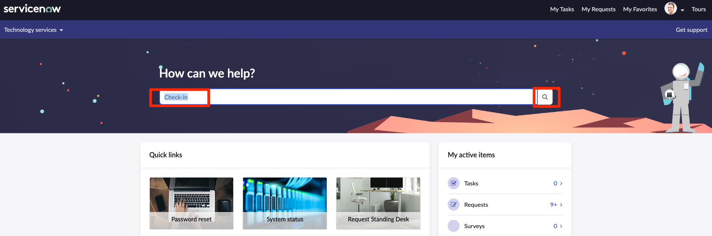
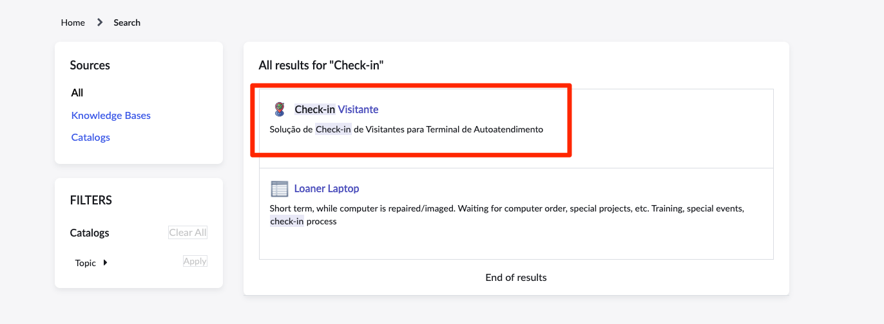
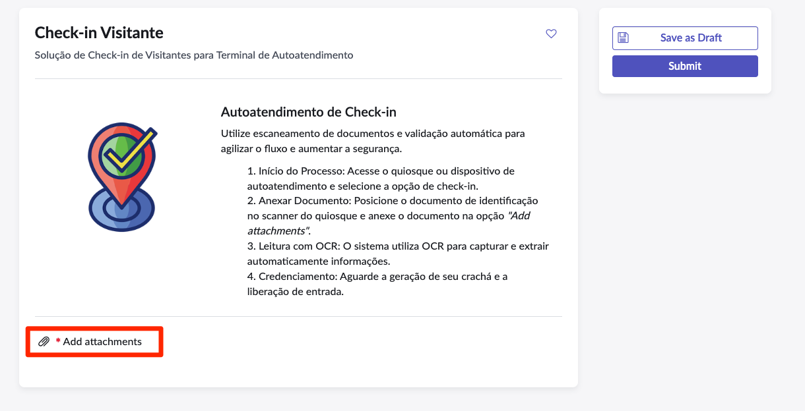
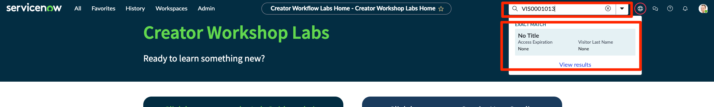
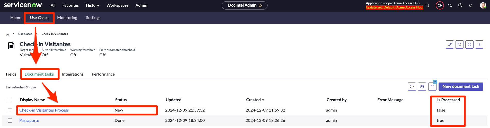
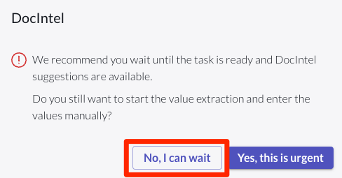
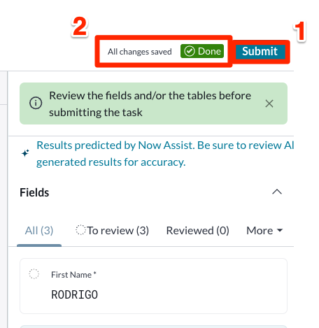
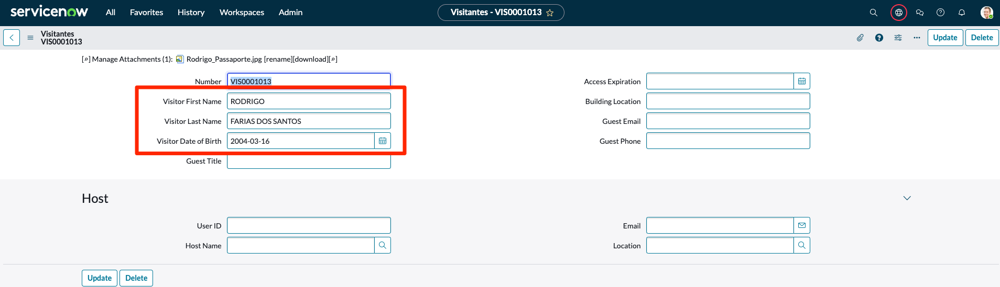

## Visão Geral

Os **usuários requisitantes** acessam o ServiceNow através de portais. O principal portal padrão oferecido pelo ServiceNow é chamado **Employee Center**.

_Para mais informações: [Documentos do Produto ServiceNow Employee Center](https://docs.servicenow.com/csh?topicname=employee-center-landing-page.html&version=latest)_

Neste exercício, você visualizará o 'Apply for Telework' Record Producer no portal Employee Center.

## Instruções

1. Vá para a aba do navegador que diz 'Home'.

2. **Abra o Employee Center.**
    1. Clique em All.
    2. Digite `employee center`.
    3. Clique em **Employee Center**.
    

3. **Procure o formulário 'Check-in Visitante' Record Producer.**
   1. Digite `Check-in` na caixa de pesquisa.
   2. Pressione ENTER no teclado.
   

4. Clique em 'Check-in Visitante' nos resultados da pesquisa.

5. Clique na opção "Add attachments".
   

6. Arraste ou clique em "Choose a file" e carregue o documento `Rodrigo_Passaporte.jpg`.
   

7. Clique em Submit.
    

8. Copie o ID da requisição `VIS000XXX`
   

9. Abra a aba "Home" do seu navegador novamente e clique no ícode de busca (caso a barra de pesquisa esteja oculta).
    

10. No campo de busca digite o número da requisição `VIS000XXX` e clique no primeiro resultado.
    

11. Deixe a aba do formulário aberta. Repare que os campos `Visitor First Name`, `Visitor Last Name` e `Visitor Date of Birth` estão vazios.
    

12. Mantenha essa guia aberta e retorne para a guia do Document Intelligence. Caso Tenha fechado acesse novamente: **All > Document Intelligence > Document Data Extraction Administration > Home** e clique na Aba **Use Case > Document tasks**.

    

:::info
A coluna `Is Processed` indica se o documento foi completamente processado para extração dos dados.
:::

13. Clique na tarefa mais recente "Check-in Visitantes Process" e Open in Document Intelligence

    

14. Caso a extração ainda não tenha sido processada, clique em "No, I can wait".
    

15. Clique em atualizar até o processamento ser concluído.
   
   

16. Verifique se as sugestões foram aplicadas corretamente, caso alguma sugestão esteja errada ajuste para o valor correto. 
    

17. Clique em cada um dos campos para validar os valores.
    
    
    

18. Ao finalizar clique em **(1) Submit**. Após confirmar a submissão a tarefa ficará com status de **(2) Done**.
    
    

19. Volte para a janela do formulário com título `VIS000XXX` e verifique se os campos foram corretamente populados com os valores extraídos.
    

## Recapitulação do Exercício

Neste exercício, você aprendeu extrair informações de um documento utilizando o Document Intelligence integrado a um formulário.
