## Visão Geral

Um fluxo representa uma sequência de etapas que são automatizadas para alcançar um resultado de negócios específico. Cada fluxo pode incluir os seguintes componentes:
- **Gatilho**: O evento ou condição que, quando atendido, inicia automaticamente um fluxo.
- **Condições**: Permite fornecer condições sob as quais o fluxo será executado. Por exemplo, execute o fluxo apenas se um campo estiver acima de um determinado valor.
- **Ações**: As tarefas realizadas pelo Fluxo, como atualizar dados, solicitar aprovações ou enviar notificações.

## Objetivo: Fluxo de Check-in de Visitantes
O objetivo aqui é projetar um fluxo de trabalho que automatize o processo de check-in de visitantes.

## Visão Geral do Fluxo
- O fluxo precisa começar assim que o DocIntel fizer a correta extração dos campos: `Visitor First Name`, `Visitor Last Name` e `Visitor Date of Birth`
- A primeira coisa que o fluxo de trabalho precisa fazer é validar se já existe uma pré-aprovação de visitante por meio da API `checkUser`.
- Se caso existir um pré-cadastro, popule os dados do usuário.
- Caso não exista, deve solicitar aprovação de um usuário responsável.

## Visão Geral da Configuração do Fluxo

**Gatilho:**
- O fluxo começa quando o registro de visitante for atualizado pela primeira vez com os seguintes campos `Visitor First Name`, `Visitor Last Name` e `Visitor Date of Birth` preenchidos

## Instruções

1. Retorne para o App Engine Studio. Caso tenha fechado a janela do AES, acesse sua Instância de laboratório e navegue até o **AES (App Engine Studio)** em `All > App Engine > App Engine Studio`. e acesse a aplicação `Acme Access Hub`.

1. Na aba Página Inicial do App, na seção "Lógica e automação", **clique em Add**.
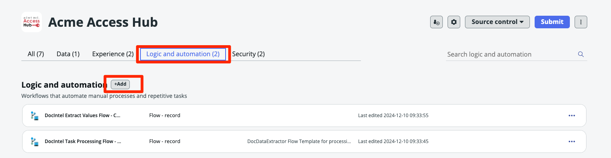

2. Clique em **Flow**.
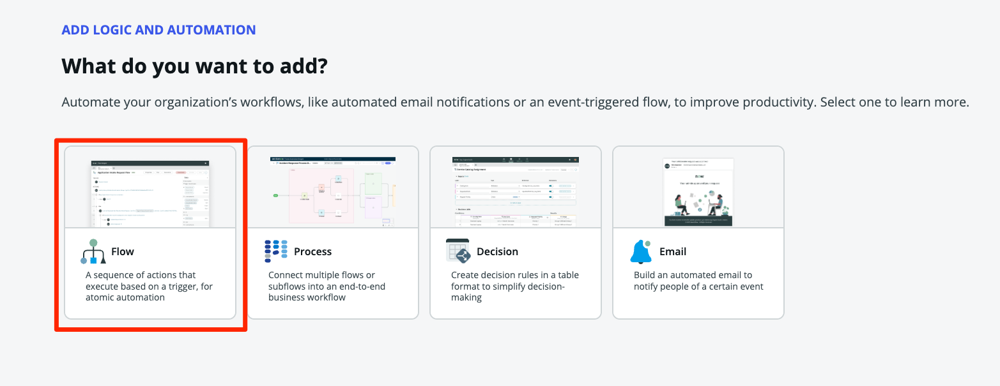

3. Clique em **Build from scratch** para criar um novo fluxo de trabalho.

4. Crie o fluxo com as seguintes informações:

    |**Campo** | **Valor** |
    |-|-|
    |**Name** | Check-in Visitante |
    |**Description** | Registra o visitante para acesso |

    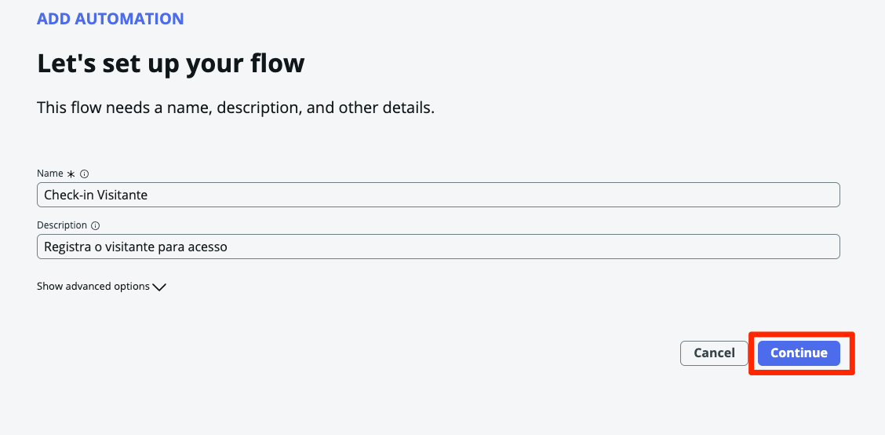

    Clique no botão Continue.

5. **Clique** no botão **Edit this flow** para iniciar o processo de configuração.
    

6. Você pode ver um popup de tour. Vamos pular o tour por agora, clicando no botão **Skip tour**.

7. **Adicione um gatilho para determinar quando e como o Fluxo será executado.**
    1. Clique em **Add a trigger** no canto superior esquerdo da tela do designer de fluxos.
    
    2. Selecione **Created or Updated** na seção Registro.
    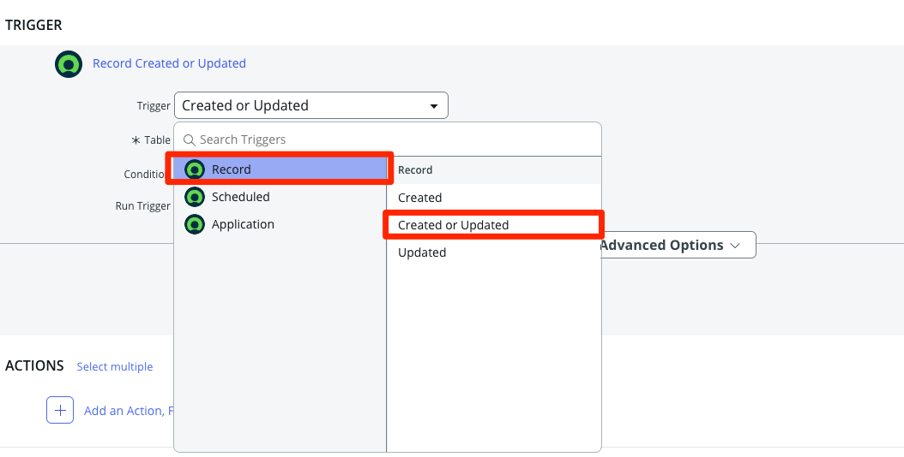
    3. Clique no drop-down 'Table'.
    4. Digite `Visitantes` e clique na tabela *x_snc_acme_acces_0_visitantes*.
    5. Clique em `+ Add filters`
    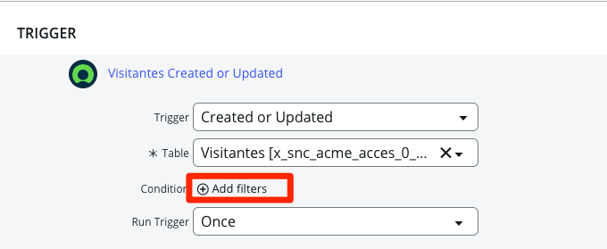
    6. Adicione os seguintes critérios:
   
    |**Campo** | **Operador** | **Lógica** |
    |-|-|-|
    |**Visitor Date of Birth** | is not empty | AND |
    |**Visitor First Name** | is not empty | AND |
    |**Visitor Last Name** | is not empty | AND |

    
    
    7. Clique em Done para fechar o gatilho.
    

8. **Consulte a API Pré-Cadastro utilizando o Spoke criado na parte 3 deste laboratório**
    1. Clique em **Add an Action, Flow Logic, or Subflow**.
    
    2. Clique em **Action**.
    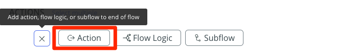
    3. Clique em **ServiceNow Code > Update Record**
    
    4. Arraste o Data Pill **Visitantes Record** para o campo **Record**
    
    5. Clique em **+ Add field value** e selecione o campo **Check-in Visitante** e marque-o.
    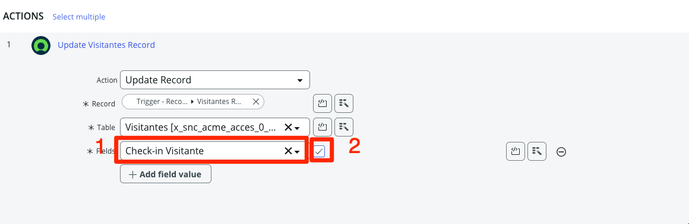
    6. Clique em Done e clique em "Add Anotation".
    
    7. Digite **"Marcar check-in de visitante"**
    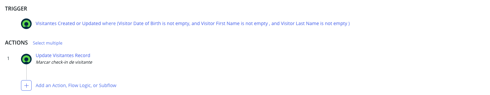
    8. Abaixo da Action anterior. Clique em **Add an Action**.
    
    9.  Clique em **Acme Access Hub>Check if a user exists**.
    
    10. Observe a barra lateral da direira chamada de **Data Pills**.
    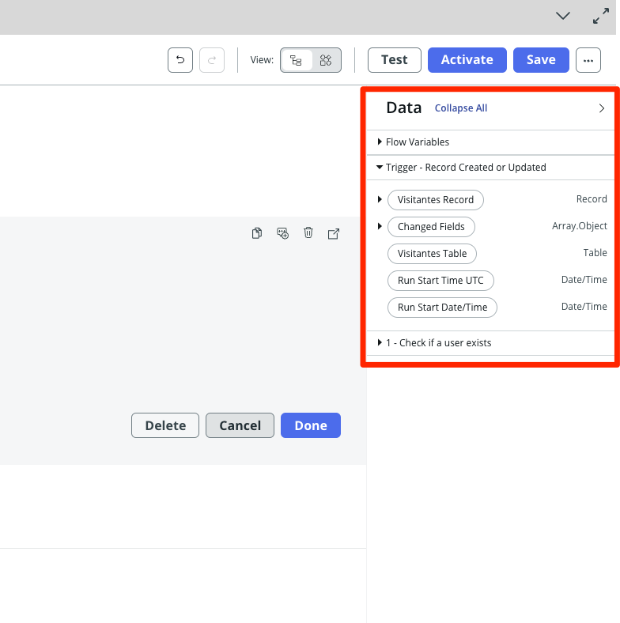
    11. Expanda os data pills da seguinte forma: **Trigger > Visitantes Record > Visitor Date of Birth**.
    
    12. Arraste o data pill `Visitor Date of Birth` para o campo `dateofbirth` da action `Check if a user exists`
    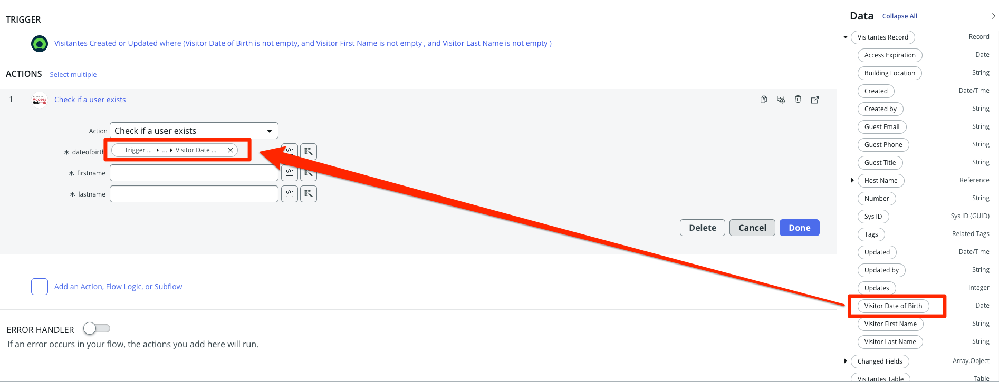
    13. Faça isso para os demais campos `Visitor First Name` e  `Visitor Last Name`.
    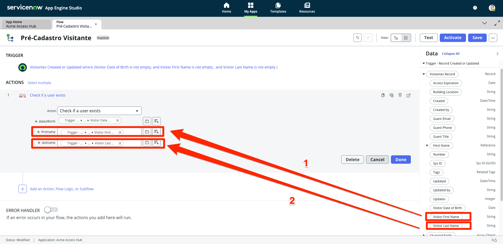
    14. Clique em Done
    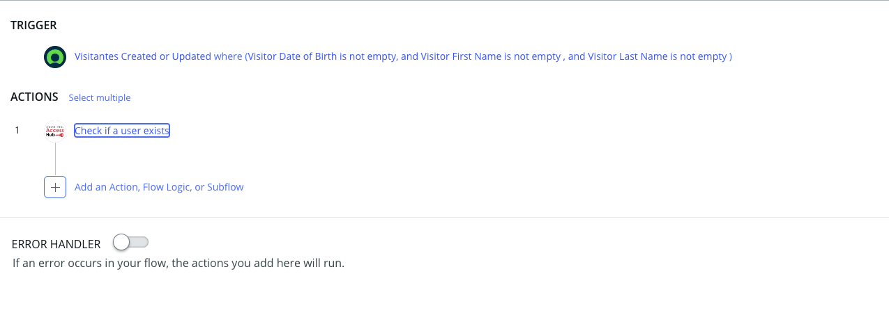

9.  **Adicione Lógica ao Fluxo para _Se houver retorno...**
    1. Sob a Ação 'Check if a user exists', **clique** em **Add an Action. Flow Logic, or Subflow**.
    2. Clique em **Flow Logic**.
    3. Clique em **If**.
    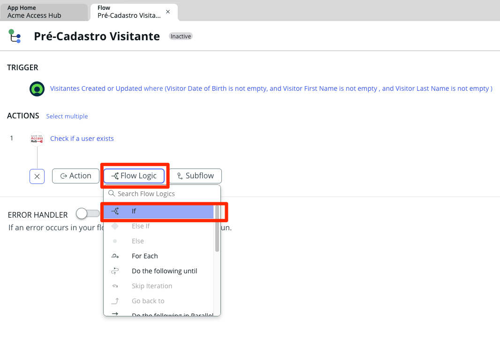
    4. No campo **Condition Label**, digite "Verificar retorno com sucesso da API (Status Code = 0)".
    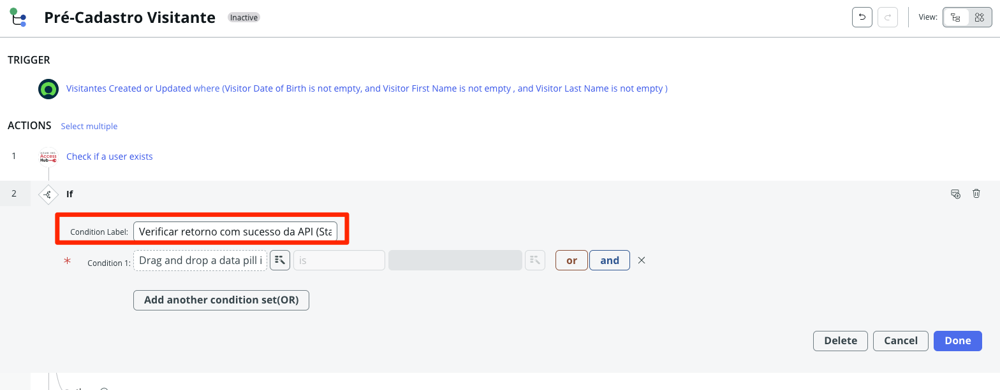
    5. Clique no **Data Pill Picker** ao lado de 'Condition 1'.
    
    6. Clique em **1 - Check If A User Exists**.
    7. Clique no símbolo **(>)** ao lado de **Action Status** (Não clique na linha, apenas no simbolo)
    
    8. Clique em **Code**.
    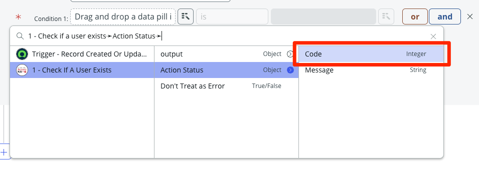
    9.  Mantenha o operador **is**.
    10. Inclua o valor **"0"** no campo de condição.
    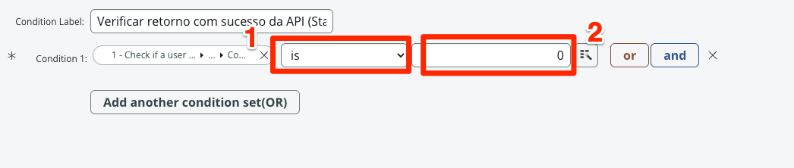
    11. Clique em Done.

:::info
O retorno com Action Status Code = 0 significa que a API retornou com sucesso. Todo valores diferente deve ser tratado como erro.
:::

Em seguida, se o gerente aprovar, uma tarefa deve ser enviada para a TI configurar o acesso VPN para a pessoa.

11. **Adicione a Ação Criar um Ticket.**
    1. Sob _If Verificar retorno com sucesso da API (Status Code = 0)_, clique ⊕ ao lado de 'then'.
    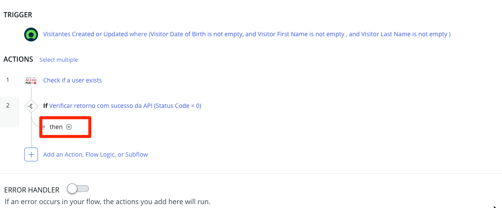
    2. Selecione **Action** > **ServiceNow Core** > **Update Record**.
    
    3. Arraste o Data Pill `Visitantes Record` no painel da direita para o campo `Record` da action.
    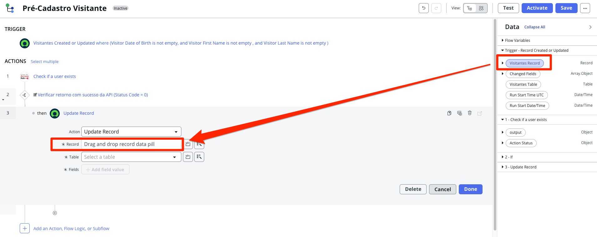
    4. Clique em **Add a field value**.
    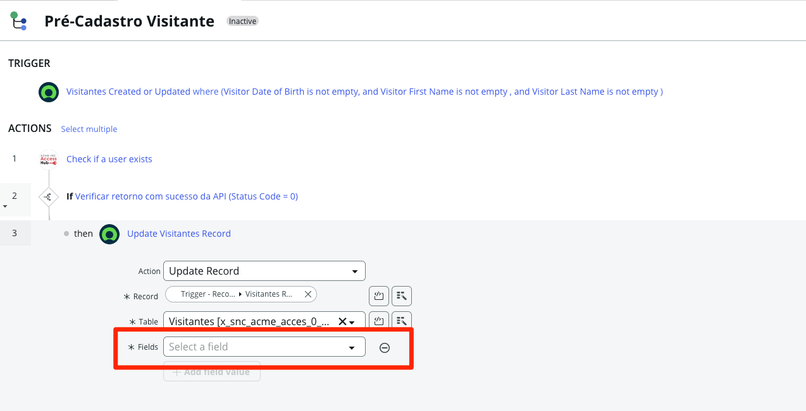
    5. Clique em 'Select a field'.
    6. Procure por 'Access Expiration' no drop-down e clique nele. 
    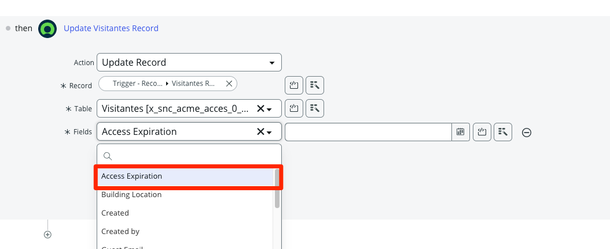
    7. No painel lateral de **Data Pills**, encontre e arraste para o campo o Data Pill **1 - Check if a users exists > output > user > access_expiration**.
    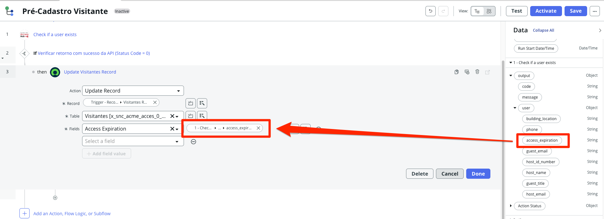
    8. Faça a mesma ação para os demais campos:
       - Building Location = `building_location`
       - Guest Email = `guest_email`
       - Guest Phone = `phone`
       - Guest Title = `guest_title`
    
    9. Adicione o último campo **Host Name** e arraste o data pill **host_id_number**
    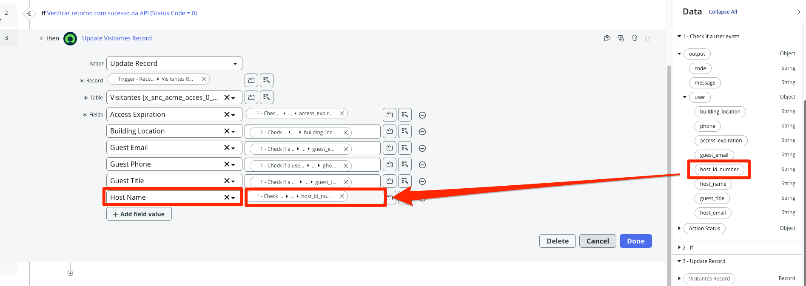
    :::info
    Adicionamos o campo `host_id_number` ao invés do campos `host_name` pois como se trata de uma campo de referência a tabela `sys_user` precisamos usar o `sys_id` para que funcione corretamente.
    :::
    10. Adicione por último o campo `Pré-Cadastro Validado` e deixe marcado.
    
    
    11. Se os Valores dos Campos estiverem como abaixo, clique em Done.
    12. Clique no botão **Add Annotation** à direita da Ação **Update Visitantes Record**.
    
    13. Digite `Atualiza informações retornadas da API externa` e pressione ENTER.
    
    :::info
    Adicionar Anotações torna o Fluxo mais fácil de ler.
    :::

12. No canto superior direito da tela, clique em Save.

13. Clique em Activate à esquerda do botão Save. Isso torna o Fluxo 'ativo' no aplicativo.  

14. Na caixa de Confirmação, clique no botão Activate.

**Por enquanto vamos parar por aqui. Claro, poderíamos tratar os fluxos de excessão para garantir que não haja problemas para o usuário. Mas para efeito de laboratório vamos trabalhar apenas com o caminho feliz.**

### Seu fluxo deve se parecer com isso:

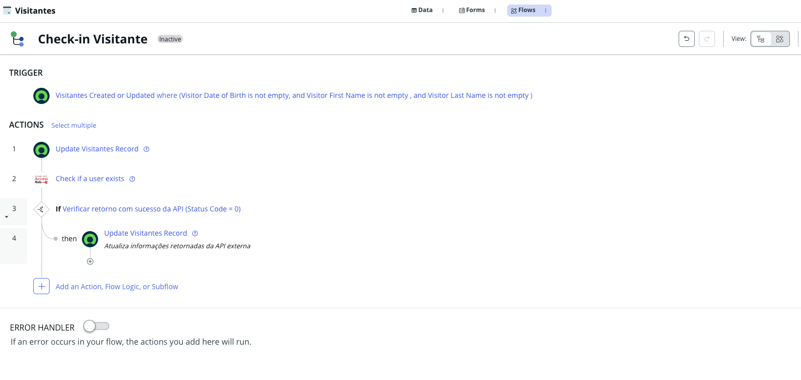

## Vamos testar o nosso fluxo

17. Clique no botão `Test` no canto superior direito
    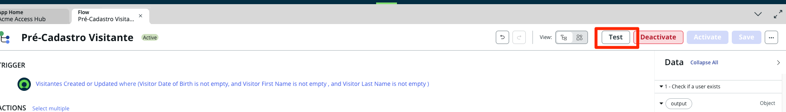

18. No campo **Visitantes Record**, role até o final e selecione o registro mais atual (O mesmo que criamos no passo anterior)
    

19. Clique no botão Run Test
    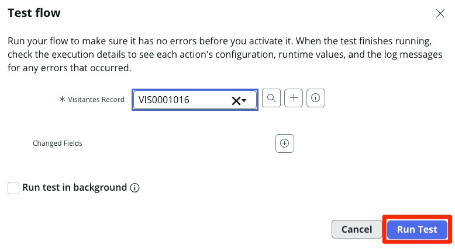

20. Após concluir o teste clique no link **Your test has finished running. View the flow execution details.**
    

21. Uma nova aba será criada com os detalhes da execução. Verifique se todos os passos foram completados com sucesso (em verde). Caso positivo clique na linha **Update Record**
    

22. Verifique os detalhes. e clique no link do registro atualizado no campo **Record: VIS000XXXX**
    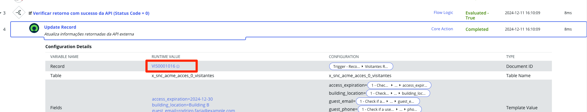

23. Veja o preview com as informações populadas por meio da API. Para ver o registro completo clique em **Open Record** ou retorne para aba que possui seu registro aberto.
    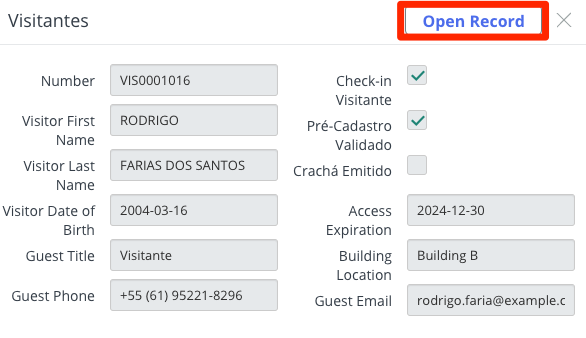

24. Verifique que todos os campos foram preenchidos por meio da integração com uma API Externa.
    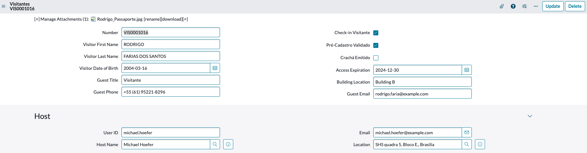

## Recapitulação do Exercício

Você construiu um Fluxo que cuida da gestão de tarefas e comunicações entre vários departamentos.

A seguir, você irá testar o Fluxo para vê-lo em ação.
