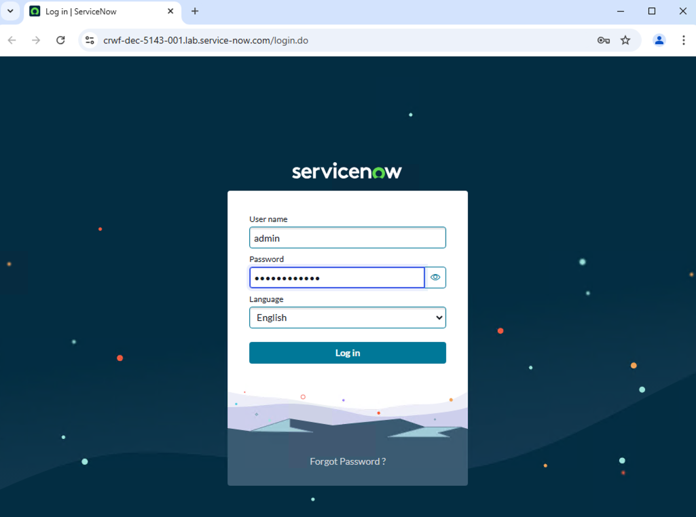
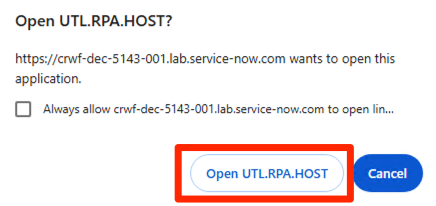
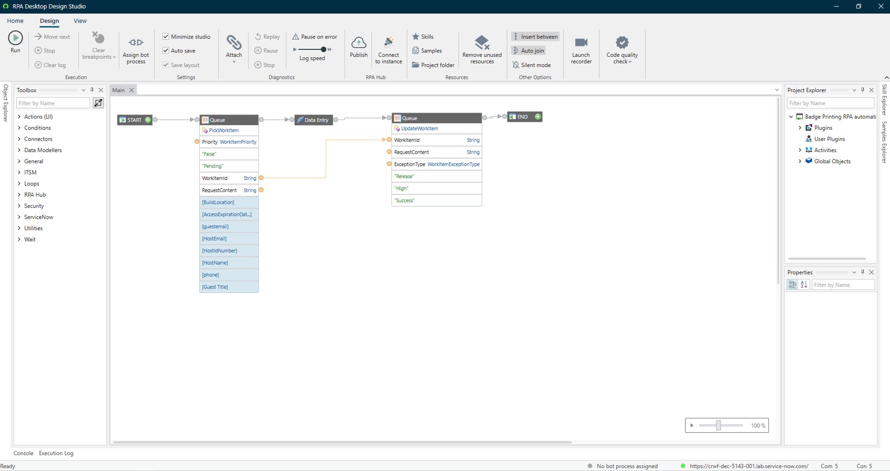
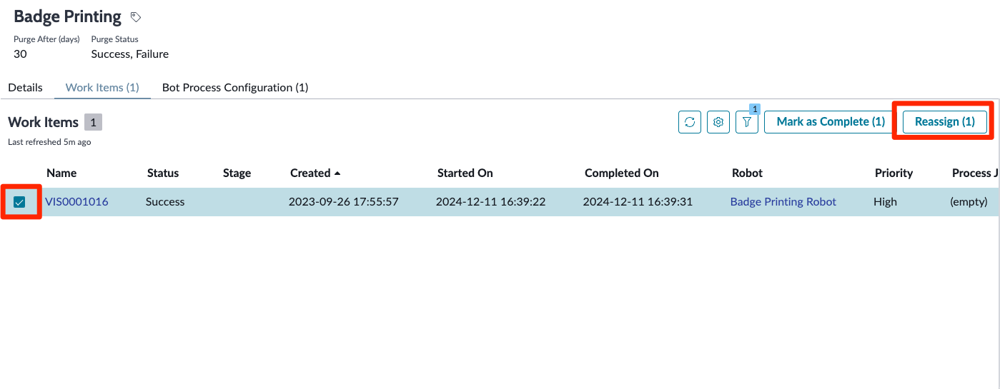
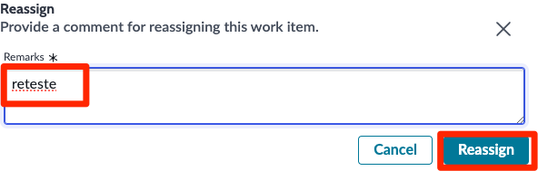

O Robotic Process Automation (RPA) Desktop Design Studio é um Ambiente de Desenvolvimento Integrado (IDE) low-code onde você pode projetar ou configurar fluxos de trabalho de automação RPA arrastando e soltando componentes na superfície de design. O RPA Desktop Design Studio é um aplicativo nativo do Windows.

Dê um duplo clique no ícone do RPA Desktop Design Studio na área de trabalho do Windows

Na janela pop-up **Connection Manager**, preencha os campos com as informações abaixo

   | Campo | valor |
   |-------|-------|
   | Nome | Minha Instância de Laboratório |
   | URL | Digite a URL da sua instância de laboratório, incluindo http:// |
   | Marcar como Padrão | Marque a caixa |
   | Abrir no navegador padrão | Marque a caixa |

Depois clique em **Proceed** (5)

Na primeira vez que o Studio é aberto, pode levar um minuto para carregar todos os componentes necessários

Faça Login com a suas credencias da instância.

Click em `Open UTL.RPA.HOST`

Antes de fechar o Google Chrome, digite `chrome://extensions` na barra de URL e pressione Enter. Certifique-se de que a extensão ServiceNow RPA Chrome esteja habilitada; é necessária para que o Robô interaja com o Google Chrome

Se você não ver a Extensão ServiceNow RPA Chrome, vá para a loja do Google Chrome e instale-a como mostrado abaixo:

.gif>)

Você verá a tela de de boas-vindas do RPA Desktop Design Studio.

Para este lab iremos utilizar um projeto de automação já criado, na pasta extraída do laboratório contém um arquivo com extensão .ibot que será importado para o Design Studio. Caso precise baixar novamente utilize o link: **[Badge_Printing_RPA_automation.iBot](../downloads/Badge_Printing_RPA_automation.iBot)**

No RPA Desktop Design Studio, acesse **Automation project** e selecione **Open local project**

Busque pelo arquivo `Badge Printing RPA automation.ibot` e clique em **Open**

Vamos navegar um pouco pela estrutura do projeto para entender o seu funcionamento.

Agora que exploramos um pouco o projeto vamos testá-la para verificar se tudo está correto.

Antes de testá-la, vamos garantir que o Studio esteja conectado à instância seguindo estas etapas. Não se esqueça de atribuir também o processo do Bot, conforme mostrado:

.gif)

Clique no botão **Run** no Studio para testá-la!

.gif)

Se você se conectar ao espaço de trabalho RPA Hub e inspecionar o Work Item da fila, você deverá ver seu status como 'Success'. Seu desenvolvedor ServiceNow pode então aproveitar essa atualização como um gatilho no Flow Designer para acionar outras etapas do processo, mas a entrada de dados na aplicação de badging legada agora está automatizada com o RPA Hub!

.gif)

:::info
Caso precise retestar o processo ou houve erro durante a execução no passo de `Queue` no RPA Design Studio. Não se preocupe, isso é por que nesse momento possuimos apenas um único item na fila e nosso critério é buscar por itens com status *Pending*.

Para resolver isso, volte para a tela do RPA Hub na plataforma ServiceNow e clique na guia **Queue** do seu Bot Process, se você não a vê, clique no botão **More**.

Clique no registro de Queue de Trabalho **Badge Printing** para abrir e inspecionar.

Clique no registro de Item de Trabalho **VIS0001016** (2) para inspecionar.

Clique selecione o item da lista e clique em **'Reassign (1)'**

Inclua qualquer comentário e clique em Reassign

Pronto, seu Work Item já voltou para status `Pending` e você pode testar novamente no RPA Design Studio.
:::

Você concluiu com sucesso o laboratório!
