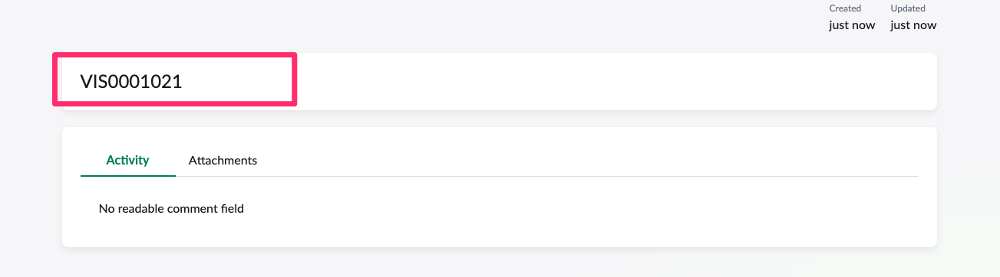
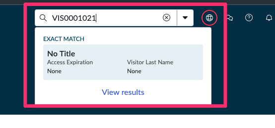
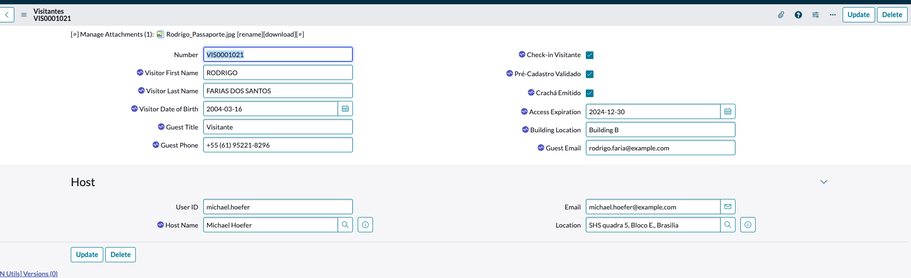

## Visão Geral

Agora chegou a hora de realizar o teste final 

## Instruções

1. Vá para a aba do navegador que diz 'Home'.

2. **Abra o Employee Center.**
    1. Clique em All.
    2. Digite `employee center`.
    3. Clique em **Employee Center**.
    

3. **Procure o formulário 'Check-in Visitante' Record Producer.**
   1. Digite `Check-in` na caixa de pesquisa.
   2. Pressione ENTER no teclado.
   

4. Clique em 'Check-in Visitante' nos resultados da pesquisa.

5. Clique na opção "Add attachments".
   

6. Arraste ou clique em "Choose a file" e carregue o documento `Rodrigo_Passaporte.jpg`.
   

7. Clique em Submit.
    

8. Copie o ID da requisição `VIS000XXX` e mantenha aberta essa janela.
   

9. Abra ele via plataforma.
    

10. Aguarde alguns minutos e observe os campos sendo preenchidos junto com os campos de status.
    
    

11. Volte para a sua máquina virtual Windows e com o RPA Desktop Design Studio, feche o navegador se ele estiver aberto e execute novamente.

    

12. Verifique o preenchimento das informações pelo RPA com os dados do visitante
    

## Recapitulação do Exercício

🎉 Parabéns você acaba de criar uma aplicação utilizando os recursos da hiperautomação com a plataforma ServiceNow!