## Visão Geral

Agora iremos criar uma interface mais amigável para que os visistantes façam o check-in.

Para isso, iremos criar um **Record Producer** diz respeito a onde os registros serão criadas. Elas devem ser criadas na nossa tabela 'Visitantes'.

Siga as instruções abaixo para aprender a criar um **Record Producer** que atenda aos requisitos acima.

## Instruções

1. Retorne para o App Engine Studio. Caso tenha fechado a janela do AES, acesse sua Instância de laboratório e navegue até o **AES (App Engine Studio)** em `All > App Engine > App Engine Studio`. e acesse a aplicação `Acme Access Hub`.

2. Clique na aba **Experience**.

3. Clique em +Add.
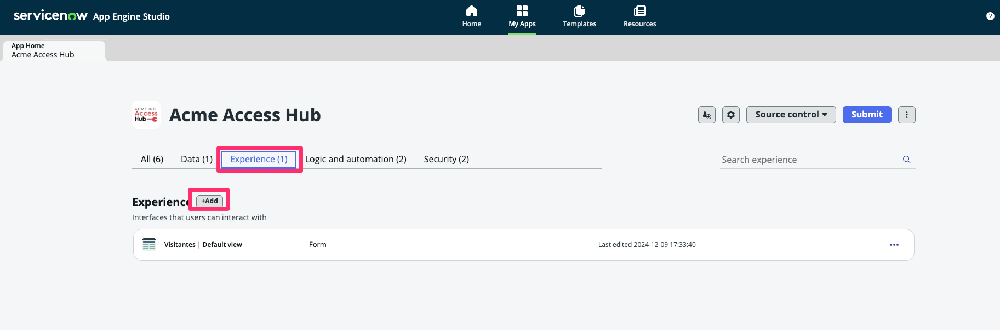

3. Clique em **Record Producer**.
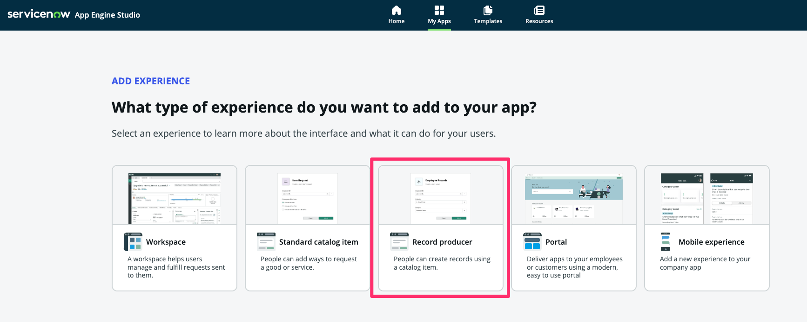

:::info
Um Record Producer é um tipo específico de Item de Catálogo que permite que os usuários finais criem registros a partir de um Catálogo de Serviço.
:::

4. Clique em Begin.
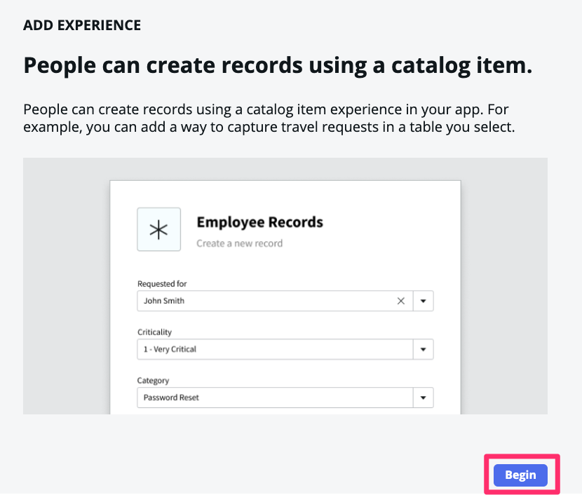

5. **Vamos configurar seu Record Producer.**
    - Defina os seguintes valores e clique em Continue. 

    | Campo                | Valor                |
    |----------------------|----------------------|
    | **Name**              | `Check-in Visitante` |
    | **Short description** | `Solução de Check-in de Visitantes para Terminal de Autoatendimento` |

    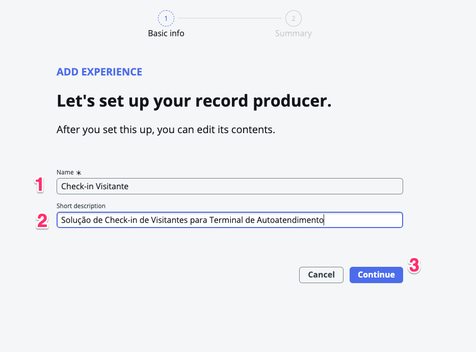

6. Clique no botão Edit record producer.
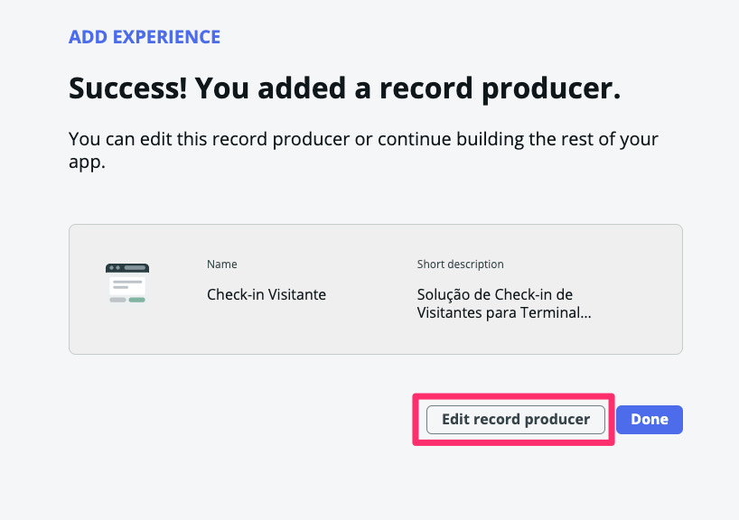

7. Na Guia **Details** preencha as informações restantes na sessão **Item details**:

    | Campo                | Valor                |
    |----------------------|----------------------|
    | **Image**            |Carregue o arquivo `check-in_Logo.png` disponibilizado na pasta do laboratório. |

8. Copie e cole os detalhes abaixo no campo **Description**: 
    
import useBaseUrl from '@docusaurus/useBaseUrl';

<iframe 
  src={useBaseUrl('/checkin.html')} 
  style={{ width: '100%', height: '250px', border: 'none', borderRadius: '8px' }}
  title="Check-in Process"
></iframe>

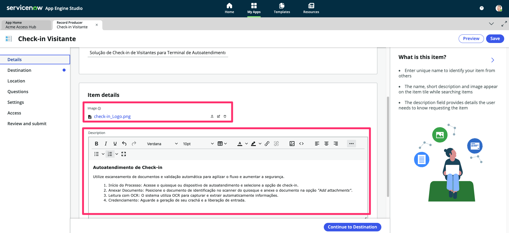

9. Clique em Continue to Destination

10.  **O destino do Record Producer será a tabela `Visitantes`.**
   > * Clique em **Destination** 
   > * Digite **Visitantes**.
   > * Selecione a tabela **Visitantes**.
   > * Clique em Continue to Location.

    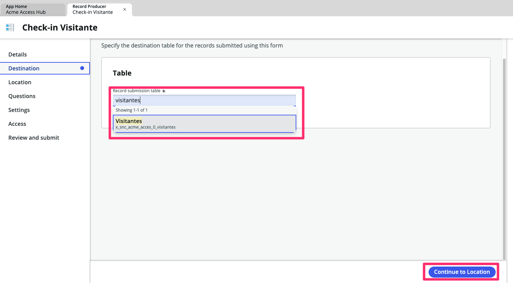

:::info Catálogos e Categorias
Assim como na vida real, um **Catalog** do ServiceNow contém **Categories** de itens e serviços que podem ser solicitados por um **requester**.
IMAGEM

Um **Topic** é uma maneira mais recente no ServiceNow para organizar **Catalog Items** e **Record Producers** para o portal do **Employee Center**.
:::

8. **Adicione o Record Producer a um Catálogo.**
    1. Na caixa **Catalogs**, clique em Browse.
    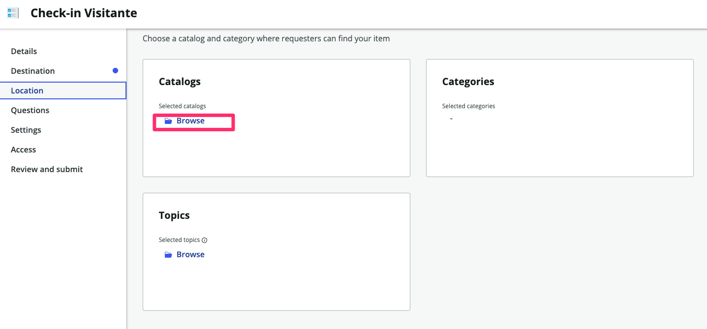
    2. Mova **Service Catalog** para a caixa da direita, 'Selected catalogs'.
    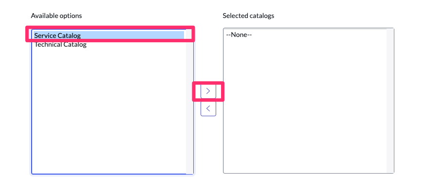
    3. Clique em Save selections.
    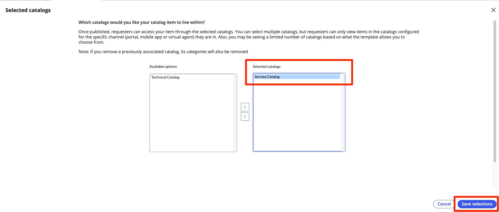

9. **Adicione o Record Producer a uma Categoria.**
    1. Na caixa **Categories**, clique em Browse.
    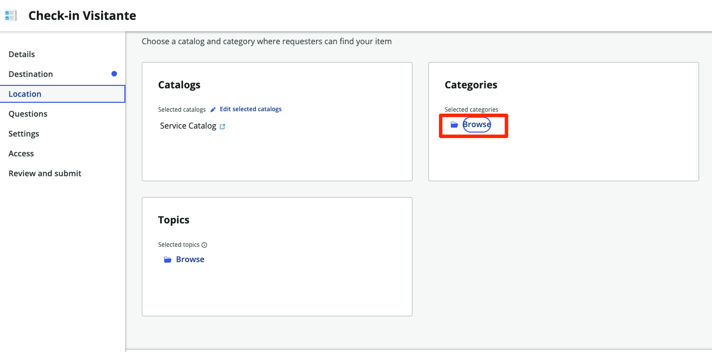
    2. Mova **Can We Help You?** para a caixa da direita, 'Selected categories'.
    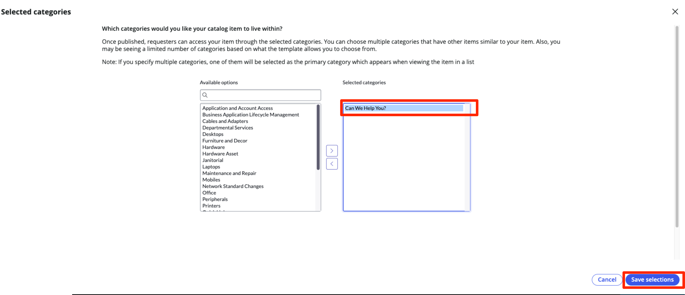
    3. Clique em Save selections.
    
10. Clique em Continue to Questions.
    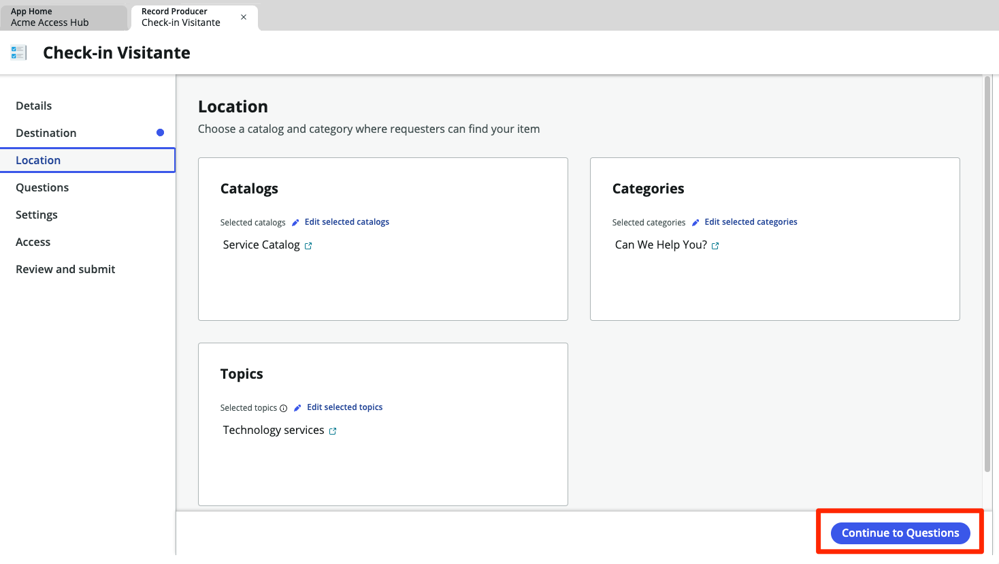

11. Agora em **Question**, iremos adicionar os campos que queremos receber as informações do visitante para o Record Producer. Clique em Insert new question.
    

12. Adicione a pergunta **Nome**.

    1. Defina os seguintes valores na seção **Type**:  

    |**Field Name** | **Field Value**
    |-----------------| --------------
    |**Question type**    | Text
    |**Question subtype** | Single line

    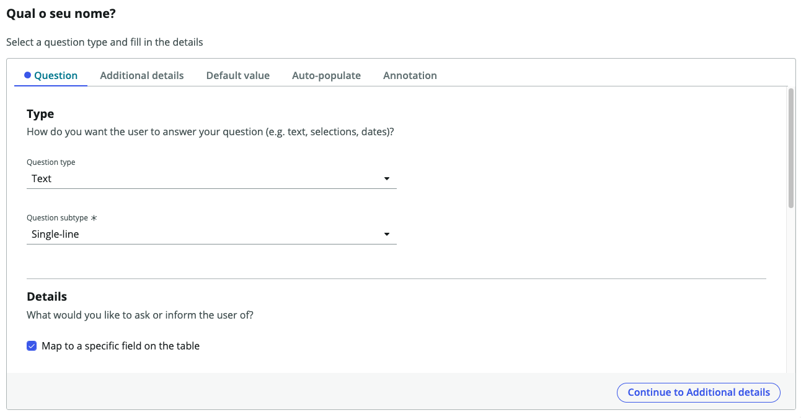

    2. Na seção abaixo **Details**, insira as seguintes informações: (💡 duplo clique, copie e cole no formulário).

    |**Field Name**                   | **Field Value**
    |-----------------------------| --------------
    |**Map to a specific field**      | ✅ Checked
    |**Table field**                  | Visitor First Name
    |**Question label**	             | Qual o seu nome?
    |**Name**                        | nome 
    |**Mandatory**                    | ✅ Checked

    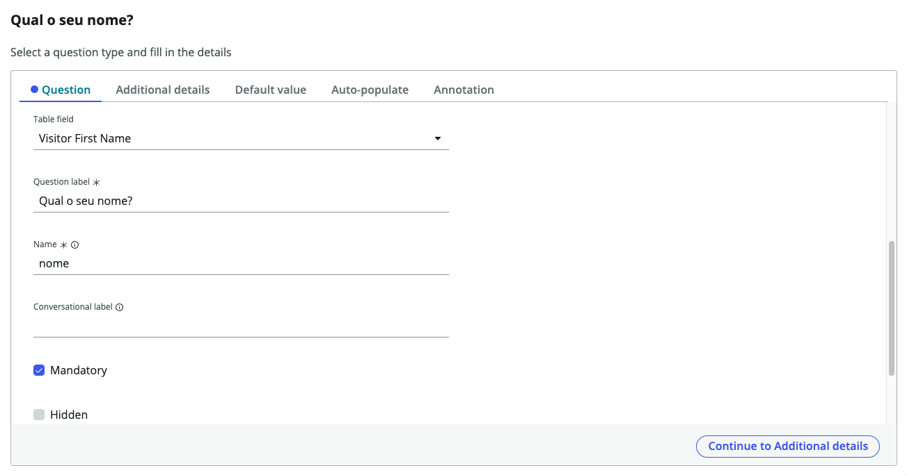

    3. Clique em Insert Question.

12. Repita o passo anteiror mas agora para o **sobrenome.**
    1. Defina os seguintes valores na seção **Type**:  

    |**Field Name** | **Field Value**
    |-----------------| --------------
    |**Question type**    | Text
    |**Question subtype** | Single line

    2. Na seção abaixo **Details**, insira as seguintes informações: (💡 duplo clique, copie e cole no formulário).

    |**Field Name**                   | **Field Value**
    |-----------------------------| --------------
    |**Map to a specific field**      | ✅ Checked
    |**Table field**                  | Visitor Last Name
    |**Question label**	             | Qual o seu sobrenome?
    |**Name**                        | sobrenome 
    |**Mandatory**                    | ✅ Checked

    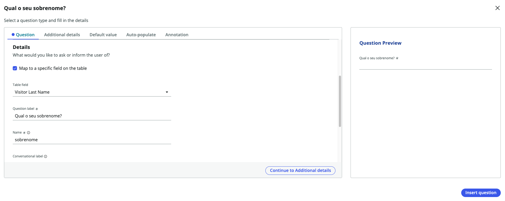

    3. Clique em Insert Question.

14. Por último vamos adicionar o campo para **data de nascimento** o passo anteiror mas agora para o sobrenome.
    1. Defina os seguintes valores na seção **Type**:  

    |**Field Name** | **Field Value**
    |-----------------| --------------
    |**Question type**    | Date / Time
    |**Question subtype** | Date

    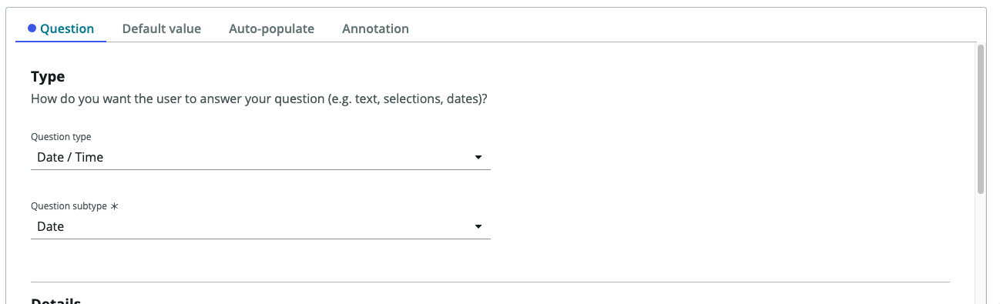

    2. Na seção abaixo **Details**, insira as seguintes informações: (💡 duplo clique, copie e cole no formulário).

    |**Field Name**                   | **Field Value**
    |-----------------------------| --------------
    |**Map to a specific field**      | ✅ Checked
    |**Table field**                  | Visitor Date of Birth
    |**Question label**	             | Qual a sua data de nascimento?
    |**Name**                        | data_nascimento
    |**Mandatory**                    | ✅ Checked

    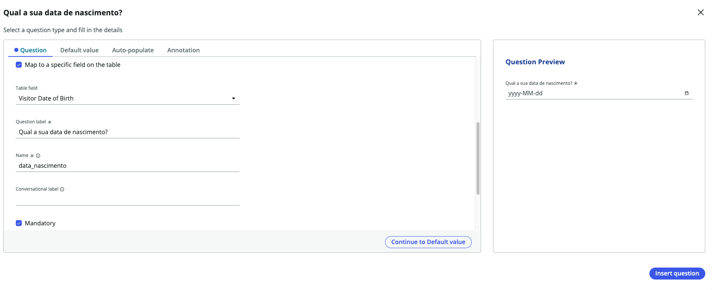

    3. Clique em Insert Question.

16. Ao final, teremos as 3 perguntas no nosso record producer. 
    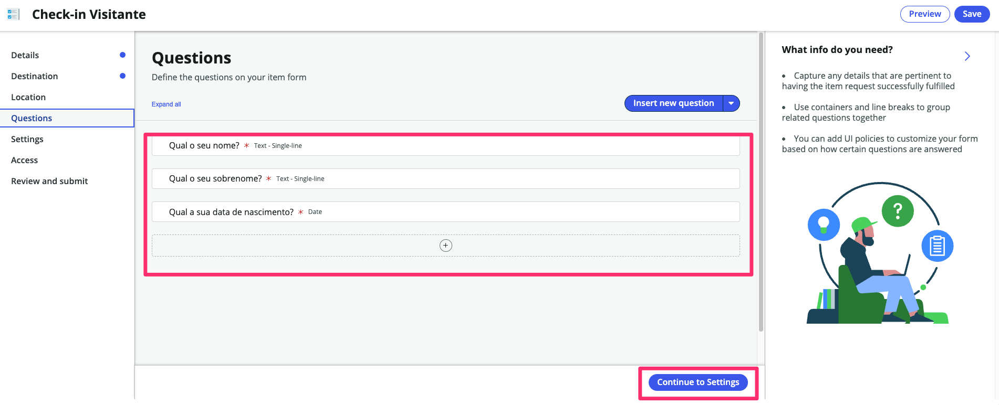
    Em seguida, cique em Continue to Settings.

13. Como iremos precisar do documento, vamos marcar a opção "Make attachment mandatory".
    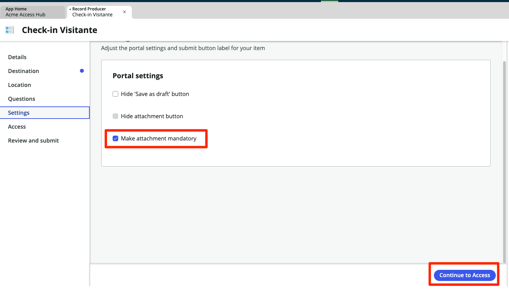
    Clique em Continue to Access.

14. Clique em "Browse" na sessão "Available for".
    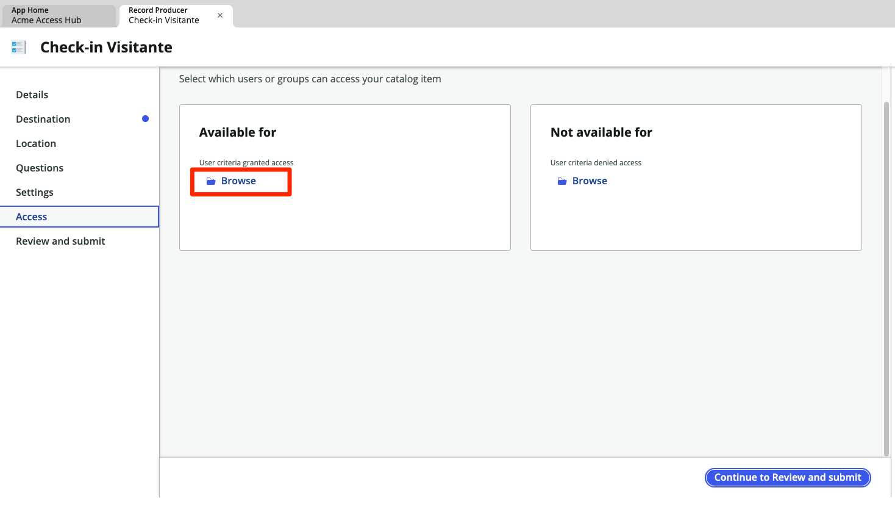
    1. Adicione as opções "Any User" e "Guest user" em **Available For**
    2. Remova a opção SNC External de **Not Available For**
    3. Clique em Save selections.

15. Clique em Continue to Review and Submit.
    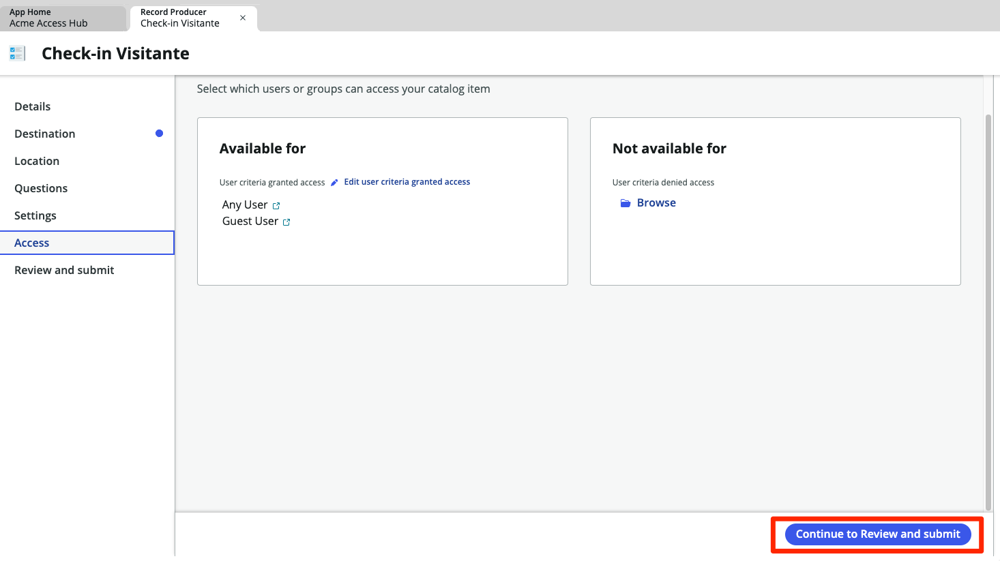

16. Clique no botão Save
    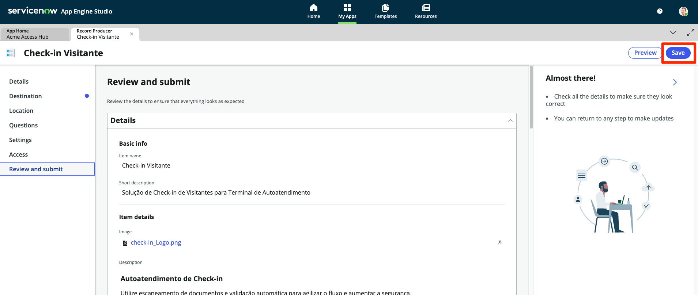

17. Clique no botão Preview.
    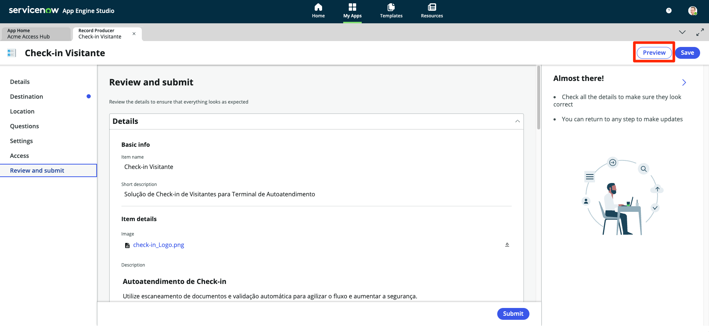

18. Visualize como será a experiência para o usuário em 3 tipos de plataforma: Portal, Now Mobile e Virtual Agent
    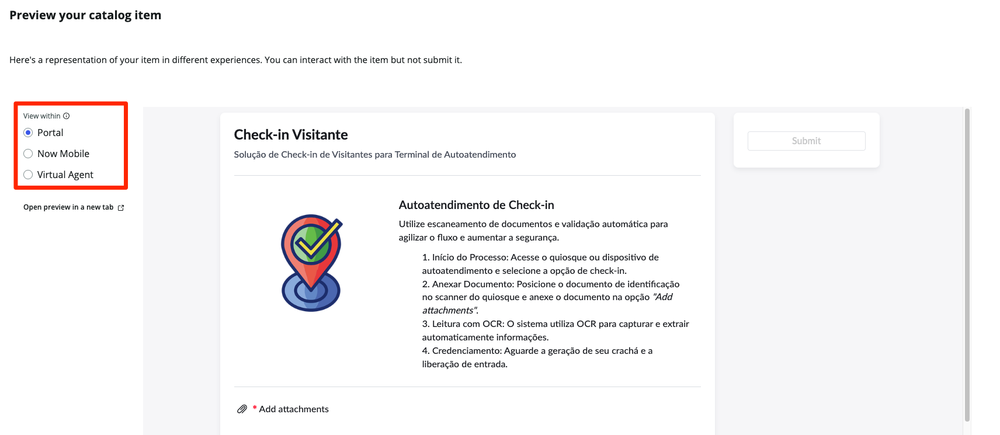
    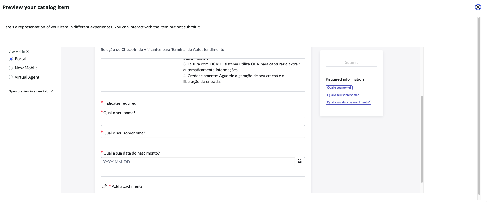

19. Feche a janela de preview (X).
    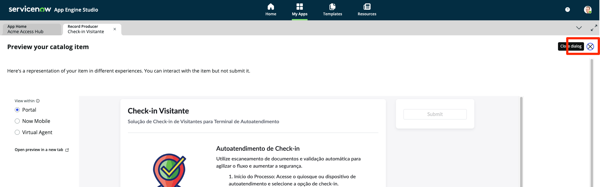

20. Clique no botão Submit
    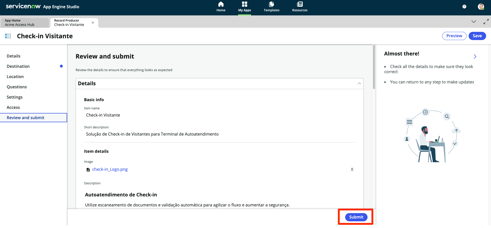

21. Clique no botão Return to my application
    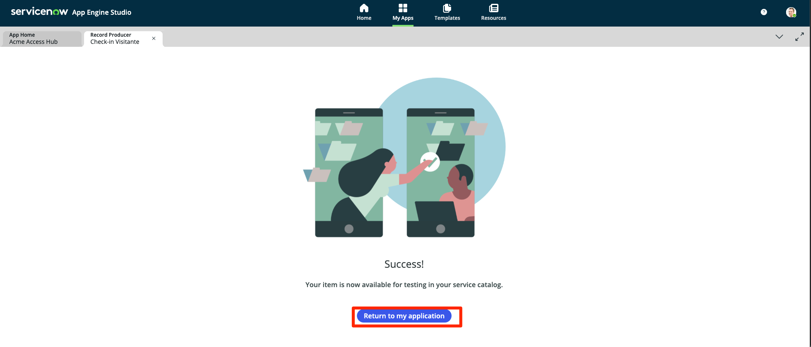

## Recapitulação do Exercício

Você configurou onde o **Record Producer** será visível para os usuários **solicitantes** para enviar solicitações de Teletrabalho.
