## Visão Geral

Os **usuários requisitantes** acessam o ServiceNow através de portais. O principal portal padrão oferecido pelo ServiceNow é chamado **Employee Center**.

_Para mais informações: [Documentos do Produto ServiceNow Employee Center](https://docs.servicenow.com/csh?topicname=employee-center-landing-page.html&version=latest)_

Neste exercício, você visualizará o 'Apply for Telework' Record Producer no portal Employee Center.

## Instruções

1. Vá para a aba do navegador que diz 'Home'.
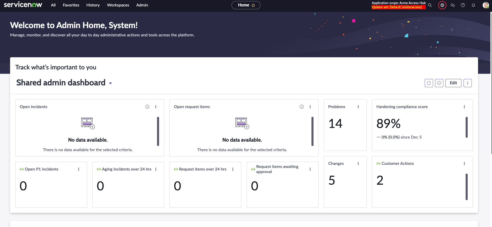

1. **Abra o Service Portal.**
    1. Clique em All.
    2. Digite `service portal`.
    3. Clique em **Service Portal Home**.
    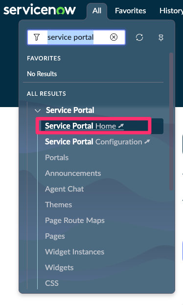

2. **Procure o formulário 'Check-in Visitante' Record Producer.**
   1. Digite `Check-in` na caixa de pesquisa.
   2. Pressione ENTER no teclado.
   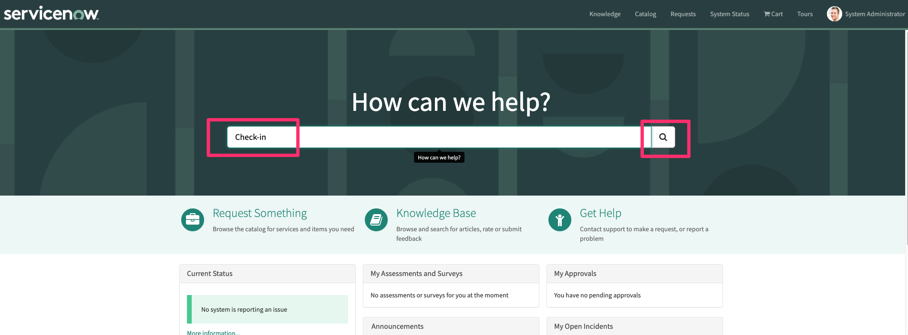

3. Clique em 'Check-in Visitante' nos resultados da pesquisa.
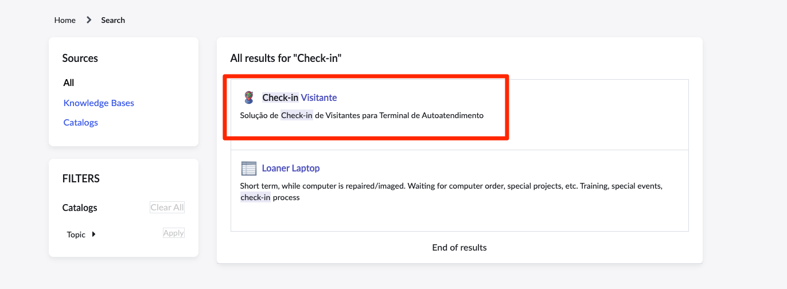

4. Preencha as seguintes informações:

    |**Field Name**                   | **Field Value**
    |-----------------------------| --------------
    |**Qual o seu nome?**      | RODRIGO
    |**Qual o seu sobrenome?**                  | FARIAS DOS SANTOS
    |**Qual a sua data de nascimento?**	             | 2004-03-16

5. Clique na opção "Add attachments".
   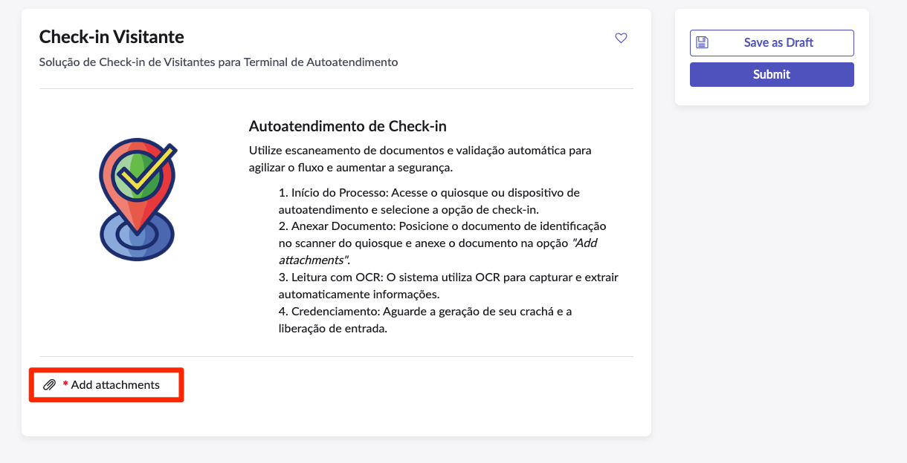

6. Arraste ou clique em "Choose a file" e carregue o documento `Rodrigo_Passaporte.jpg`.
   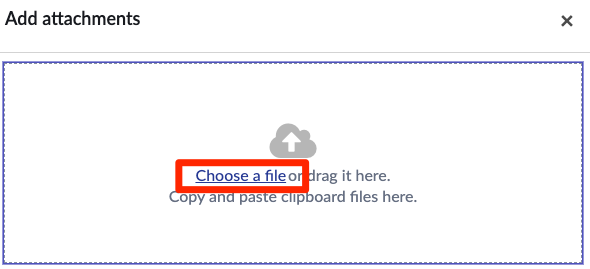

7. Clique em Submit.
    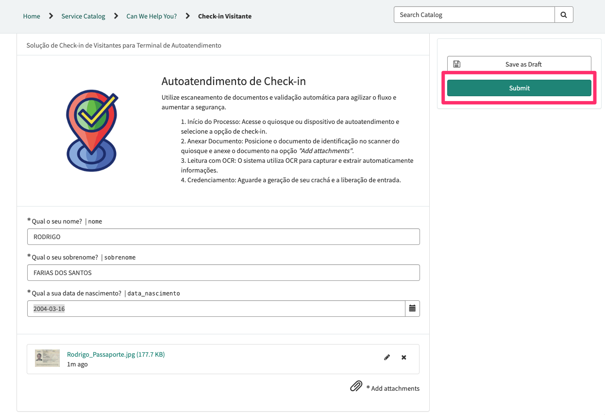

8. Copie o ID da requisição `VIS000XXX`
   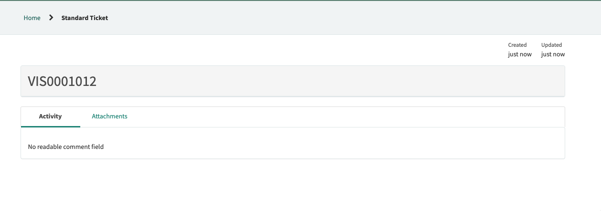

9.  Abra a aba "Home" do seu navegador novamente e clique no ícode de busca (caso a barra de pesquisa esteja oculta).
    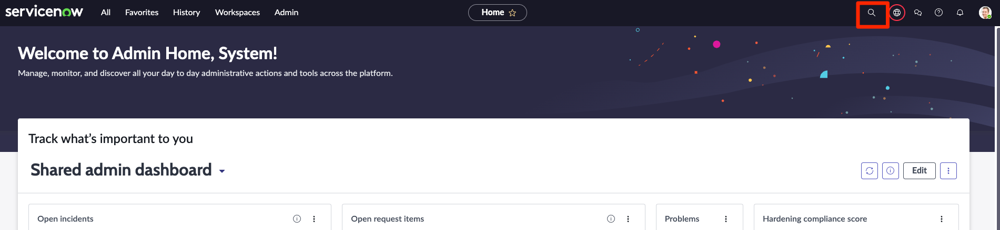

10. No campo de busca digite o número da requisição `VIS000XXX` e clique no primeiro resultado.
    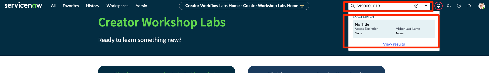

11. Na aba formulário aberta. Repare que os campos `Visitor First Name`, `Visitor Last Name` e `Visitor Date of Birth` foram preenchidos.
    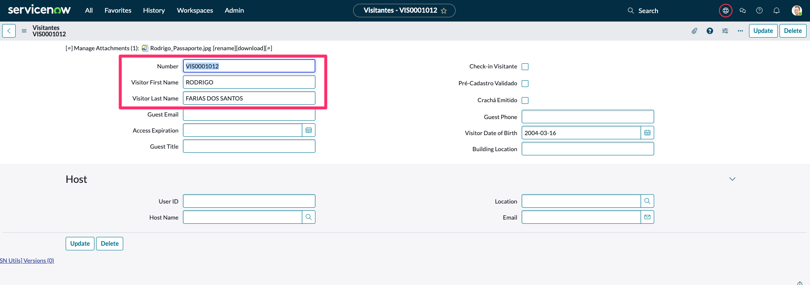

12. Mantenha essa guia aberta.

## Recapitulação do Exercício

Neste exercício, você aprendeu a criar uma interface amigável para o usuário chamado de Record Producer.
