## Visão Geral

Neste exercício, você criará um Spoke personalizado no Integration Hub.

## Instruções

1. Volta para a aba da plataforma (se tiver fechado basta acessar o link raiz da instância novamente), na página principal, clique em **All** (1). Em seguida, digite **flow** (2) e clique em **Flow Designer** (3) para abrir a interface do Flow Designer.
   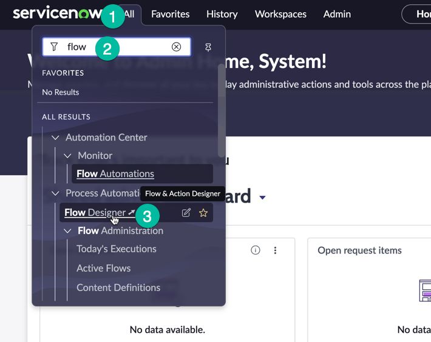

2. Uma vez na interface do **Flow Designer**, para acessar o Spoke Generator, selecione **Create New** (1) (localizado no lado direito da tela) e depois clique em **Spoke**.
   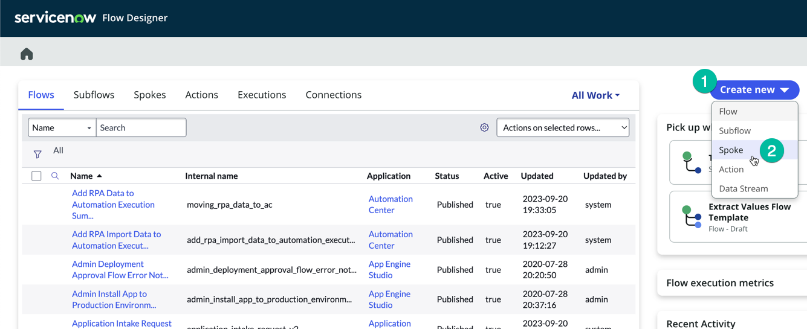

3. O Spoke Generator solicitará o escopo, vamos selecionar o mesmo escopo da nossa aplicação.

   | Campo         | Valor                                                        |
   |---------------|--------------------------------------------------------------|
   | 1. Choose how you want to build your spoke | Create a spoke in existing scope|
   | 2. Application name | **Acme Access Hub**                                        |

   Ao selecioná-lo ele automaticamente carrega as demais informações. Clique em **Continue**

   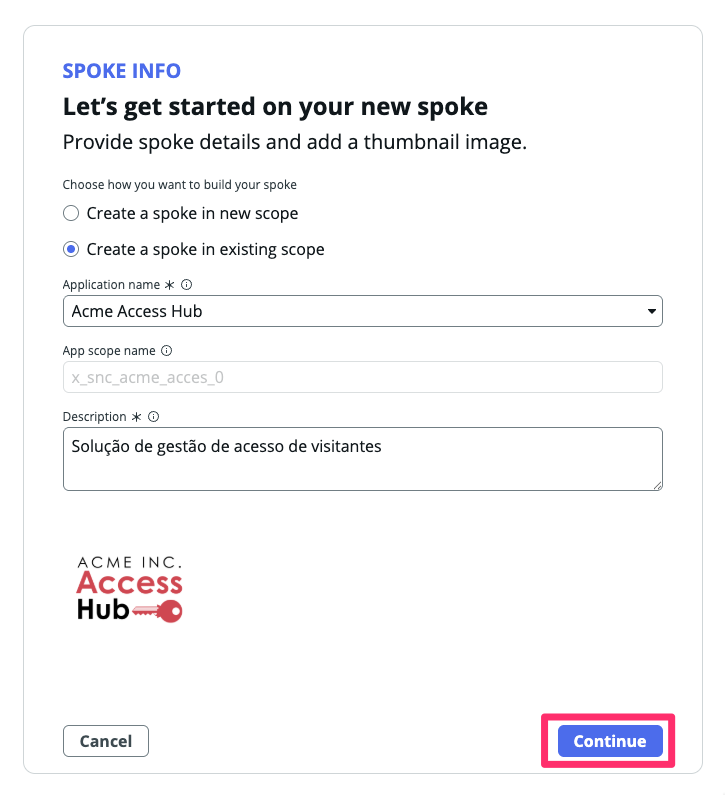

4. Na tela seguinte, você será solicitado a selecionar o método que deseja usar para criar seu novo spoke. Pretendemos utilizar o método OpenAPI Specification, já que temos o arquivo YAML que descreve a API e segue a Especificação OPENAPI.
   * Selecione **OpenAPI Specification** (1) e clique em **Continue** (2)
   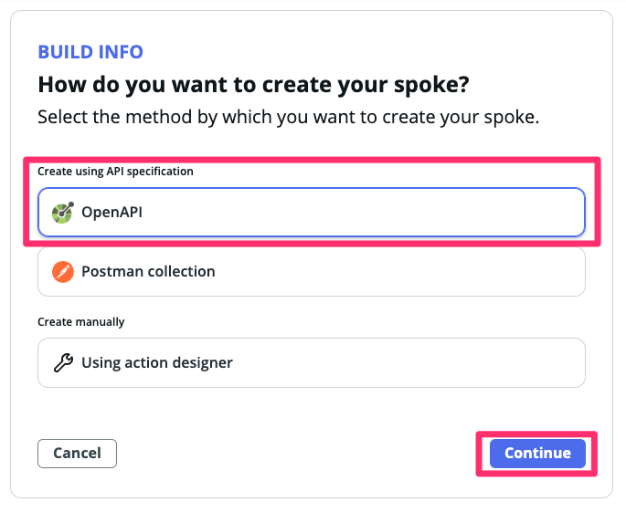

5. Na próxima tela, **Visitor Access: Add operations**, você pode fornecer o arquivo YAML. Clique em **Import New** (1), e depois **Import from JSON OR YAML manually**, copie e cole o conteúdo do swagger abaixo:
  ```yaml
  openapi: 3.0.3
  info:
    title: User Checker API
    version: 2.0.0
  servers:
    - url: https://sncrwf.azurewebsites.net
  paths:
    /checkUser:
      get:
        tags:
          - User
        operationId: checkUser
        summary: Check if a user exists
        description: This endpoint checks if a user exists based on their first name, last name, and date of birth.
        parameters:
          - in: query
            name: firstname
            required: true
            description: First name of the user
            schema:
              type: string
              minLength: 1
            example: Ashley
          - in: query
            name: lastname
            required: true
            description: Last name of the user
            schema:
              type: string
              minLength: 1
            example: Burney
          - in: query
            name: dateofbirth
            required: true
            description: Date of birth in YYYY-MM-DD format
            schema:
              type: string
              format: date
            example: 1984-01-25
        responses:
          '200':
            description: User existence result
            content:
              application/json:
                schema:
                  $ref: '#/components/schemas/CheckUserResponse'
                examples:
                  exists:
                    value:
                      code: "0"
                      message: User exists
                      user:
                        guest_title: Guest
                        phone: "123-456-7890"
                        host_name: Jane Smith
                        host_id_number: "987654"
                        host_email: jane@example.com
                        guest_email: ashley.burney@example.com
                        building_location: Building A
                        access_expiration: "2024-12-31"
          '404':
            description: User not found
            content:
              application/json:
                schema:
                  $ref: '#/components/schemas/ErrorResponse'
                examples:
                  notFound:
                    value:
                      code: "1"
                      message: User does not exist

  components:
    schemas:
      CheckUserResponse:
        type: object
        properties:
          code:
            type: string
            description: Response code ("0" for success, "1" for failure)
            enum: ["0", "1"]
          message:
            type: string
            description: Response message
          user:
            type: object
            description: User details (present only when the user exists)
            nullable: true
            properties:
              guest_title:
                type: string
              phone:
                type: string
                description: Phone number
              host_name:
                type: string
              host_id_number:
                type: string
              host_email:
                type: string
                format: email
              guest_email:
                type: string
                format: email
              building_location:
                type: string
              access_expiration:
                type: string
                format: date
        required:
          - code
          - message

      ErrorResponse:
        type: object
        properties:
          code:
            type: string
            enum: ["1"]
            description: Error code ("1" for failure)
          message:
            type: string
            description: Error message
        required:
          - code
          - message
  ```
   
   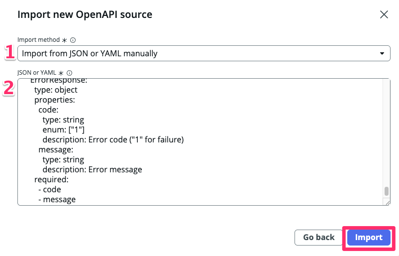

1. Após a importação, você deve ver algo semelhante a isto:
   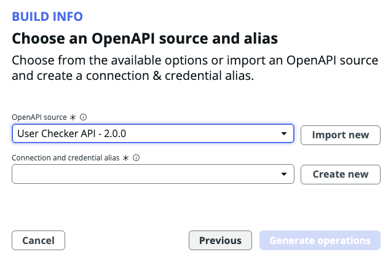

2.  Em seguida, clique em **Create New** ao lado do campo **Connection Alias** (1)
   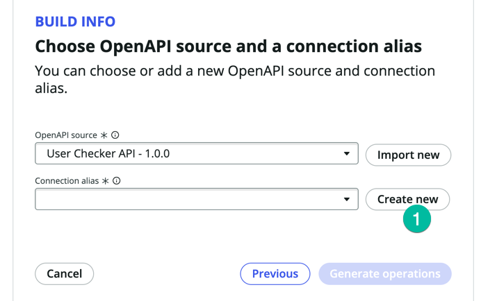
   :::note
   No ServiceNow, um Connection Alias é uma configuração usada para estabelecer e gerenciar conexões com sistemas externos. Funciona como uma camada de abstração para conectar a sistemas externos e simplifica o processo de integração dentro dos fluxos de trabalho e outros componentes do ServiceNow. Normalmente, ao conectar o ServiceNow a um sistema externo, você deve configurar a URL do endpoint (o sistema de terceiros) e especificar como autenticar com ele. Isso é feito através das configurações de Conexão e Credenciais no ServiceNow. Na prática, é essencial discutir com o administrador do sistema remoto e coordenar com a equipe de segurança antes de iniciar essa configuração.
   :::

3.  No campo **Connection alias name** (1) digite **VisitorAppConnection** e mantenha o **Authentication Configuration Template** com o valor padrão **Api Key Template** (2), depois clique em **Create** (3)
    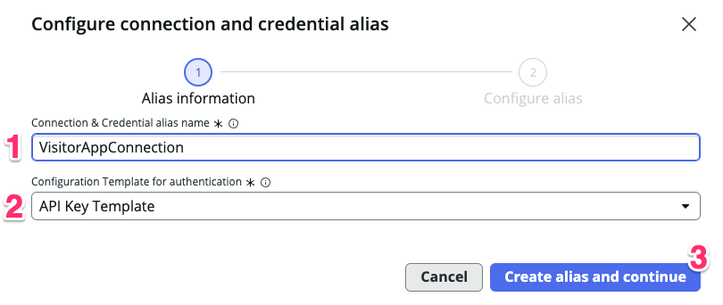

4.  Preencha as informações a seguir e clique em **Submit**

   | Campo         | Valor                                                        |
   |---------------|--------------------------------------------------------------|
   | (1) Connection URL | `https://sncrwf.azurewebsites.net`   |
   | (2) API Key | `appkey`                                    |
   | (3)     | <span className="button-purple">Submit</span> |

    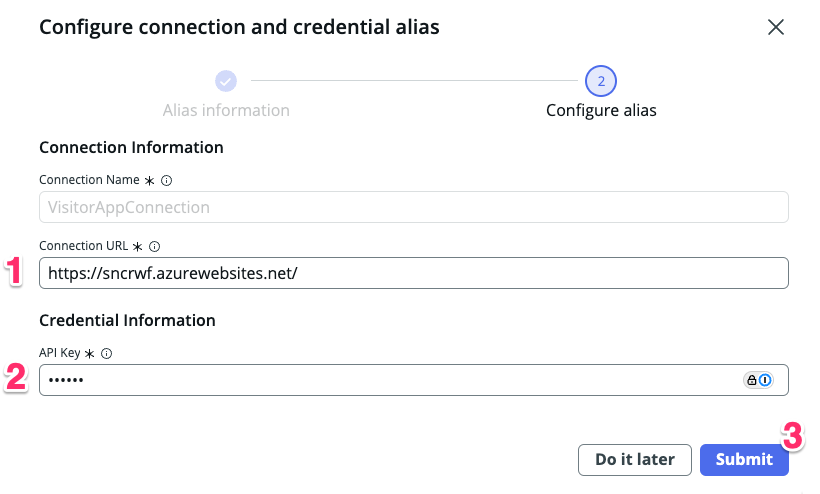

5.  Clique em **Generate Operations**.
    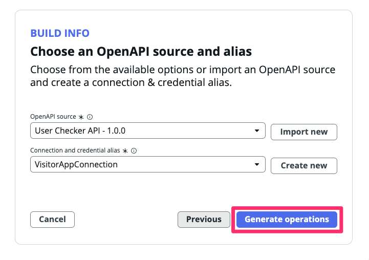

6.  O sistema solicitará que você selecione qual Spoke Action deseja criar, como mostrado abaixo:
    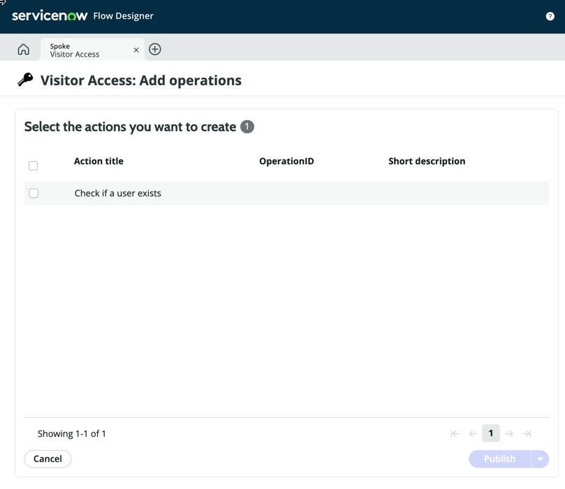
    :::note
    Para este laboratório, estamos utilizando uma API muito básica projetada especificamente para fins de laboratório e educativos. Esta API consiste em apenas um método, por isso apenas uma ação está visível. Em cenários do mundo real, a maioria das aplicações comerciais que você tenta integrar terá dezenas ou até centenas de métodos em sua API. Você terá a opção de escolher os métodos que deseja utilizar do ServiceNow e criar Spoke Actions para eles.
    :::

7.  Selecione a Ação **Check if a user exists** (1) e depois clique em **Publish** (2)
    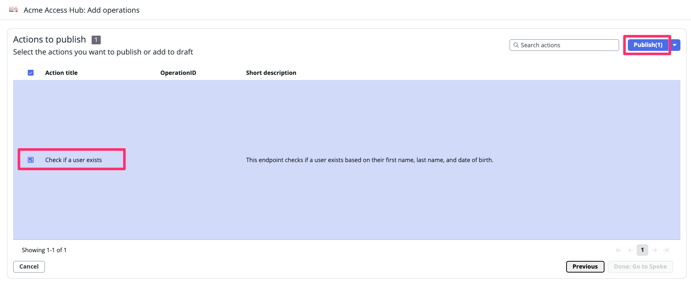

8.  Clique em **Done: Go to Spoke**.

    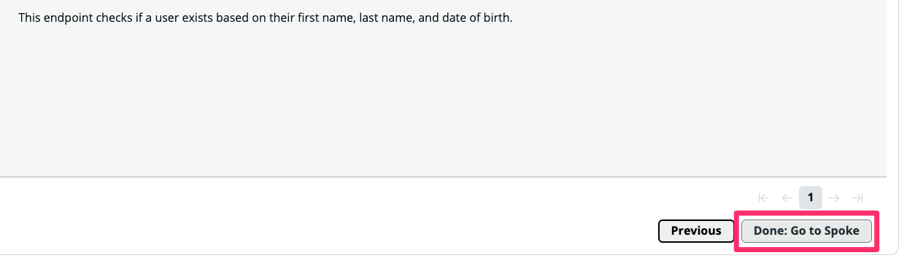

9.  Clique na Spoke Action recém-criada **Check if a user exists** (1), isso abrirá o editor de Ação no Flow Designer para que possamos inspecioná-la
    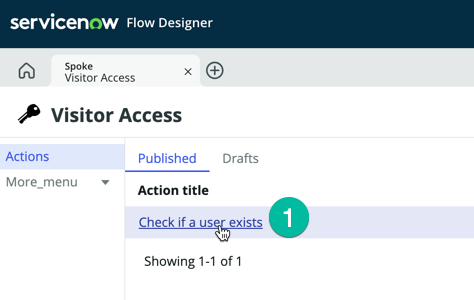

10. Observe a seção de Entrada da Ação, as Entradas para essa Spoke Action foram criadas automaticamente
    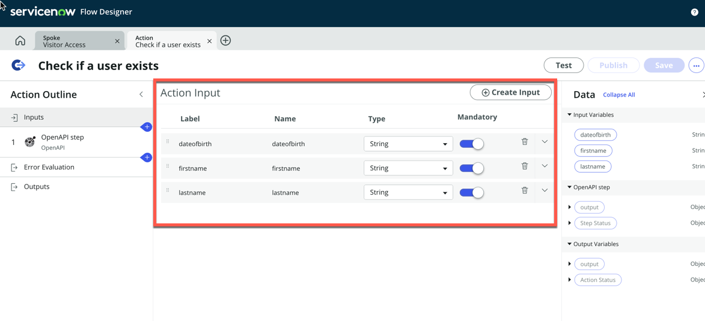

11. Clique no OpenAPI Step (1)
    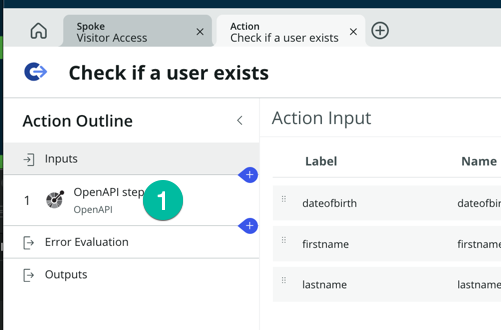

12. Observe os inputs da etapa, eles estão usando as Entradas da Ação, então os valores das Entradas da Ação serão passados como parâmetros quando a chamada API for feita ao sistema externo.
    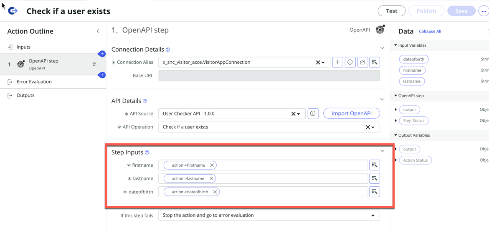

