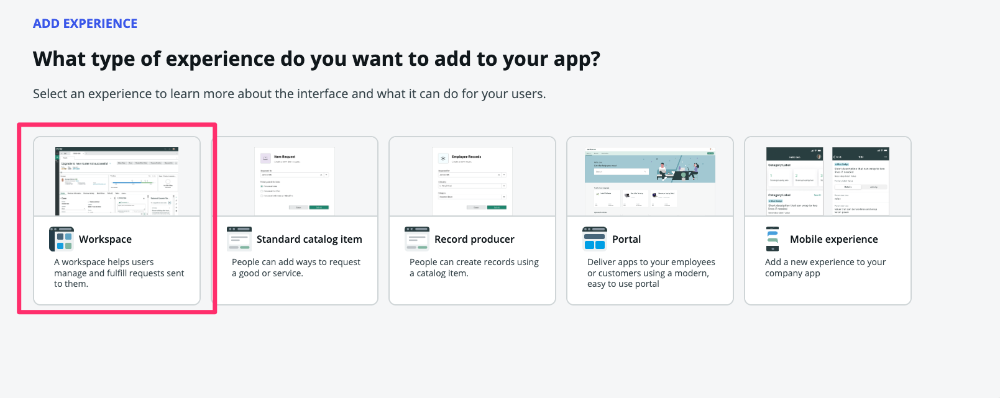
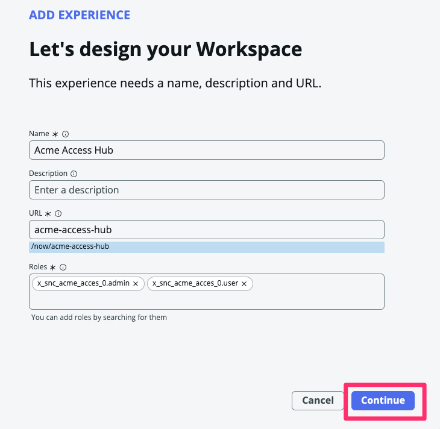
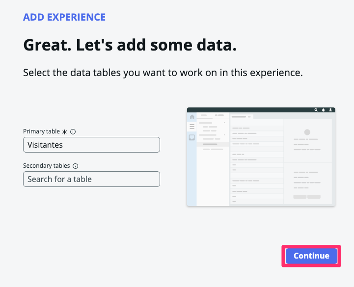
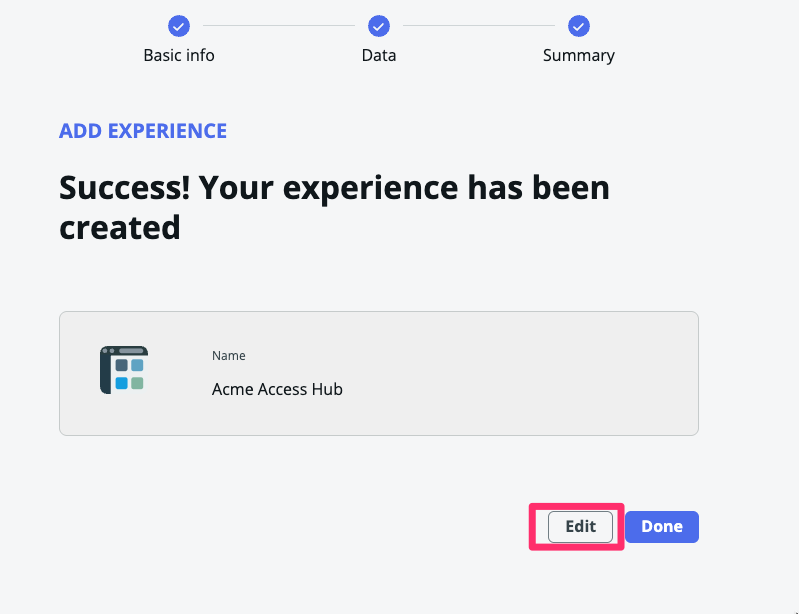
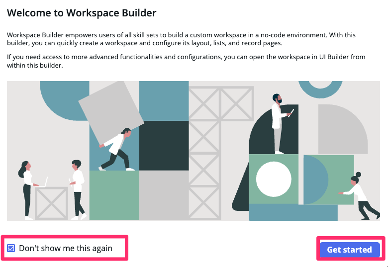
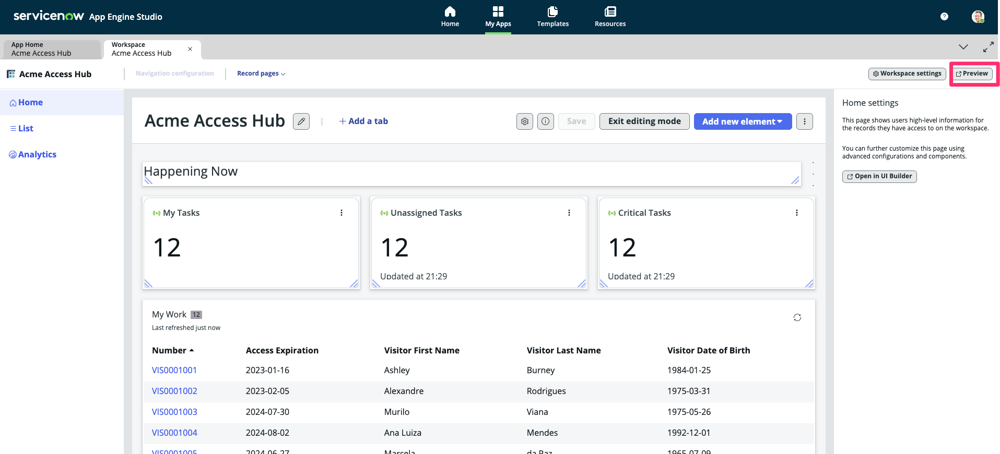
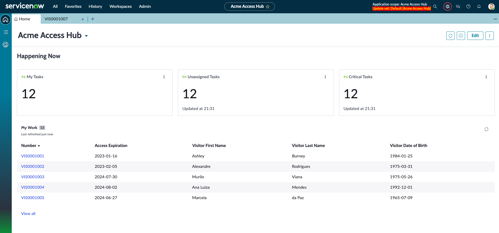
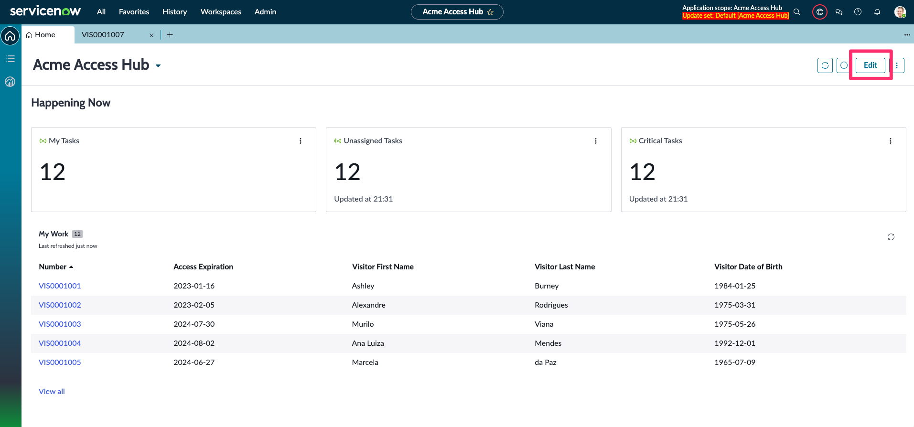
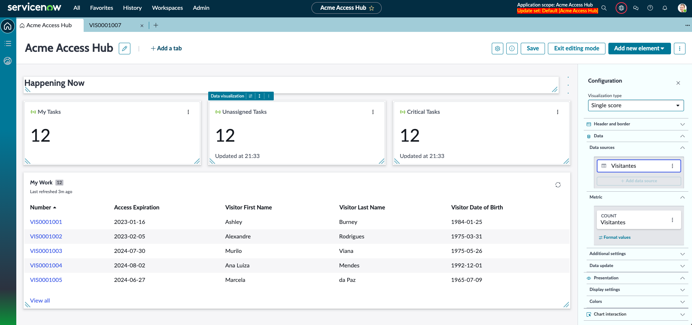
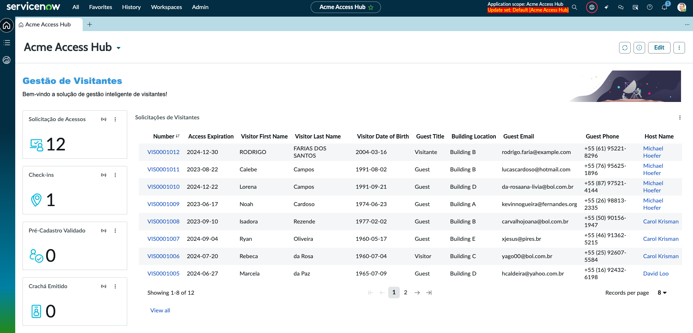

## Visão Geral

Neste passo, vamos criar uma interface de gestão voltada para o time interno, chamada de **Workspace** (espaço de trabalho).

Na ServiceNow, um **Workspace** é uma interface moderna e personalizável que consolida todas as informações, ferramentas e tarefas relevantes para um determinado papel ou processo em um único local. Ele oferece uma experiência fluida e orientada a ações, com visualização de listas, formulários, gráficos e painéis interativos, facilitando a tomada de decisões e o acompanhamento de atividades em tempo real.

Siga as instruções a seguir para aprender como criar um **Workspace** utilizando o **Workspace Generator**, garantindo que ele atenda aos requisitos definidos anteriormente.

## Instruções

1. Retorne para o App Engine Studio. Caso tenha fechado a janela do AES, acesse sua Instância de laboratório e navegue até o **AES (App Engine Studio)** em `All > App Engine > App Engine Studio`. e acesse a aplicação `Acme Access Hub`.

2. Clique na aba **Experience**.

3. Clique em +Add.

4. Selecione Workspace.

5. Clique em Begin.
6. Clique em Continue.

7. Clique em Continue.

8. Clique em Edit.

9. Selecione "Don't show me this again" e clique em Get started.

10. Após finalizar. clique em **Preview**

11. Navegue pelo workspace padrão.

### OPCIONAL - Editar Layout
Você pode personalizar o dashboard para que ele possua os dados e as informações necessárias.
Experimente editar o layout arrastando e soltando os componentes.

1. Clique em **Edit**

2. Arraste e os componentes e edite o conteúdo como quiser.

:::danger DESAFIO
Tente transformar o workspace padrão em algo mais personalizado como o exemplo a seguir

:::