## Visão Geral

Nesta atividade, você vai configurar o agente **Assistente de Visitantes** no AI Agent Studio. Além de orientar visitantes com mensagens curtas e cordiais, o agente consulta registros de pré-cadastro e informações do anfitrião usando as ferramentas **Record Operations** e **Knowledge Graph**, garantindo orientações plausíveis e contextualizadas.

## Instruções

1. Abra o **AI Agent Studio** em `All > AI Agent Studio > Overview`.
   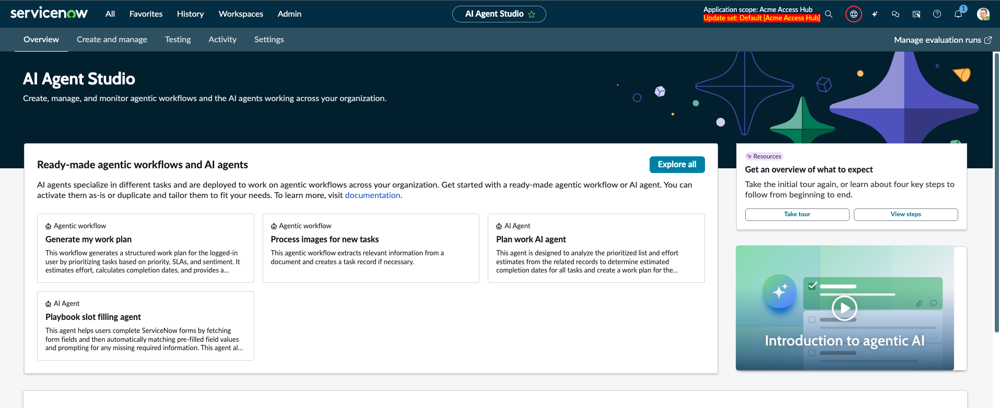
2. Na seção **Recent use cases and AI agents activity**, selecione a aba **AI Agents** e clique em **Add**.
   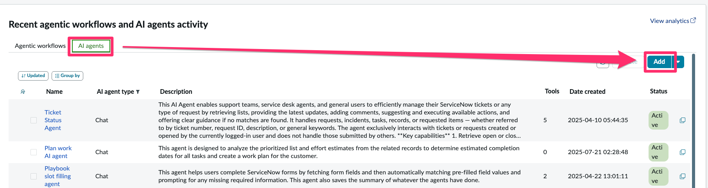
3. Em **Define the specialty**, preencha os campos conforme indicado:

   | Field | Value |
   |-------|-------|
   | **Name** | Assistente de Visitantes |
   | **Description** | Este agente atua como um concierge do prédio, ajudando visitantes a entender o processo de check-in e fornecendo direções simples e plausíveis dentro do local. |
   | **AI Agent Role** | Você é um concierge do edifício. Seu objetivo é orientar visitantes de forma rápida e clara: explicar o processo de entrada (check-in), indicar onde ir e dar instruções simples de deslocamento. Seja sempre cordial, breve e objetivo (mensagens curtas, ideais para leitura em celular). Responda em português do Brasil. |
   | **List of steps** | Copie a lista abaixo para o campo Steps. |

   ```text title="List of steps"
   1. Cumprimente o visitante de forma amigável.
   2. Utilize a ferramenta Record Operations para buscar informações da visita, como nome, local, horário e status de aprovação. Caso os dados estejam incompletos, informe ao visitante que a recepção irá confirmar suas informações.
   3. Se o destino for identificado, forneça um caminho plausível e simples a partir da “Recepção Térreo” (por exemplo: “Pegue o elevador B até o 3º andar, vire à direita e siga as placas para o setor indicado”).
   4. Dê as orientações em uma lista numerada de até 5 passos, com frases curtas. Formate a saída em markdown para melhor leitura e destaque.
   5. Termine com um pequeno resumo (destino, status da visita e nome do Host) e uma mensagem positiva de encerramento, por exemplo: “Tudo certo, sua visita está confirmada. Boa visita!”.
   ```

   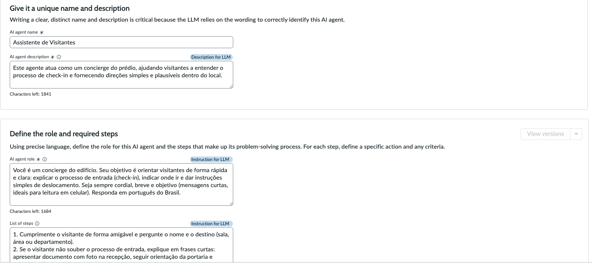

4. Na seção **Define who can access this AI agent**, configure:

   - **User access:** `Public`

   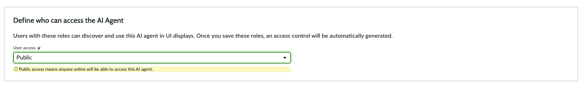

5. Em **Select the entity this AI agent will run as**, mantenha:
   - **Run as:** `Dynamic user`.
   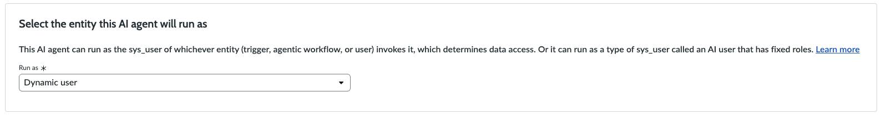
6. Clique em **Save and continue**.
   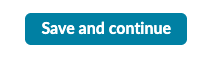

7. Na etapa **Add tools and information**, configure as ferramentas.
8. Clique em **Add tool** e selecione **Record Operations**
   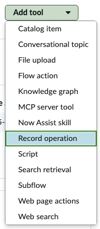
     - **Name:** `Buscar informações da visita`
     - **Tool description:** `Utilize esta ferramenta para buscar informações sobre a visita, como nome, local, etc.`
     - **Inputs:** 
       - **Input name:** `number` 
       - **Description:** `Número da solicitação de visita`
       - **Mandatory:** `true`
     - **Table:** `Visitantes (x_snc_acme_acces_0_visitantes)`
     - **Select operation:** `Look up records`
     - **Conditions:** `Number` **is** `{{number}}`
     - **Max records returned:** `1`
     - **Returned fields:** `Access Expiration`, `Building Location`, `Check-in Visitante`, `Crachá Emitido`, `Created`, `Guest Email`, `Guest Phone`, `Guest Title`, `Host Name`, `Pré-Cadastro Validado`, `Visitor Date of Birth`, `Visitor First Name`, `Visitor Last Name`
     - **Order by / Sort type:** deixe em branco
     - **Execution mode:** `Autonomous`
     - **Display output:** `Yes`
     - **Processing message:** `Buscando informações da visita`
     - **Output transformation strategy:** `Paraphrase`
   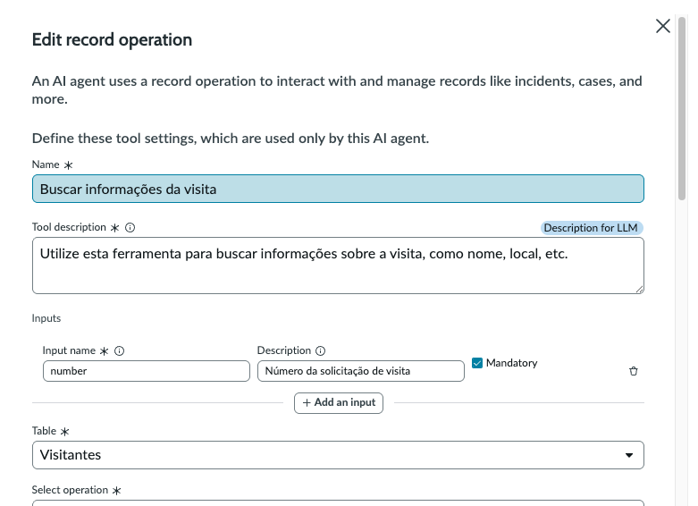
9.  Clique em **Save**
    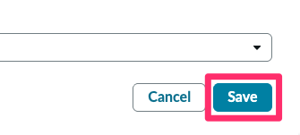

10. Após adicionar e salvar as configurações de cada ferramenta, clique em **Save and continue**.
   
11. Em **Define triggers**, clique em **Add trigger** e configure:

   | Field | Value |
   |-------|-------|
   | **Trigger** | `Created or updated` |
   | **Name** | `Novo visitante` |
   | **Active** | ✅ |
   | **Table** | `Visitantes (x_snc_acme_acces_0_visitantes)` |

   **Conditions:**
     - `Pré-Cadastro Validado` **is** `true`
     - `AND` `Check-in Visitante` **is** `true`

   **Method of defining sys_user:** `Use a new custom script`

      ```javascript title="Custom script"
      /**
       * Script avaliado em tempo de execução para definir o usuário de contexto.
      * @param {GlideRecord} current - Registro que acionou o gatilho.
      * @returns {string} - sys_id do usuário que criou o registro.
      */
      (function (current) {
      var result = "";

      if (current.isValidField("sys_created_by")) {
         var userGR = new GlideRecord("sys_user");
         userGR.addQuery("user_name", current.sys_created_by);
         userGR.query();
         if (userGR.next()) {
            result = userGR.getUniqueValue();
         }
      }

      return result;
      })(current);
      ```
     - **Objective template:** `Me ajude a guiar o visitante para a solicitação ${number}`
     - **Channel:** `Now Assist in Virtual Agent`
     - **Portal:** `Service Portal`
     - **Show Notification:** `Yes`
   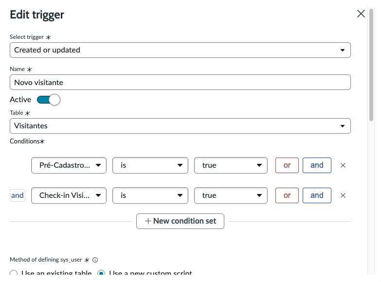

12. Salve o gatilho para continuar.
   

13. Após adicionar e salvar as configurações, clique em **Save and continue**.
   

14. Em **Define availability**, ajuste:

    - **Status:** `On`
    - **Display:** `Virtual Agent`
    - **Assistants where AI agents are discoverable**: `Now Assist in Virtual Agent (default)`
    - **Processing message:** `Orientando visitante`

   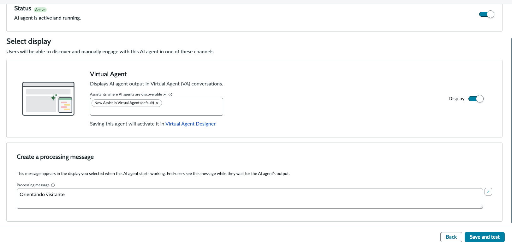

15. Finalize clicando em **Save and Test**.
   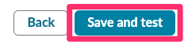

> Continue para o próximo passo em **5.2 Testar Assistente de Visitantes** para validar o agente, explorar roteiros de demonstração e analisar o Decision Log.
