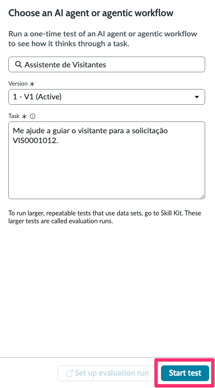
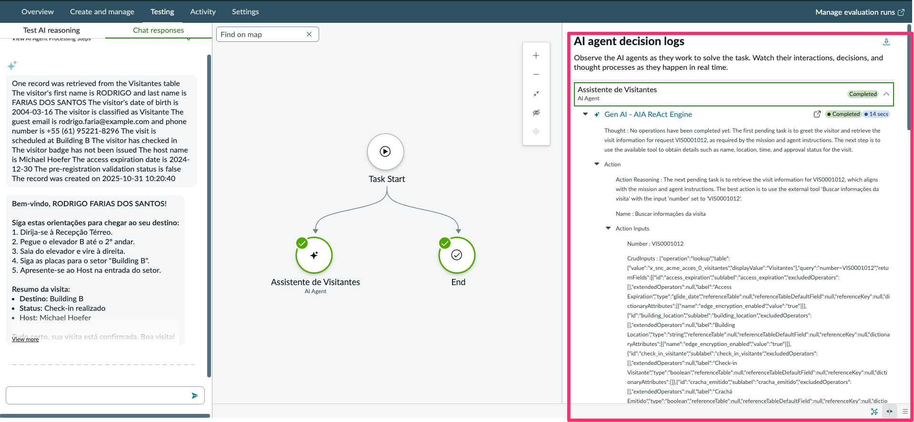
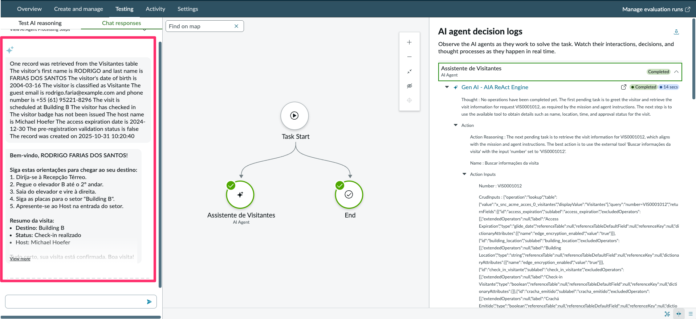

## Visão Geral

Com o agente configurado, é hora de validar sua experiência no AI Agent Studio. Neste passo, você testará as respostas, analisará o **AI Agent Decisions Log** e preparará um roteiro de demonstração para stakeholders.

## Testar o agente

1. Abra o agente **Assistente de Visitantes** e clique em Test.
2. No campo **Task**, informe: `Me ajude a guiar o visitante para a solicitação VIS0001012.`  
   :::tip
   Ajuste o número (`VIS0001012`) para um registro válido na tabela de visitantes da sua instância, garantindo que o gatilho utilize dados reais.
   :::
   

4. Expanda o **AI Agent Decisions Log** e revise:
   - **Thought:** como o agente estruturou o raciocínio em cada etapa.
   - **Action:** confirmação de que o agente respondeu ao visitante.
   - **Action Inputs:** evidências de que as ferramentas **Record Operations** e **Knowledge Graph** foram acionadas com os parâmetros esperados.
  
  

5. Confirme se a resposta do agente apresenta:
   - Lista numerada de até 5 passos com orientações curtas.
   - Síntese final contendo destino, status da visita e nome do anfitrião.
   - Mensagem de encerramento positiva (ex.: “Boa visita!”).

   

:::note
Para validar a experiência completa no portal, siga para **5.3 Teste Final no Portal**.
:::

