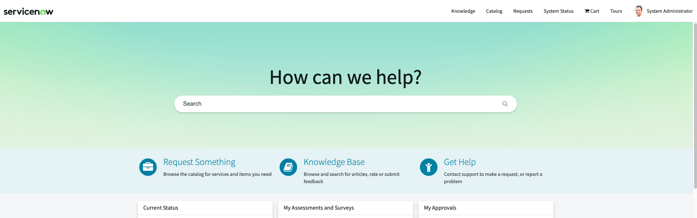
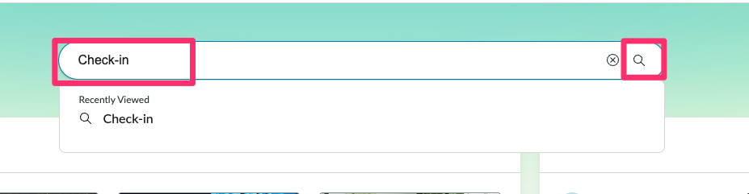
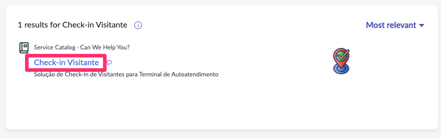
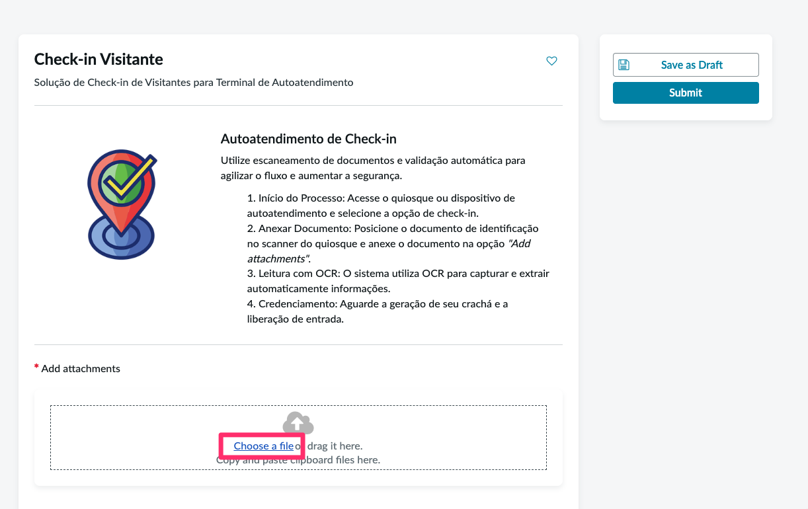
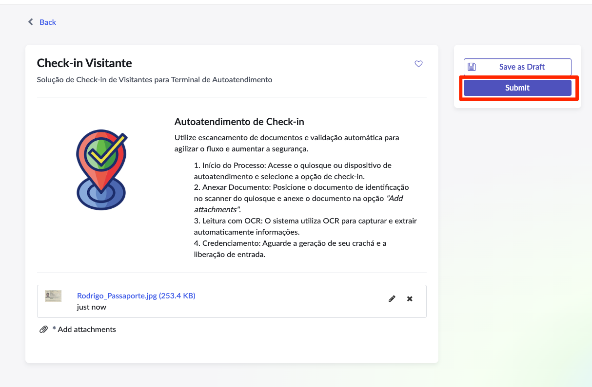
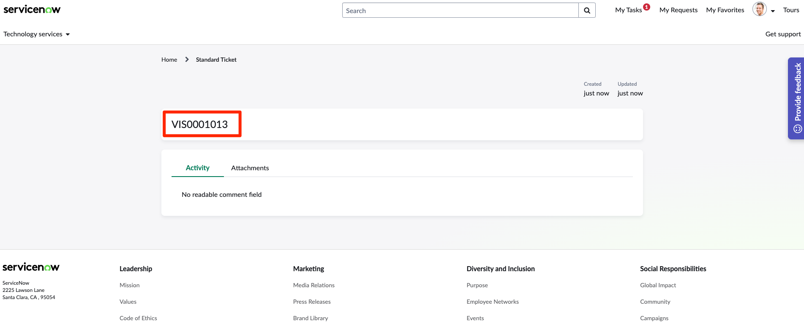
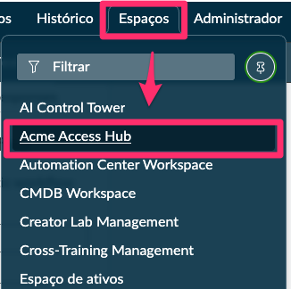
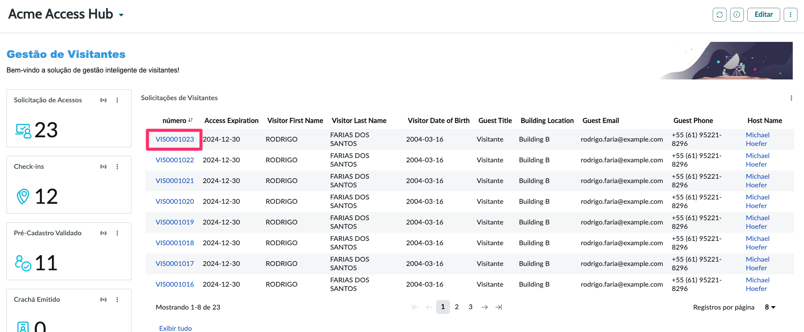
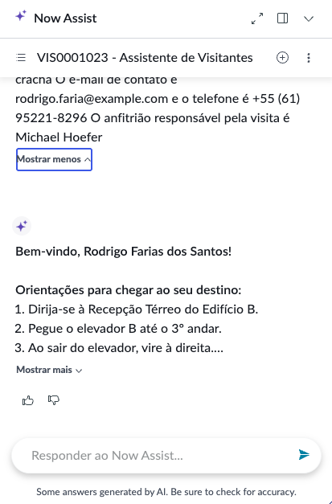

## Visão Geral

Nesta etapa final, validaremos a jornada completa do visitante no **Service Portal**, incluindo o registro via Record Producer, o upload de documento e a verificação do agente **Assistente de Visitantes** acionado pelo Now Assist.

## Executar o check-in no portal

# Instruções

1. Vá para a aba do navegador que diz 'Home'.

2. **Abra o Service Portal.**
    1. Clique em All.
    2. Digite `service portal`.
    3. Clique em **Service Portal**.
    

    :::tip
    Você também pode acessar facilmente colocando **/sp** ao final da URL raiz da sua instância.
    :::

3. **Procure o formulário 'Check-in Visitante' Record Producer.**
   1. Digite `Check-in` na caixa de pesquisa.
   2. Pressione ENTER no teclado.
   

4. Clique em 'Check-in Visitante' nos resultados da pesquisa.
    

5. Clique na opção "Choose a file" e carregue o documento `Rodrigo_Passaporte.jpg`.
   

6. Clique em Submit.
    

7. Copie o ID da requisição `VIS000XXX`
   

## Validar o registro criado

1. Em outra aba, acesse o workspace que criamos em  e localize o registro recém-criado.
   
2. Acesse o registro mais recente.
   
3. Confira se os campos a seguir estão preenchidos corretamente:
   - `Number` (ex.: `VIS00010XX`).
   - `Pré-Cadastro Validado` = `true`.
   - `Check-in Visitante` = `true`.
   - Dados de host e horário da visita.
4. Ajuste manualmente os campos caso seja necessário simular o cenário de visita aprovada.

## Acompanhar o Now Assist

1. Retorne ao portal e observe o ícone flutuante do **Now Assist** no canto inferior da tela.
2. Assim que o gatilho for disparado, o Now Assist exibirá uma notificação informando que o agente está trabalhando.
   
3. Clique na notificação para abrir o painel do Now Assist e acompanhar o diálogo.
   
4. Verifique se o agente:
   - Solicita nome e destino do visitante.
   - Consulta a solicitação para confirmar o status e as informações do host.
   - Apresenta o trajeto em uma lista numerada de até 5 passos, utilizando frases curtas.
   - Finaliza com um resumo e mensagem positiva, seguindo as instruções configuradas.

## Ajustes e observações

- Monitore o **AI Agent Decisions Log** para confirmar que as ferramentas **Record Operations** e **Knowledge Graph** foram acionadas corretamente.
- Caso a notificação não apareça, verifique se o gatilho está ativo, se o registro atende aos critérios e se o usuário autenticado tem permissão para visualizar o Now Assist.
- Documente qualquer divergência e volte aos passos de configuração (5.1) ou de testes no estúdio (5.2) para ajustes.

Com este teste final, você garante que a experiência ponta a ponta do visitante está consistente e pronta para demonstrações.
