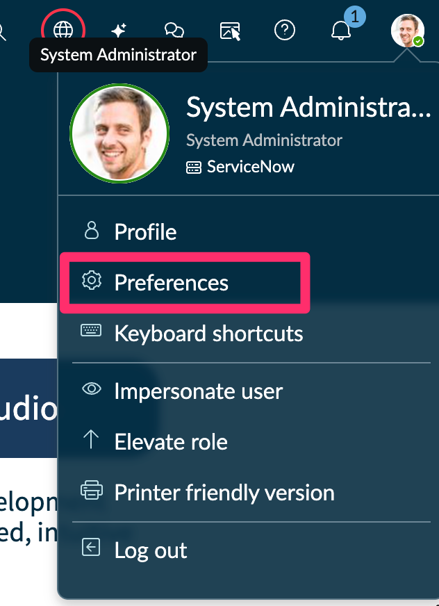
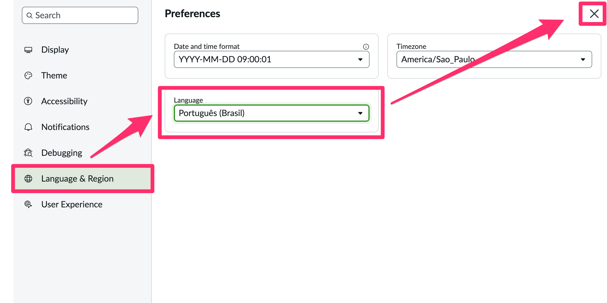
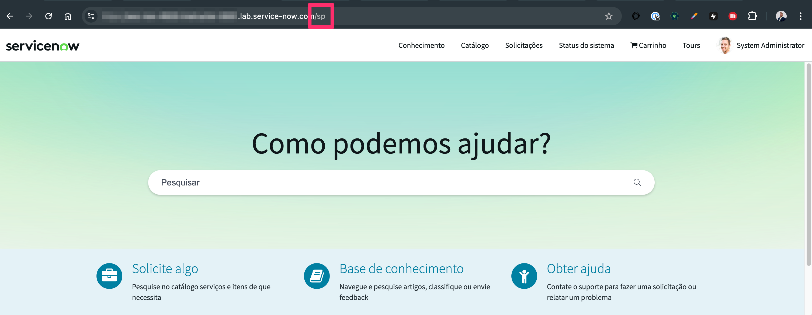
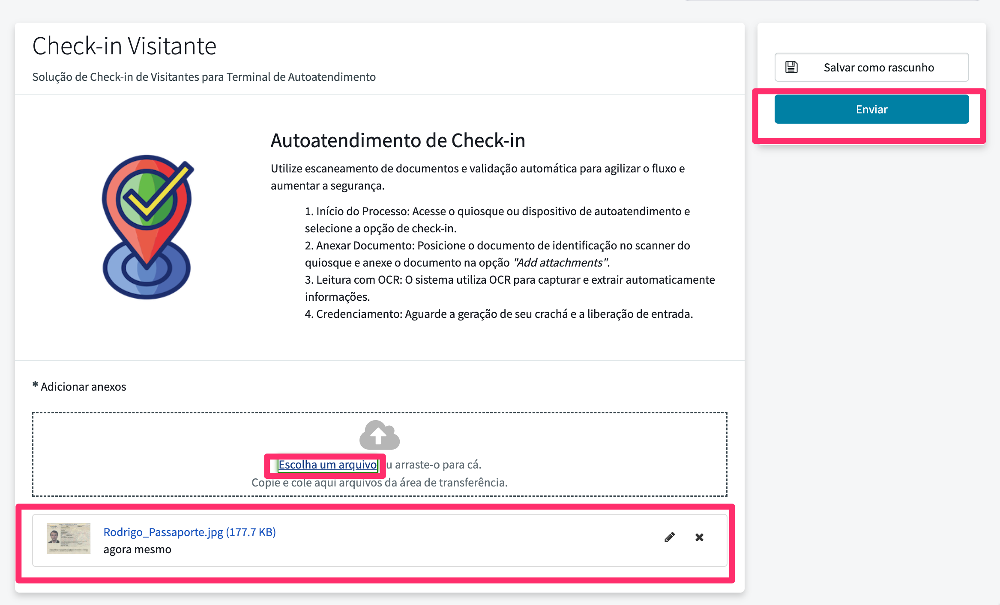
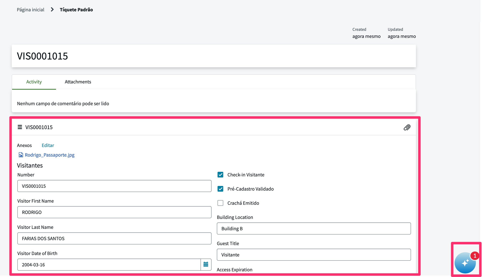
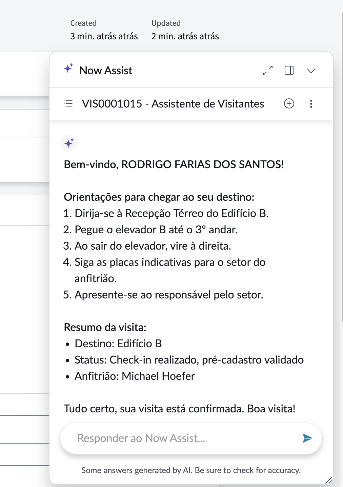
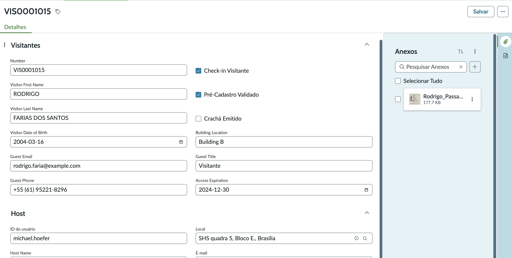

## Visão Geral

Nesta etapa final, validaremos a jornada completa do visitante no **Service Portal**, incluindo o registro via Record Producer, o upload de documento e a verificação do agente **Assistente de Visitantes** acionado pelo Now Assist.

Antes, para termos uma melhor experiência, vamos trocar o idioma da instância para Português, assim o agente poderá falar também em Português.

1. Volte para a plataforma.

2. Clique na foto do seu avatar e em seguida **Preferences**.
   

3. Selecione **Language & Region** > **Language** > **Português (Brasil)** e Feche a janela.
   

## Executar o check-in no portal

1. **Abra o Service Portal** colocando ao final da sua URL raiz **/sp**
   

2. **Procure o formulário 'Check-in Visitante' Record Producer.**
   1. Digite `Check-in` na caixa de pesquisa.
   2. Pressione ENTER no teclado.
   

3. Clique em 'Check-in Visitante' nos resultados da pesquisa.
    

4. Clique na opção "Choose a file" e carregue o documento `Rodrigo_Passaporte.jpg` e Clique em Enviar.
   

5. Acompanhe a execução do Docintel e do nosso flow preencher automaticamente os campos. Aguarde um pouco, uma nova notificação no canto da tela aparecerá.
   

6. Clique na notificação para abrir o painel do Now Assist e acompanhar o diálogo.
   
7. Verifique se o agente:
   - Solicita nome e destino do visitante.
   - Consulta a solicitação para confirmar o status e as informações do host.
   - Apresenta o trajeto em uma lista numerada de até 5 passos, utilizando frases curtas.
   - Finaliza com um resumo e mensagem positiva, seguindo as instruções configuradas.

## Validar o registro criado na retaguarda (Workspace)

1. Em outra aba, acesse o workspace que criamos em  e localize o registro recém-criado.
   
2. Acesse o registro mais recente.
   
3. Confira se os campos a seguir estão preenchidos corretamente:
   - `Number` (ex.: `VIS00010XX`).
   - `Pré-Cadastro Validado` = `true`.
   - `Check-in Visitante` = `true`.
   - Dados de host e horário da visita.
  
4. Ajuste manualmente os campos caso seja necessário simular o cenário de visita aprovada.

## Ajustes e observações

- Monitore o **AI Agent Decisions Log** para confirmar que as ferramentas **Record Operations** e **Knowledge Graph** foram acionadas corretamente.
- Caso a notificação não apareça, verifique se o gatilho está ativo, se o registro atende aos critérios e se o usuário autenticado tem permissão para visualizar o Now Assist.
- Documente qualquer divergência e volte aos passos de configuração (5.1) ou de testes no estúdio (5.2) para ajustes.

Com este teste final, você garante que a experiência ponta a ponta do visitante está consistente e pronta para demonstrações.
